**Author**: Mark E. Pepin, MS, PhD \
**Contact**: pepinme@gmail.com  \
**Institution**: Institute for Experimental Cardiology, University of Heidelberg \
**Location**: 669 Im Neuenheimer Feld, 69120 Heidelberg, DE

# Genome Assembly and Alignment

The first task is to align the bisulfite reduced and sequenced reads to a genome assembly. To accomplish this, the genome assembly was generated based on Gencode annotation (gencode.v28.annotation.gtf) and sequence (GRCh38.p12.genome.fa). For whole-genome bisulfite sequencing via the Bismark (v0.20.0) aligner and genome preparation, a CT- and GA-converted assemblies are created.

## Genome Assembly

## Adapter and Read Quality Trimming

Once the genome assembly was created, adapter sequences were trimmed and sequencing quality assessed via trim_galore and FastQC, respectively.

`trim_galore -o $INPUT_DIR/fastq_trimmed/ --paired --rrbs --non_directional --length 20 --fastqc #$INPUT_DIR/fastq/${VAR}_R1_001.fastq.gz $INPUT_DIR/fastq/${VAR}_R2_001.fastq.gz.`

## Read Alignment

We then aligned all .fastq files to the genome assemblies using the following command:

`bwameth.py --threads 8 --reference $GENOME_DIR/GRCh38.p12.genome.fa $INPUT_DIR/fastq_trimmed/${VAR}_R1_001_val_1.fq.gz $INPUT_DIR/fastq_trimmed/${VAR}_R2_001_val_2.fq.gz > $RESULTS_DIR/RRBS_bwa/${VAR}.sam`

Once aligned, we converted to .bam output.

`#Convert .sam to .bam`
`samtools view -S -b $RESULTS_DIR/RRBS_bwa/${VAR}.sam > $RESULTS_DIR/RRBS_bwa/${VAR}.bam`
`#Sort using samtools`
`samtools sort $RESULTS_DIR/RRBS_bwa/${VAR}.bam -o $RESULTS_DIR/RRBS_bwa/${VAR}.sorted.bam`
`#create an index`
`samtools index $RESULTS_DIR/RRBS_bwa/${VAR}.sorted.bam`
`#MethylDackel`
`MethylDackel extract $GENOME_DIR/GRCh38.p12.genome.fa $RESULTS_DIR/RRBS_bwa/${VAR}.sorted.bam -o $RESULTS_DIR/RRBS_bwa/${VAR}.counted --methylKit`

Once finished, the CpG methylation was extracted as both bedgraph file (for UCSC genome browser) and bed file, which was then used to identify differentially-methylated cytosines (DMCs) and differentially-methylated regions (DMRs).

The "*.counted" files that resulted from this process were then read into R () and combined into a single "object" for differential methylation analysis

# Differential Methylation Analysis

## Combining sample methylation


```r
#Conditions to be used in differential methylation analysis (FILL OUT)
library(openxlsx)
library(dplyr)
TREATMENT=c("CON","HIGH")
CELL=c("HAEC")

ANALYSIS="HAEC_DM.v.CON"
### "2" is Pre-LVAD, "3" is Post-LVAD, "1" is CON
library(methylKit)
file.list <- list.files(path = paste0("../1_Input/Methyl/2_bwameth.out/", CELL), pattern = "*.counted_CpG.bedGraph", full.names = TRUE, all.files = TRUE)
#Generate Column names (remove the extra nonsense from the path names)
colnames <- gsub( "*.counted_CpG.bedGraph", "", file.list)
colnames <- gsub( paste0("[.][.]/1_Input/Methyl/2_bwameth.out/", CELL, "/"), "", colnames)
sample_id<-as.list(colnames)
#Import the Index file
Index.raw<-read.xlsx("../1_Input/Index/Index_Napoli.xlsx", sheet = CELL)
Index.raw$Treatment<-factor(Index.raw$Group, levels = c("CON", "LOW", "HIGH"))

## Sort the index according to the .bed file ordering (as imported). This is important for correct annotation of samples.
Index.raw$Treatment<-as.integer(Index.raw$Treatment)
Index.raw<-Index.raw %>% arrange(Sample.ID)

## Filter according to analysis parameters (CELL and TREATMENT)
Index.subset<-subset(Index.raw, Group %in% TREATMENT)
sample_id<-as.list(colnames)
##Create a methlRawlistDB
file.list<-as.list(file.list)
myobj<-methRead(file.list, sample.id = sample_id, assembly = "hg38", treatment = Index.raw$Treatment, pipeline = "bismarkCoverage", header = FALSE, context = "CpG")
##Example of smaple statistics (can spot check these)
getMethylationStats(myobj[[2]], plot = F, both.strands = F)
```

```
## methylation statistics per base
## summary:
##    Min. 1st Qu.  Median    Mean 3rd Qu.    Max. 
##   0.000   0.000   5.556  31.377  75.000 100.000 
## percentiles:
##         0%        10%        20%        30%        40%        50%        60% 
##   0.000000   0.000000   0.000000   0.000000   0.000000   5.555556  19.047619 
##        70%        80%        90%        95%        99%      99.5%      99.9% 
##  57.692308  85.714286 100.000000 100.000000 100.000000 100.000000 100.000000 
##       100% 
## 100.000000
```

```r
#Subset the methylRawList to include only the sample_id's for the desired analysis
myobj_filtered<-reorganize(myobj, sample.ids = Index.subset$Sample.ID, Index.subset$Treatment)
```

Once the samples have been compiled, it is valuable to perform some basic visualizations and statistics to determine whether quality filtering is necessary. The distribution of methylation change is plotted as a histogram (typically bimodal at the extremes), as well as a distribution of the read coverage per based, again plotted as a histogram. For the latter plot, it is important to determine whether PCR duplication biases the read coverage. If so, a secondary peak would emerge on the right-most portion of the histogram. In the current analysis, coverage distribution exhibits a one-tailed distribution, suggesting that the "deduplication" step in the alignment effectively eliminated the PCR amplification bias in coverage.


```r
library(graphics)
getMethylationStats(myobj_filtered[[2]], plot = T, both.strands = F)
```

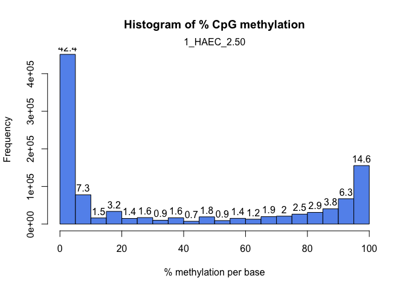<!-- -->

```r
getCoverageStats(myobj_filtered[[2]], plot = T, both.strands = F)
```

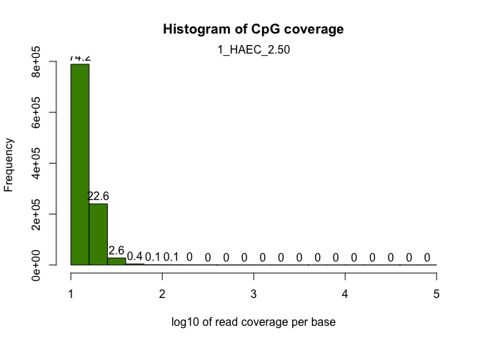<!-- -->

```r
#Save these files in an output folder
ifelse(!dir.exists(file.path("../2_Output/", ANALYSIS)), dir.create(file.path("../2_Output/", ANALYSIS)), FALSE)
```

```
## [1] FALSE
```

```r
pdf(file=paste0("../2_Output/", ANALYSIS, "/", ANALYSIS, "_Methylation.Stats.pdf"))
getMethylationStats(myobj_filtered[[2]], plot = T, both.strands = F)
dev.off()
```

```
## quartz_off_screen 
##                 2
```

```r
pdf(file=paste0("../2_Output/", ANALYSIS, "/", ANALYSIS, "_Coverage.Stats.pdf"))
getCoverageStats(myobj_filtered[[2]], plot = T, both.strands = F)
dev.off()
```

```
## quartz_off_screen 
##                 2
```

Although most important in the context of correcting PCR-bias (duplication), filtering samples based on coverage also reduces false discovery based on low-coverage genomic regions. If PCR bias exists, an artificially high coverage would exist. Low coverage is also a concern due to low statistical power associated with low-coverage regions. Below, we discard bases with coverage below 10X, but also discard bases with coverage > 99.9th percentile.


```r
#remove exceedingly high-coverage (risk of PCR bias) or low-coverage DMPs (low statistical power) 
filtered.myobj <- filterByCoverage(myobj_filtered, lo.count = 5, lo.perc = NULL, hi.count = NULL, hi.perc = 99.9)
```

##Visualizing Methylation


```r
#destrand and unite the sample data
meth<-unite(filtered.myobj, destrand = FALSE) #When calculating DMRs, it is not helpful to "destrand"
clusterSamples(meth, dist = "correlation", method = "ward", plot = TRUE)
```

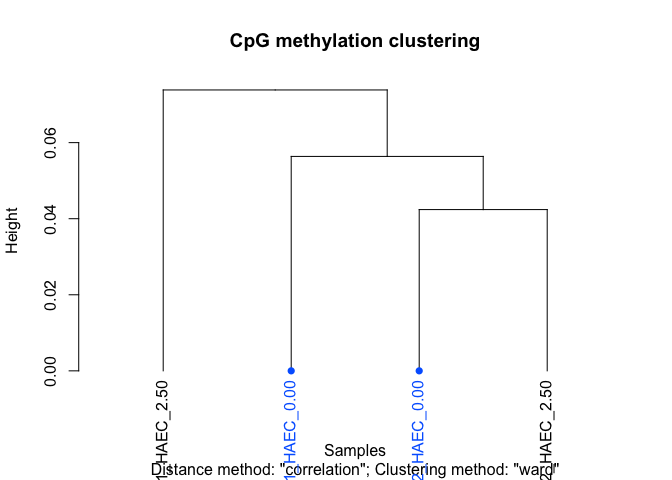<!-- -->

```
## 
## Call:
## hclust(d = d, method = HCLUST.METHODS[hclust.method])
## 
## Cluster method   : ward.D 
## Distance         : pearson 
## Number of objects: 4
```

```r
PCASamples(meth, screeplot = TRUE)
```

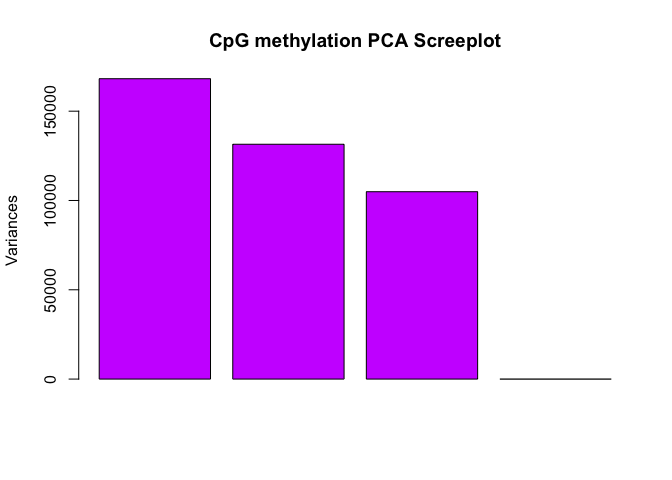<!-- -->

```r
PCASamples(meth)
```

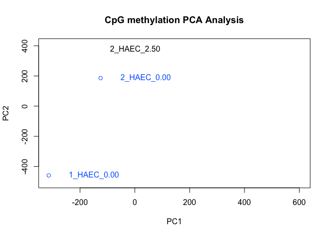<!-- -->

```r
#Create a folder in which to generate all documents/tables for this analysyis
ifelse(!dir.exists(file.path("../2_Output/", ANALYSIS)), dir.create(file.path("../2_Output/", ANALYSIS)), FALSE)
```

```
## [1] FALSE
```

```r
#Create dendrogram and PCA plots
pdf(file=paste0("../2_Output/", ANALYSIS, "/", ANALYSIS, "_Clustering.pdf"))
clusterSamples(meth, dist = "correlation", method = "ward", plot = TRUE)
```

```
## 
## Call:
## hclust(d = d, method = HCLUST.METHODS[hclust.method])
## 
## Cluster method   : ward.D 
## Distance         : pearson 
## Number of objects: 4
```

```r
PCASamples(meth, screeplot = TRUE)
PCASamples(meth)
dev.off()
```

```
## quartz_off_screen 
##                 2
```


## Tiling Methylation Windows


```r
library(dplyr)
##################################
#Differential Methylation of Tiles
##################################
tiles = tileMethylCounts(myobj_filtered, win.size = 500, step.size = 500)
meth_tile<-unite(tiles, destrand = FALSE) #When calculating DMRs, it is not helpful to "destrand"
myDiff_tiles=calculateDiffMeth(meth_tile, test = "Chisq", adjust = "SLIM", mc.cores = 7)
myDiff_tile.md<-as(myDiff_tiles,"methylDiff")
myDiff_tiles.filtered<-getData(myDiff_tile.md)

#Check clustering of samples by DMR correlation
clusterSamples(meth_tile, dist = "correlation", method = "ward", plot = TRUE)
```

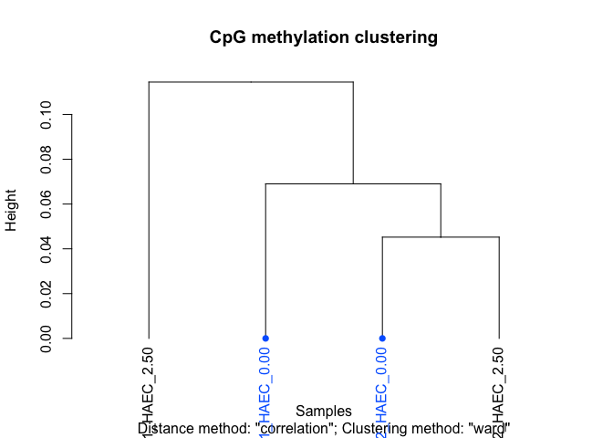<!-- -->

```
## 
## Call:
## hclust(d = d, method = HCLUST.METHODS[hclust.method])
## 
## Cluster method   : ward.D 
## Distance         : pearson 
## Number of objects: 4
```

```r
PCASamples(meth_tile, screeplot = TRUE)
```

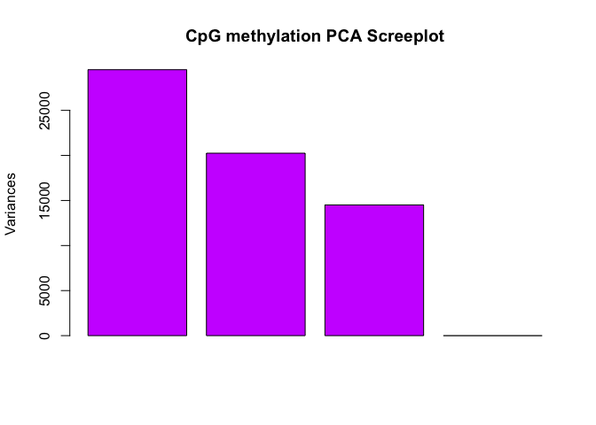<!-- -->

```r
PCASamples(meth_tile)
```

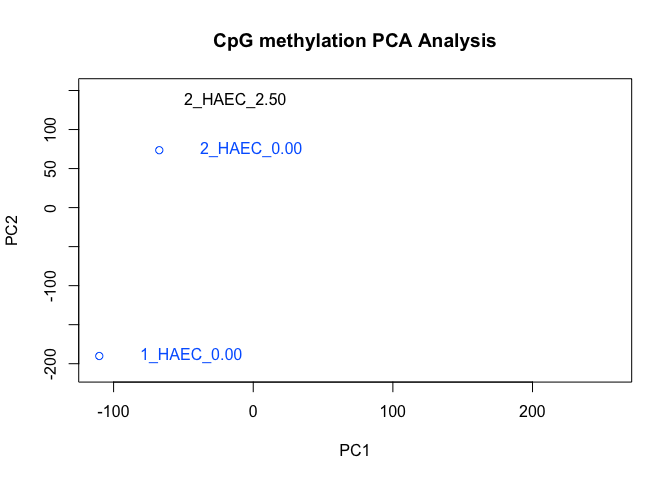<!-- -->

```r
#Create a folder in which to generate all documents/tables for this analysyis
ifelse(!dir.exists(file.path("../2_Output/", ANALYSIS, "DMR/")), dir.create(file.path("../2_Output/", ANALYSIS, "DMR/")), FALSE)
```

```
## [1] FALSE
```

```r
#Create dendrogram and PCA plots
pdf(file=paste0("../2_Output/", ANALYSIS, "/DMR/", ANALYSIS, "_Clustering.pdf"))
clusterSamples(meth_tile, dist = "correlation", method = "ward", plot = TRUE)
```

```
## 
## Call:
## hclust(d = d, method = HCLUST.METHODS[hclust.method])
## 
## Cluster method   : ward.D 
## Distance         : pearson 
## Number of objects: 4
```

```r
PCASamples(meth, screeplot = TRUE)
PCASamples(meth)
dev.off()
```

```
## quartz_off_screen 
##                 2
```

```r
##############################################
#Calculate percent methylation for each sample/site
##############################################

Methylation<-getData(meth_tile)
f = function(Cyt, cov, col_name) {
  require(lazyeval)
  require(dplyr)
    mutate_call = lazyeval::interp(~ (a / b)*100, a = as.name(Cyt), b = as.name(cov))
    Methylation %>% mutate_(.dots = setNames(list(mutate_call), col_name))
}
for(i in seq_along(Index.subset$Sample.ID)){
  COVERAGE=paste0("coverage", i)
  mC=paste0("numCs", i)
  perc.mC=paste0("perc.mC_", Index.subset$Sample.ID[i])
  Methylation<-f(Cyt=mC, cov=COVERAGE, col_name=perc.mC)
}
Methylation<-dplyr::select(Methylation, chr, start, end, contains("perc.mC"))

#Merge with the percent methylation (by cytosine)
myDiff_tiles.filtered<-left_join(myDiff_tiles.filtered, Methylation)

#Subset by statistical threshold
myDiff.tiles_p05<-dplyr::filter(myDiff_tiles.filtered, pvalue<0.05)
myDiff.tiles_q05<-dplyr::filter(myDiff_tiles.filtered, qvalue<0.05)

#Save a copy of the differential Methylation analysis
wb_countData<-createWorkbook()
addWorksheet(wb_countData, "P_0.05")
  writeData(wb_countData, "P_0.05", myDiff.tiles_p05, rowNames = F)
addWorksheet(wb_countData, "Q_0.05")
  writeData(wb_countData, "Q_0.05", myDiff.tiles_q05, rowNames = F)
saveWorkbook(wb_countData, file = paste0("../2_Output/", ANALYSIS, "/DMR/", ANALYSIS, "_DiffMeth.xlsx"), overwrite = TRUE)

myDiff.files_q05_GR<-makeGRangesFromDataFrame(myDiff.tiles_q05, seqnames.field = "chr", strand.field="strand", start.field = "start", end.field = "end", keep.extra.columns = T)

write.table(myDiff.tiles_q05, file = "../2_Output/Tiles_Q05_DiffMeth.bed", sep = "\t", row.names = F, col.names = F, quote = F)

############################
##ANNOTATION
############################
library(openxlsx)
library(annotatr)
library(AnnotationHub)
library(rtracklayer)
library(TxDb.Hsapiens.UCSC.hg38.knownGene)
#convert to GRanges object (correct format for annotatr)
myDiff.tiles_p05_GR<-makeGRangesFromDataFrame(myDiff.tiles_p05, seqnames.field = "chr", strand.field="strand", start.field = "start", end.field = "end", keep.extra.columns = T)
#create annotations from the following sources
annots = c('hg38_cpgs', 'hg38_basicgenes')
# Build the annotations (a single GRanges object)
annotations = build_annotations(genome = 'hg38', annotations = annots)
# myDiff_GR<-as(myDiff, "GRanges")
# Intersect the regions read in with the annotations
dm_annotated.tiles = annotate_regions(
    regions = myDiff.tiles_p05_GR,
    annotations = annotations,
    ignore.strand = TRUE,
    quiet = FALSE)
#convert to a data.frame
df_dm_annotated.tiles = data.frame(dm_annotated.tiles)
# A GRanges object is returned
print(dm_annotated.tiles)
```

```
## GRanges object with 158251 ranges and 8 metadata columns:
##            seqnames        ranges strand |     pvalue     qvalue meth.diff
##               <Rle>     <IRanges>  <Rle> |  <numeric>  <numeric> <numeric>
##        [1]     chr1 629501-630000      * | 3.3385e-05 0.00514958   26.0453
##        [2]     chr1 629501-630000      * | 3.3385e-05 0.00514958   26.0453
##        [3]     chr1 629501-630000      * | 3.3385e-05 0.00514958   26.0453
##        [4]     chr1 629501-630000      * | 3.3385e-05 0.00514958   26.0453
##        [5]     chr1 629501-630000      * | 3.3385e-05 0.00514958   26.0453
##        ...      ...           ...    ... .        ...        ...       ...
##   [158247]     chrM     8501-9000      * | 0.00732381   0.158793  -0.62724
##   [158248]     chrM     8501-9000      * | 0.00732381   0.158793  -0.62724
##   [158249]     chrM     8501-9000      * | 0.00732381   0.158793  -0.62724
##   [158250]     chrM     8501-9000      * | 0.00732381   0.158793  -0.62724
##   [158251]     chrM     8501-9000      * | 0.00732381   0.158793  -0.62724
##            perc.mC_1_HAEC_0.00 perc.mC_1_HAEC_2.50 perc.mC_2_HAEC_0.00
##                      <numeric>           <numeric>           <numeric>
##        [1]             74.0741             90.7216             47.2727
##        [2]             74.0741             90.7216             47.2727
##        [3]             74.0741             90.7216             47.2727
##        [4]             74.0741             90.7216             47.2727
##        [5]             74.0741             90.7216             47.2727
##        ...                 ...                 ...                 ...
##   [158247]            0.259067                   0            0.821918
##   [158248]            0.259067                   0            0.821918
##   [158249]            0.259067                   0            0.821918
##   [158250]            0.259067                   0            0.821918
##   [158251]            0.259067                   0            0.821918
##            perc.mC_2_HAEC_2.50                annot
##                      <numeric>            <GRanges>
##        [1]             62.7907 chr1:628640-629639:+
##        [2]             62.7907 chr1:626074-630073:+
##        [3]             62.7907 chr1:627757-631756:+
##        [4]             62.7907 chr1:628535-632534:+
##        [5]             62.7907 chr1:628696-632695:+
##        ...                 ...                  ...
##   [158247]                   0    chrM:6892-10891:-
##   [158248]                   0    chrM:8515-12514:-
##   [158249]                   0     chrM:8366-8572:+
##   [158250]                   0     chrM:8527-9207:+
##   [158251]                   0       chrM:1-16569:*
##   -------
##   seqinfo: 206 sequences from an unspecified genome; no seqlengths
```

```r
##The issue with this annotation is that each DMP has multiple repeated rows if different annotations. To simplify this, we can condense the annotations into strings. This makes the resulting file more manageable based on the differential-methylation data.
DiffMeth_Annotated.tiles<-df_dm_annotated.tiles %>% 
  tidyr::fill(annot.symbol) %>% distinct() %>%
  dplyr::group_by(seqnames, start, end, meth.diff, pvalue, qvalue, annot.symbol) %>% 
  dplyr::summarise(Annotation=paste(unique(annot.type), collapse = ";"), Test=paste(unique(annot.id), collapse = ";"))
#Add %Methylation
DiffMeth_Annotated.tiles<-dplyr::rename(DiffMeth_Annotated.tiles, chr=seqnames)
DiffMeth_Annotated.tiles<-dplyr::left_join(DiffMeth_Annotated.tiles, Methylation)
#subset the Differential Methylation by statistics
DiffMeth_Annotated.tiles_p05<-subset(DiffMeth_Annotated.tiles, pvalue<0.05)
DiffMeth_Annotated.tiles_q05<-subset(DiffMeth_Annotated.tiles, qvalue<0.05)
#Write out the annotated DMP file 
library(openxlsx)
ifelse(!dir.exists(file.path("../2_Output/", ANALYSIS, "/DMR/")), dir.create(file.path("../2_Output/", ANALYSIS, "/DMR/")), FALSE)
```

```
## [1] FALSE
```

```r
wb_WGBS_Annotate<-createWorkbook()
addWorksheet(wb_WGBS_Annotate, "P_0.05")
  writeData(wb_WGBS_Annotate, "P_0.05", DiffMeth_Annotated.tiles_p05, rowNames = F)
addWorksheet(wb_WGBS_Annotate, "Q_0.05")
  writeData(wb_WGBS_Annotate, "Q_0.05", DiffMeth_Annotated.tiles_q05, rowNames = F)
saveWorkbook(wb_WGBS_Annotate, file = paste0("../2_Output/", ANALYSIS, "/DMR/", ANALYSIS, "_Annotated_DiffMeth.xlsx"), overwrite = TRUE)
#Provide a summary of the annotation
dm_annsum.tile = summarize_annotations(
    annotated_regions = dm_annotated.tiles,
    quiet = TRUE)
print(dm_annsum.tile)
```

```
## # A tibble: 10 x 2
##    annot.type               n
##  * <chr>                <int>
##  1 hg38_cpg_inter        7125
##  2 hg38_cpg_islands      6439
##  3 hg38_cpg_shelves       924
##  4 hg38_cpg_shores       5850
##  5 hg38_genes_1to5kb     5339
##  6 hg38_genes_3UTRs      1051
##  7 hg38_genes_5UTRs      3118
##  8 hg38_genes_exons      7020
##  9 hg38_genes_introns   10488
## 10 hg38_genes_promoters  5651
```

```r
#Plot the annotation distribution
dm_vs_kg_annotations.tile = plot_annotation(
    annotated_regions = dm_annotated.tiles,
    plot_title = '# of Sites Tested',
    x_label = 'knownGene Annotations',
    y_label = 'Count')
print(dm_vs_kg_annotations.tile)
```

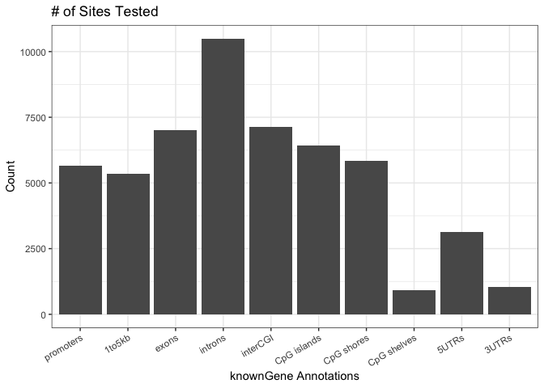<!-- -->

```r
annots_order = c(
    'hg38_genes_1to5kb',
    'hg38_genes_promoters',
    'hg38_genes_5UTRs',
    'hg38_genes_exons',
    'hg38_genes_introns',
    'hg38_genes_3UTRs')
dm_vs_kg_annotations = plot_annotation(
    annotated_regions = dm_annotated.tiles,
    annotation_order = annots_order,
    plot_title = '# of Sites Tested for differentially-methylated positions',
    x_label = 'knownGene Annotations',
    y_label = 'Count')
print(dm_vs_kg_annotations)
```

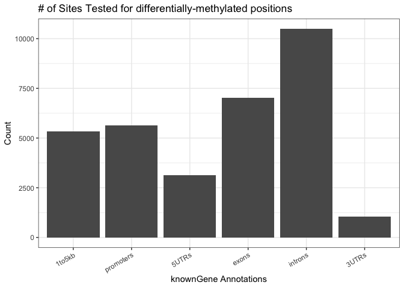<!-- -->

#Heatmap of Differential Methylation


```r
library(pheatmap)
hm_Data<-as.data.frame(DiffMeth_Annotated.tiles_p05)
hm_Data<-hm_Data[!is.na(hm_Data$annot.symbol),]
rownames(hm_Data)<-make.unique(hm_Data$annot.symbol, sep = ".")

## Heatmap
STATISTIC=0.05
hm_Data<-dplyr::filter(hm_Data, pvalue<STATISTIC)

hm_Data<-dplyr::select(myDiff.tiles_p05, contains("perc.mC"))
hm_Data<-data.matrix(hm_Data)

##
## Index file for annotating samples
hm_Index<-Index.raw
hm_Index$Sample.ID<-paste0("perc.mC_", hm_Index$Sample.ID)
rownames(hm_Index)<-hm_Index$Sample.ID
hm_Index<-as.data.frame(hm_Index)
hm_Index<-dplyr::select(hm_Index, Sample.ID, Treatment)

paletteLength <- 100
myColor <- colorRampPalette(c("dodgerblue4", "white", "gold2"))(paletteLength)
pheatmap(hm_Data,
         cluster_cols=T, 
         border_color=NA, 
         cluster_rows=T, 
         scale = 'row',
         show_colnames = T, 
         show_rownames = F, 
         color = myColor,
         annotation_col = hm_Index, 
         filename = paste0("../2_Output/", ANALYSIS, "/DMR/", ANALYSIS, "_Heatmap.Q05.pdf"))
```

# Figure 3: Hierarchical Clustering of Top 5 Canonical Pathways


```r
library(dplyr)
library(openxlsx)
library(pheatmap)
library(RColorBrewer)
Gene.List<-read.xlsx("../1_Input/Pathway.Analysis/PANTER.Pathways.xlsx", sheet = "DMRs - Dose.Response")
Gene.List[is.na(Gene.List)]<-""
#Import datasets for the comparison
DMRs_prediabetic<-read.xlsx("../2_Output/2_Methyl/HAEC_Pre.v.CON/DMR/HAEC_Pre.v.CON_Annotated_DiffMeth.xlsx", sheet = "Q < 0.05") %>% group_by(., annot.symbol) %>% summarise(., DMR.mean=mean(meth.diff))
DMRs_diabetic<-read.xlsx("../2_Output/2_Methyl/HAEC_DM.v.CON/DMR/HAEC_DM.v.CON_Annotated_DiffMeth.xlsx", sheet = "Q < 0.05") %>% group_by(., annot.symbol) %>% summarise(., DMR.mean=mean(meth.diff))

one_prediabetic<-merge(Gene.List, DMRs_prediabetic, by.x=1, by.y="annot.symbol") %>% dplyr::select(., Gene=1, pre.Angenesis=DMR.mean)
one_diabetic<-merge(Gene.List, DMRs_diabetic, by.x=1, by.y="annot.symbol") %>% dplyr::select(., Gene=1, DM.Angiogenesis=DMR.mean)

two_prediabetic<-merge(Gene.List, DMRs_prediabetic, by.x=2, by.y="annot.symbol") %>% dplyr::select(., Gene=1, pre.Endothelin=DMR.mean)
two_diabetic<-merge(Gene.List, DMRs_diabetic, by.x=2, by.y="annot.symbol") %>% dplyr::select(., Gene=1, DM.Endothelin=DMR.mean)

three_prediabetic<-merge(Gene.List, DMRs_prediabetic, by.x=3, by.y="annot.symbol") %>% dplyr::select(., Gene=1, pre.arachidonoyl=DMR.mean)
three_diabetic<-merge(Gene.List, DMRs_diabetic, by.x=3, by.y="annot.symbol") %>% dplyr::select(., Gene=1, DM.arachidonoyl=DMR.mean)

four_prediabetic<-merge(Gene.List, DMRs_prediabetic, by.x=4, by.y="annot.symbol") %>% dplyr::select(., Gene=1, pre.Insulin.meth=DMR.mean)
four_diabetic<-merge(Gene.List, DMRs_diabetic, by.x=4, by.y="annot.symbol") %>% dplyr::select(., Gene=1, DM.Insulin=DMR.mean)

five_prediabetic<-merge(Gene.List, DMRs_prediabetic, by.x=5, by.y="annot.symbol") %>% dplyr::select(., Gene=1, pre.Glutamate=DMR.mean)
five_diabetic<-merge(Gene.List, DMRs_diabetic, by.x=5, by.y="annot.symbol") %>% dplyr::select(., Gene=1, DM.Glutamate=DMR.mean)

six_prediabetic<-merge(Gene.List, DMRs_prediabetic, by.x=6, by.y="annot.symbol") %>% dplyr::select(., Gene=1, pre.PDGF=DMR.mean)
six_diabetic<-merge(Gene.List, DMRs_diabetic, by.x=6, by.y="annot.symbol") %>% dplyr::select(., Gene=1, DM.PDGF=DMR.mean)

seven_prediabetic<-merge(Gene.List, DMRs_prediabetic, by.x=7, by.y="annot.symbol") %>% dplyr::select(., Gene=1, pre.VitD=DMR.mean)
seven_diabetic<-merge(Gene.List, DMRs_diabetic, by.x=7, by.y="annot.symbol") %>% dplyr::select(., Gene=1, DM.VitD=DMR.mean)

##Combine all of the datasets
total<-full_join(one_prediabetic, one_diabetic, by='Gene') %>% full_join(., two_prediabetic, by='Gene') %>% full_join(., two_diabetic, by='Gene') %>% full_join(., three_prediabetic, by='Gene') %>% full_join(., three_diabetic, by='Gene') %>% full_join(., four_prediabetic, by='Gene') %>% full_join(., four_diabetic, by='Gene') %>% full_join(., five_prediabetic, by='Gene') %>% full_join(., five_diabetic, by='Gene') %>% full_join(., six_prediabetic, by='Gene') %>% full_join(., six_diabetic, by='Gene') %>% full_join(., seven_prediabetic, by='Gene') %>% full_join(., seven_diabetic, by='Gene')
row.names(total)<-total$Gene
total[is.na(total)]<-""
cluster<-dplyr::select(total, -Gene)
cluster<-data.matrix(cluster)
cluster[is.na(cluster)]<-0
##row names to display
paletteLength <- 100
myColor <- colorRampPalette(c("dodgerblue4", 
    "white", "firebrick4"))(paletteLength)
# length(breaks) == length(paletteLength) + 1
# use floor and ceiling to deal with even/odd length pallettelengths
myBreaks <- c(min(cluster), seq(-50, 0, length.out=ceiling(paletteLength/2)), 
              seq(2/paletteLength, 20, length.out=floor(paletteLength/2)-1), 
              max(cluster))
pheatmap(cluster, 
         cluster_cols=FALSE, 
         border_color=NA, 
         cluster_rows=TRUE, 
         color = myColor, 
         breaks = myBreaks, 
         scale = 'none', 
         show_colnames = T, 
         show_rownames = T, 
         fontsize=6,
         filename = "../2_Output/Hierarchical.Pathway.Analysis.pdf")
write.csv(cluster, "../2_Output/Top2.Canonical.Pathways_clustering.csv")
```

# Circular Genome plot of CpG Sites


```r
library(dplyr)
#create gene labels
DM.DMRs<-read.xlsx("../2_Output/2_Methyl/HAEC_DM.v.CON/DMR/HAEC_DM.v.CON_Annotated_DiffMeth.xlsx", sheet = "Q < 0.05")
Pre.DMRs<-read.xlsx("../2_Output/2_Methyl/HAEC_Pre.v.CON/DMR/HAEC_Pre.v.CON_Annotated_DiffMeth.xlsx", sheet = "Q < 0.05")

Gene_labels<-DM.DMRs %>% dplyr::filter(abs(meth.diff)>25) %>% dplyr::select(chrom=chr, chromStart=start, chromEnd=end, GeneSymbol=annot.symbol)
Gene_labels<-distinct(Gene_labels)
Gene_labels<-arrange(Gene_labels, chromStart)
Gene_labels$chrom<-factor(Gene_labels$chrom, levels=c("chr1", "chr2", "chr3", "chr4", 
                                                      "chr5", "chr6", "chr7", "chr8", 
                                                      "chr9", "chr10", "chr11", "chr12", 
                                                      "chr13", "chr14", "chr15", "chr16", 
                                                      "chr17", "chr18", "chr19", "chr20", 
                                                      "chr21", "chr22", "chr23", "chrX", 
                                                      "chrY"))
Gene_labels<-Gene_labels[order(Gene_labels$chrom),]
Gene_labels<-Gene_labels[!duplicated(Gene_labels[,4]),]
#Create gene expression
##Fold Change UP
# Gene_FoldChange.UP<-dplyr::select(DMPs_DEGs, chrom=Methyl_chr, 
#                                                       chromStart=Methyl_start, FoldChange_DEG=RNA_log2FoldChange)
# Gene_FoldChange.UP<-dplyr::filter(Gene_FoldChange.UP, FoldChange_DEG>0)
# Gene_FoldChange.UP<-dplyr::mutate(Gene_FoldChange.UP, chromEnd=chromStart+1)
# Gene_FoldChange.UP<-dplyr::select(Gene_FoldChange.UP, chrom, chromStart, chromEnd, FoldChange_DEG)
# Gene_FoldChange.UP<-arrange(Gene_FoldChange.UP, chromStart)
# Gene_FoldChange.UP$chrom<-factor(Gene_FoldChange.UP$chrom, levels=c("chr1", "chr2", "chr3", "chr4", 
#                                                       "chr5", "chr6", "chr7", "chr8", 
#                                                       "chr9", "chr10", "chr11", "chr12", 
#                                                       "chr13", "chr14", "chr15", "chr16", 
#                                                       "chr17", "chr18", "chr19", "chr20", 
#                                                       "chr21", "chr22", "chr23", "chrX", 
#                                                       "chrY"))
# Gene_FoldChange.UP<-Gene_FoldChange.UP[order(Gene_FoldChange.UP$chrom),]
# ##Fold Change DOWN
# Gene_FoldChange.DOWN<-dplyr::select(DMPs_DEGs, chrom=Methyl_chr, 
#                                                       chromStart=Methyl_start, FoldChange_DEG=RNA_log2FoldChange)
# Gene_FoldChange.DOWN<-dplyr::filter(Gene_FoldChange.DOWN, FoldChange_DEG<0)
# Gene_FoldChange.DOWN<-dplyr::mutate(Gene_FoldChange.DOWN, chromEnd=chromStart+1)
# Gene_FoldChange.DOWN<-dplyr::select(Gene_FoldChange.DOWN, chrom, chromStart, chromEnd, FoldChange_DEG)
# Gene_FoldChange.DOWN<-arrange(Gene_FoldChange.DOWN, chromStart)
# Gene_FoldChange.DOWN$chrom<-factor(Gene_FoldChange.DOWN$chrom, levels=c("chr1", "chr2", "chr3", "chr4", 
#                                                       "chr5", "chr6", "chr7", "chr8", 
#                                                       "chr9", "chr10", "chr11", "chr12", 
#                                                       "chr13", "chr14", "chr15", "chr16", 
#                                                       "chr17", "chr18", "chr19", "chr20", 
#                                                       "chr21", "chr22", "chr23", "chrX", 
#                                                       "chrY"))
# Gene_FoldChange.DOWN<-Gene_FoldChange.DOWN[order(Gene_FoldChange.DOWN$chrom),]
# ##Fold Change List
# Gene_FoldChange_List<-list(Gene_FoldChange.UP, Gene_FoldChange.DOWN)

# Pre Methylation Density
DMR.Pre.PerChange<-dplyr::select(Pre.DMRs, chrom=chr, 
                      chromStart=start, chromEnd=end, perc.change=meth.diff)
DMR.Pre.PerChange<-DMR.Pre.PerChange[, c("chrom", "chromStart", "chromEnd", "perc.change")]
DMR.Pre.PerChange<-dplyr::filter(DMR.Pre.PerChange, chrom!="chrM")
DMR.Pre.PerChange$chrom<-factor(DMR.Pre.PerChange$chrom, levels=c("chr1", "chr2", "chr3", "chr4", 
                                                      "chr5", "chr6", "chr7", "chr8", 
                                                      "chr9", "chr10", "chr11", "chr12", 
                                                      "chr13", "chr14", "chr15", "chr16", 
                                                      "chr17", "chr18", "chr19", "chr20", 
                                                      "chr21", "chr22", "chr23", "chrX", 
                                                      "chrY"))
DMR.Pre.PerChange<-DMR.Pre.PerChange[order(DMR.Pre.PerChange$chrom),]
Pre.UP<-filter(DMR.Pre.PerChange, perc.change>0)
Pre.DOWN<-filter(DMR.Pre.PerChange, perc.change<0)
Pre.List<-list(Pre.DOWN, Pre.UP)

#Plot the Circos
library(circlize)
library(gtools)
library(dplyr)

circos.genomicDensity1 = function (data, ylim.force = FALSE, window.size = NULL, overlap = TRUE, col = ifelse(area, "grey", "black"), lwd = par("lwd"), lty = par("lty"), type = "l", area = TRUE, area.baseline = NULL, baseline = 0, border = NA, ...) { if (!is.null(area.baseline)) 
data = normalizeToDataFrame(data)
if (!is.dataFrameList(data)) {
data = list(data)
}
if (length(col) == 1) {
col = rep(col, length(data))
}
if (length(lwd) == 1) {
lwd = rep(lwd, length(data))
}
if (length(lty) == 1) {
lty = rep(lty, length(data))
}
if (length(type) == 1) {
type = rep(type, length(data))
}
if (length(area) == 1) {
area = rep(area, length(data))
}

if (length(baseline) == 1) {
    baseline = rep(baseline, length(data))
}
if (length(border) == 1) {
    border = rep(border, length(data))
}
s = sapply(get.all.sector.index(), function(si) get.cell.meta.data("xrange", 
    sector.index = si))

if (is.null(window.size)) {
    window.size = 10^nchar(sum(s))/1000
}
df = vector("list", length = length(data))
for (i in seq_along(data)) {
    all.chr = unique(data[[i]][[1]])
    for (chr in all.chr) {
        region = data[[i]][data[[i]][[1]] == chr, 2:3, drop = FALSE]
        dn = genomicDensity(region, window.size = window.size, 
            overlap = overlap)
        dn = cbind(rep(chr, nrow(dn)), dn)
        df[[i]] = rbind(df[[i]], dn)
    }
}
if (ylim.force) {
    ymax = 1
}
else {
    ymax = max(sapply(df, function(gr) max(gr[[4]])))
}

circos.genomicTrackPlotRegion(df, ylim = c(-ymax,0), panel.fun = function(region, 
    value, ...) {
    i = getI(...)

    circos.genomicLines(region, -value, col = col[i], lwd = lwd[i], 
        lty = lty[i], type = type[i], border = border[i], 
        area = area[i], baseline = baseline[i])
}, ...)
}

environment(circos.genomicDensity1) <- asNamespace('circlize')

#to get error line number:

f <- function (data, ylim.force = FALSE, window.size = NULL, overlap = TRUE,
col = ifelse(area, "grey", "black"), lwd = par("lwd"), lty = par("lty"),
type = "l", area = TRUE, area.baseline = NULL, baseline = 0,
border = NA, ...)
{
circos.genomicDensity1(data, ylim.force = FALSE, window.size = NULL, overlap = TRUE,
col = ifelse(area, "grey", "black"), lwd = par("lwd"), lty = par("lty"),
type = "l", area = TRUE, area.baseline = NULL, baseline = 0,
border = NA, ...)
}
###########################################################
om = circos.par("track.margin")
oc = circos.par("cell.padding")
circos.par(track.margin = c(0, 0), cell.padding = c(0, 0, 0, 0))
circos.par(start.degree = -250)
pdf(file=paste0("../2_Output/_Circos.pdf"))
circos.initializeWithIdeogram(track.height = 0.05)
### Labels for inversely changing DMRs with DEG
circos.genomicDensity(Pre.UP, col = c("coral2"), track.height = 0.1, baseline="bottom", bg.border ="white", track.margin = c(0, 0.0))
circos.genomicDensity(Pre.DOWN, col = c("darkcyan"), track.height = 0.1, baseline="top", bg.border ="white", track.margin = c(0, 0.0))
# circos.genomicLabels(Gene_labels, labels.column=4, side='inside', cex=0.6)
circos.clear()
dev.off()
```

```
## quartz_off_screen 
##                 2
```

## Circos


```r
library(dplyr)
library(openxlsx)
Dose.DMRs<-read.xlsx("../2_Output/2_Methyl/HAEC_Dose.Response/DMR/HAEC_Dose.Response_Annotated_DiffMeth.xlsx", sheet = "Q < 0.05")
DM.DMRs<-read.xlsx("../2_Output/2_Methyl/HAEC_DM.v.CON/DMR/HAEC_DM.v.CON_Annotated_DiffMeth.xlsx", sheet = "Q < 0.05")
Pre.DMRs<-read.xlsx("../2_Output/2_Methyl/HAEC_Pre.v.CON/DMR/HAEC_Pre.v.CON_Annotated_DiffMeth.xlsx", sheet = "Q < 0.05")
#Gene Labels
Gene_labels<-anti_join(DM.DMRs, Pre.DMRs, by = "annot.symbol") %>% semi_join(., Dose.DMRs, by = "annot.symbol") %>% filter(., abs(meth.diff)>25, qvalue<0.05) %>% dplyr::select(chrom=chr, chromStart=start, chromEnd=end, GeneSymbol=annot.symbol)
Gene_labels<-arrange(Gene_labels, chromStart)
Gene_labels$chrom<-factor(Gene_labels$chrom, levels=c("chr1", "chr2", "chr3", "chr4", 
                                                      "chr5", "chr6", "chr7", "chr8", 
                                                      "chr9", "chr10", "chr11", "chr12", 
                                                      "chr13", "chr14", "chr15", "chr16", 
                                                      "chr17", "chr18", "chr19", "chr20", 
                                                      "chr21", "chr22", "chr23", "chrX", 
                                                      "chrY"))
Gene_labels<-Gene_labels[order(Gene_labels$chrom),]
Gene_labels<-Gene_labels[!duplicated(Gene_labels[,4]),]
# DM Methylation Density
DMR.DM.PerChange<-dplyr::select(DM.DMRs, chrom=chr, 
                      chromStart=start, chromEnd=end, perc.change=meth.diff)
DMR.DM.PerChange<-DMR.DM.PerChange[, c("chrom", "chromStart", "chromEnd", "perc.change")]
DMR.DM.PerChange<-dplyr::filter(DMR.DM.PerChange, chrom!="chrM")
DMR.DM.PerChange$chrom<-factor(DMR.DM.PerChange$chrom, levels=c("chr1", "chr2", "chr3", "chr4", 
                                                      "chr5", "chr6", "chr7", "chr8", 
                                                      "chr9", "chr10", "chr11", "chr12", 
                                                      "chr13", "chr14", "chr15", "chr16", 
                                                      "chr17", "chr18", "chr19", "chr20", 
                                                      "chr21", "chr22", "chr23", "chrX", 
                                                      "chrY"))
DMR.DM.PerChange<-DMR.DM.PerChange[order(DMR.DM.PerChange$chrom),]
DM.UP<-filter(DMR.DM.PerChange, perc.change>0)
DM.DOWN<-filter(DMR.DM.PerChange, perc.change<0)
DM.List<-list(DM.DOWN, DM.UP)

#Heatmap Data
Dose.HM.values<-dplyr::select(Dose.DMRs, annot.symbol, contains("perc.mC"))
DMR.heatmap<-anti_join(DM.DMRs, Pre.DMRs, by = "annot.symbol") %>% dplyr::select(chr, start, end, annot.symbol, meth.diff, qvalue) %>% inner_join(., Dose.HM.values, by = "annot.symbol") %>% filter(., abs(meth.diff)>25, qvalue<0.05) %>% rowwise() %>% mutate(CON=mean(c(perc.mC_1_HAEC_0.00, perc.mC_2_HAEC_0.00)), PRE=mean(c(perc.mC_1_HAEC_1.25,perc.mC_2_HAEC_1.25)), DM=mean(c(perc.mC_1_HAEC_2.50,perc.mC_2_HAEC_2.50))) %>% dplyr::select(chrom=chr, chromStart=start, chromEnd=end, CON, PRE, DM)
DMR.HM.PerChange<-dplyr::filter(DMR.heatmap, chrom!="chrM")
DMR.HM.PerChange$chrom<-factor(DMR.HM.PerChange$chrom, levels=c("chr1", "chr2", "chr3", "chr4", 
                                                      "chr5", "chr6", "chr7", "chr8", 
                                                      "chr9", "chr10", "chr11", "chr12", 
                                                      "chr13", "chr14", "chr15", "chr16", 
                                                      "chr17", "chr18", "chr19", "chr20", 
                                                      "chr21", "chr22", "chr23", "chrX", 
                                                      "chrY"))
DMR.HM.PerChange<-DMR.HM.PerChange[order(DMR.HM.PerChange$chrom),]
# Pre Methylation Density
DMR.Pre.PerChange<-dplyr::select(Pre.DMRs, chrom=chr, 
                      chromStart=start, chromEnd=end, perc.change=meth.diff)
DMR.Pre.PerChange<-DMR.Pre.PerChange[, c("chrom", "chromStart", "chromEnd", "perc.change")]
DMR.Pre.PerChange<-dplyr::filter(DMR.Pre.PerChange, chrom!="chrM")
DMR.Pre.PerChange$chrom<-factor(DMR.Pre.PerChange$chrom, levels=c("chr1", "chr2", "chr3", "chr4", 
                                                      "chr5", "chr6", "chr7", "chr8", 
                                                      "chr9", "chr10", "chr11", "chr12", 
                                                      "chr13", "chr14", "chr15", "chr16", 
                                                      "chr17", "chr18", "chr19", "chr20", 
                                                      "chr21", "chr22", "chr23", "chrX", 
                                                      "chrY"))
DMR.Pre.PerChange<-DMR.Pre.PerChange[order(DMR.Pre.PerChange$chrom),]
Pre.UP<-filter(DMR.Pre.PerChange, perc.change>0)
Pre.DOWN<-filter(DMR.Pre.PerChange, perc.change<0)
Pre.List<-list(Pre.DOWN, Pre.UP)

#Plot the Circos
library(circlize)
library(gtools)
library(dplyr)
library(RColorBrewer)

circos.genomicDensity1 = function (data, ylim.force = FALSE, window.size = NULL, overlap = TRUE, col = ifelse(area, "grey", "black"), lwd = par("lwd"), lty = par("lty"), type = "l", area = TRUE, area.baseline = NULL, baseline = 0, border = NA, ...) { if (!is.null(area.baseline)) 
data = normalizeToDataFrame(data)
if (!is.dataFrameList(data)) {
data = list(data)
}
if (length(col) == 1) {
col = rep(col, length(data))
}
if (length(lwd) == 1) {
lwd = rep(lwd, length(data))
}
if (length(lty) == 1) {
lty = rep(lty, length(data))
}
if (length(type) == 1) {
type = rep(type, length(data))
}
if (length(area) == 1) {
area = rep(area, length(data))
}

if (length(baseline) == 1) {
    baseline = rep(baseline, length(data))
}
if (length(border) == 1) {
    border = rep(border, length(data))
}
s = sapply(get.all.sector.index(), function(si) get.cell.meta.data("xrange", 
    sector.index = si))

if (is.null(window.size)) {
    window.size = 10^nchar(sum(s))/1000
}
df = vector("list", length = length(data))
for (i in seq_along(data)) {
    all.chr = unique(data[[i]][[1]])
    for (chr in all.chr) {
        region = data[[i]][data[[i]][[1]] == chr, 2:3, drop = FALSE]
        dn = genomicDensity(region, window.size = window.size, 
            overlap = overlap)
        dn = cbind(rep(chr, nrow(dn)), dn)
        df[[i]] = rbind(df[[i]], dn)
    }
}
if (ylim.force) {
    ymax = 1
}
else {
    ymax = max(sapply(df, function(gr) max(gr[[4]])))
}

circos.genomicTrackPlotRegion(df, ylim = c(-ymax,0), panel.fun = function(region, 
    value, ...) {
    i = getI(...)

    circos.genomicLines(region, -value, col = col[i], lwd = lwd[i], 
        lty = lty[i], type = type[i], border = border[i], 
        area = area[i], baseline = baseline[i])
}, ...)
}

environment(circos.genomicDensity1) <- asNamespace('circlize')

#to get error line number:

f <- function (data, ylim.force = FALSE, window.size = NULL, overlap = TRUE,
col = ifelse(area, "grey", "black"), lwd = par("lwd"), lty = par("lty"),
type = "l", area = TRUE, area.baseline = NULL, baseline = 0,
border = NA, ...)
{
circos.genomicDensity1(data, ylim.force = FALSE, window.size = NULL, overlap = TRUE,
col = ifelse(area, "grey", "black"), lwd = par("lwd"), lty = par("lty"),
type = "l", area = TRUE, area.baseline = NULL, baseline = 0,
border = NA, ...)
}

om = circos.par("track.margin")
oc = circos.par("cell.padding")
circos.par(track.margin = c(0, 0), cell.padding = c(0, 0, 0, 0))
circos.par(gap.after = 2, start.degree = -250)
pdf(file=paste0("../2_Output/Circos.pdf"), width=8.5, height=8.5)
circos.initializeWithIdeogram(plotType = NULL)
# Labels
circos.genomicLabels(Gene_labels, labels.column = 4, side = "outside")
### DM Density
circos.genomicDensity(DMR.DM.PerChange, col = c("brown2"), track.height = 0.1, baseline="bottom", bg.border ="white", track.margin = c(0, 0.0))
# circos.genomicDensity1(DM.DOWN, col = c("darkblue"), track.height = 0.1, baseline="top", bg.border ="white", track.margin = c(0, 0.0))
### Pre Density
# circos.genomicDensity(DMR.Pre.PerChange, col = c("coral2"), track.height = 0.1, baseline="bottom", bg.border ="white", track.margin = c(0, 0.0))
# circos.genomicDensity1(Pre.DOWN, col = c("darkcyan"), track.height = 0.1, baseline="top", bg.border ="white", track.margin = c(0, 0.0))
##DMRs in DM
circos.genomicTrackPlotRegion(DM.List,
                              ylim = c(-75, 75), bg.border=NA,
                              panel.fun = function(region, value, ...) {
 col = ifelse(value[[1]] > 0, "darkgoldenrod1", "dodgerblue2")
 circos.genomicPoints(region, value, col = add_transparency(col, 0.2), cex = 0.5, pch = 16)
 cell.xlim = get.cell.meta.data("cell.xlim")
 for(h in c(-75, -50, -25, 0, 25, 50, 75)) {
   circos.lines(cell.xlim, c(h, h), col ="#00000040")
 }
}, track.height = 0.2)
#Heatmap
col_fun = colorRamp2(c(0, 50, 100), c("darkcyan", "white", "coral2"))
circos.genomicHeatmap(DMR.HM.PerChange, col = col_fun, side = "inside", border = "white")

circos.genomicIdeogram()
circos.clear()
dev.off()
```

```
## quartz_off_screen 
##                 2
```


# DMP Distribution: Manhattan plot


```r
library(qqman)
man_data<-dplyr::rename(DiffMeth_Annotated.tiles_p05, CHR=chr, BP=start, P=pvalue, SNP=annot.symbol)
man_data$CHR<-sub("chr","", man_data$CHR)
man_data<-dplyr::filter(man_data, CHR!="Y")
man_data$CHR<-gsub("X", "23", man_data$CHR)
man_data$CHR<-gsub("M", "25", man_data$CHR)
man_data$CHR<-as.numeric(man_data$CHR)
ANNOTATE<-unique(filter(man_data, P<0.00000001)$SNP)
manhattan(man_data, chr = "CHR", bp = "BP", p = "P", snp = "SNP",
      col = c("black","#666666","#CC6600"), chrlabs = c(1:22, "X", "MT"),
      suggestiveline = -log10(1e-05), genomewideline = -log10(5e-08),
      highlight = ANNOTATE, logp = TRUE, annotatePval = 1e-10, annotateTop = F, cex=0.5)
```

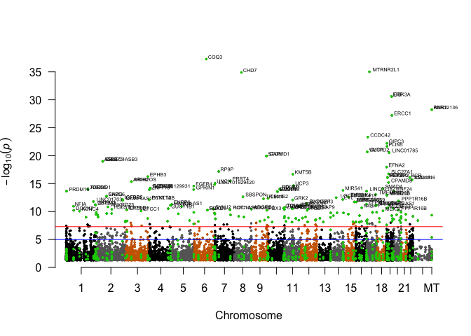<!-- -->

```r
#Make PDF
pdf(file = paste0("../2_Output/", ANALYSIS, "/", ANALYSIS, "_Manhattan.pdf"), height=3, width=5)
manhattan(man_data, chr = "CHR", bp = "BP", p = "P", snp = "SNP",
      col = c("black","#666666","#CC6600"), chrlabs = c(1:22, "X", "MT"),
      suggestiveline = -log10(1e-8), genomewideline = -log10(5e-10),
      logp = TRUE, annotatePval = 1e-08, annotateTop = F, cex=0.5)
dev.off()
```

```
## quartz_off_screen 
##                 2
```

##Volcano Plot


```r
# Load packages
library(dplyr)
library(ggplot2)
library(ggrepel)
library(openxlsx)
# Read data from the web
results<-DiffMeth_Annotated.tiles_p05
results <- results %>% dplyr::select(annot.symbol,pvalue, meth.diff) %>% mutate(minuslogpvalue=-log10(pvalue))
results$sig<-ifelse(results$pvalue<0.05 & abs(results$meth.diff)>5, "P < 0.05 and |Methylation| > 5%", "Not Sig")
max(results$minuslogpvalue, na.rm = TRUE)
```

```
## [1] 37.28479
```

```r
#plot the ggplot
p = ggplot(results, aes(meth.diff, minuslogpvalue)) + theme(panel.background = element_rect("white", colour = "black", size=2), panel.grid.major = element_line(colour = "gray50", size=.75), panel.grid.minor = element_line(colour = "gray50", size=0.4)) + 
geom_point(aes(fill=sig), colour="black", shape=21) + labs(x=expression(Methylation_percent), y=expression(-Log[10](P-value))) + xlim(-100,100)+ ylim(-0, max(40, na.rm = TRUE)) + geom_hline(yintercept = 0, size = 1) + geom_vline(xintercept=0, size=1)+ 
scale_fill_manual(values=c("black", "tomato"))
#add a repelling effect to the text labels.
p+geom_text_repel(data=filter(results, minuslogpvalue>10 & abs(meth.diff)>25 | minuslogpvalue>7 & abs(meth.diff)>25), aes(label=annot.symbol))
```

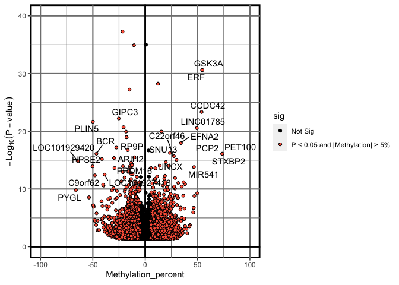<!-- -->

```r
pdf(file = paste0("../2_Output/", ANALYSIS, "/", ANALYSIS, "Volcano.Plot.pdf"))
p+geom_text_repel(data=filter(results, minuslogpvalue>10 & abs(meth.diff)>25 | minuslogpvalue>7 & abs(meth.diff)>25), aes(label=annot.symbol))
dev.off()
```

```
## quartz_off_screen 
##                 2
```


#Methylation Distribution using **EnrichedHeatmap**


```r
#Import the genomic annotation file
library(EnrichedHeatmap)
library(annotatr)
library(TxDb.Hsapiens.UCSC.hg38.knownGene)
annots = c("hg38_basicgenes", "hg38_genes_promoters", "hg38_genes_intergenic",
           "hg38_genes_intronexonboundaries", "hg38_cpgs", "hg38_cpg_islands", "hg38_cpg_shores", "hg38_cpg_shelves", "hg38_cpg_inter")
annotations=build_annotations(genome = "hg38", annotations = annots)
annotations<-keepStandardChromosomes(annotations, pruning.mode = "coarse") #Remove nonstandard chromosomes

myDiff.tiles_p05<-dplyr::mutate(myDiff.tiles_p05, absolute.meth=abs(meth.diff))
myDiff.tiles_p05<-as(myDiff.tiles_p05, "GRanges")

# #Import the annotated "target" data
# myDiff<-openxlsx::read.xlsx(paste0("../2_Input/WGBS_MethylKit_DiffMeth", ANALYSIS,".xlsx"), sheet = "P_0.05")
# myDiff_GR<-as(myDiff, "GRanges")

#Annotate GRanges using hg38 genome
dm_annotated = annotate_regions(
  regions = myDiff.tiles_p05,
  annotations = annotations,
  ignore.strand = TRUE)
#create data.frame
df_dm_annotated <- as.data.frame(dm_annotated)
#
library(GenomicFeatures)
genes<-genes(TxDb.Hsapiens.UCSC.hg38.knownGene)
tss = promoters(genes, upstream = 0, downstream = 1)
mat1 = normalizeToMatrix(myDiff.tiles_p05, tss, value_column = "absolute.meth", extend = 5000, mean_mode="w0", w=50, keep = c(0, 0.99))
EnrichedHeatmap(mat1, col = c("white", "black"), name = ANALYSIS)
# 
# png(file = paste0("../2_Output/2_Methyl/", ANALYSIS, "/","_1Methyl.Gene.Distribution.png"), height = 3, width = 5)
# EnrichedHeatmap(mat1, col = c("white", "black"), name = "Heart Failure")
# dev.off()

partition = kmeans(mat1, centers = 3)$cluster
lgd = Legend(at = c("cluster1", "cluster2", "cluster3"), title = "Clusters", 
    type = "lines", legend_gp = gpar(col = 2:4))
ht_list = Heatmap(partition, col = structure(2:4, names = as.character(1:3)), name = "partition",
              show_row_names = FALSE, width = unit(3, "mm")) + EnrichedHeatmap(mat1, col = c("white", "red"), name = "|PercentMethylation|", split = partition, top_annotation = HeatmapAnnotation(lines = anno_enriched(gp = gpar(col = 2:4))), column_title = "|PercentMethylation|")
draw(ht_list, main_heatmap = "|PercentMethylation|")

partition = kmeans(mat1, centers = 2)$cluster
lgd = Legend(at = c("cluster1", "cluster2"), title = "Clusters", 
    type = "lines", legend_gp = gpar(col = 2:3))
ht_list = Heatmap(partition, col = structure(2:3, names = as.character(1:2)), name = "partition",
              show_row_names = FALSE, width = unit(3, "mm")) + EnrichedHeatmap(mat1, col = c("white", "red"), name = "|PercentMethylation|", split = partition, top_annotation = HeatmapAnnotation(lines = anno_enriched(gp = gpar(col = 2:3))), column_title = "|PercentMethylation|")
pdf(file = paste0("../2_Output/2_Methyl/", ANALYSIS, "/", ANALYSIS, "_Methyl.Gene.Distribution_Kmeans.pdf"), height = 7, width = 5)
draw(ht_list, main_heatmap = "|PercentMethylation|")
dev.off()
```

```
## quartz_off_screen 
##                 2
```


```r
# library
library(ggridges)
library(ggplot2)
DMPs<-DiffMeth_Annotated.tiles_p05
colData<-Index.subset 
GENE="GSK3A"
Gene_DMP<-dplyr::filter(DMPs, annot.symbol %in% GENE)
Gene_DMP<-dplyr::select(Gene_DMP, chr,start, end, annot.symbol, contains("perc.mC"))
colnames(Gene_DMP)<-gsub("perc.mC_", "", colnames(Gene_DMP))
gathered<-tidyr::gather(Gene_DMP, "Sample", "Methylation", 8:length(colnames(Gene_DMP)))
gathered_annot<-merge(colData, gathered, by.x = "Sample.ID", by.y = "Sample")
gathered_annot$Methylation<-as.numeric(as.character(gathered_annot$Methylation))
gathered_annot$Group<-factor(gathered_annot$Group, levels = c("CON", "PRE", "HIGH"))
# basic example
pdf(file=paste0("../2_Output/", ANALYSIS, "/", ANALYSIS, "_", GENE, "_Methylation_gene.distribution.pdf"))
ggplot(gathered_annot, aes(x=start, y=Methylation, group = Sample.ID, color=Group))+theme_bw()+geom_line(size=1)+geom_point(size = 2, alpha = .6)+ggtitle(paste0("Methylation Distribution - ", GENE))
dev.off()
```

```
## quartz_off_screen 
##                 2
```

```r
ggplot(gathered_annot, aes(x=start, y=Methylation, group = Sample.ID, color=Group))+theme_bw()+geom_line(size=1)+geom_point(size = 2, alpha = .6)+ggtitle(paste0("Methylation Distribution - ", GENE))
```

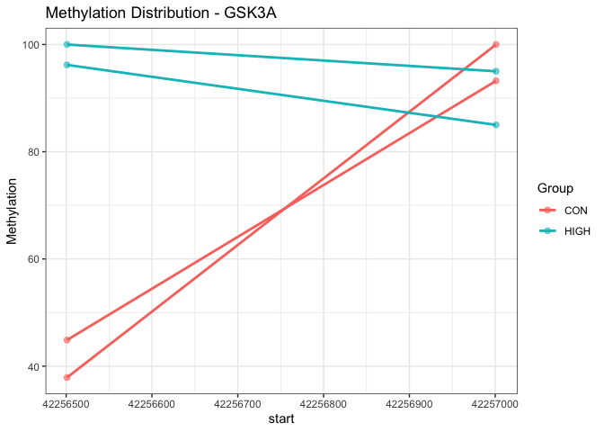<!-- -->


# Supplemental Table: R Session Information

All packages and setting are acquired using the following command: 

```r
sinfo<-devtools::session_info()
sinfo$platform
```

```
##  setting  value                       
##  version  R version 4.0.3 (2020-10-10)
##  os       macOS Big Sur 10.16         
##  system   x86_64, darwin17.0          
##  ui       X11                         
##  language (EN)                        
##  collate  en_US.UTF-8                 
##  ctype    en_US.UTF-8                 
##  tz       Europe/Berlin               
##  date     2021-01-21
```

```r
sinfo$packages %>% kable( 
                         align="c", 
                         longtable=T, 
                         booktabs=T,
                         caption="Packages and Required Dependencies") %>% 
    kable_styling(latex_options=c("striped", "repeat_header", "condensed"))
```

<table class="table" style="margin-left: auto; margin-right: auto;">
<caption>Packages and Required Dependencies</caption>
 <thead>
  <tr>
   <th style="text-align:left;">   </th>
   <th style="text-align:center;"> package </th>
   <th style="text-align:center;"> ondiskversion </th>
   <th style="text-align:center;"> loadedversion </th>
   <th style="text-align:center;"> path </th>
   <th style="text-align:center;"> loadedpath </th>
   <th style="text-align:center;"> attached </th>
   <th style="text-align:center;"> is_base </th>
   <th style="text-align:center;"> date </th>
   <th style="text-align:center;"> source </th>
   <th style="text-align:center;"> md5ok </th>
   <th style="text-align:center;"> library </th>
  </tr>
 </thead>
<tbody>
  <tr>
   <td style="text-align:left;"> AnnotationDbi </td>
   <td style="text-align:center;"> AnnotationDbi </td>
   <td style="text-align:center;"> 1.52.0 </td>
   <td style="text-align:center;"> 1.52.0 </td>
   <td style="text-align:center;"> /Library/Frameworks/R.framework/Versions/4.0/Resources/library/AnnotationDbi </td>
   <td style="text-align:center;"> /Library/Frameworks/R.framework/Versions/4.0/Resources/library/AnnotationDbi </td>
   <td style="text-align:center;"> TRUE </td>
   <td style="text-align:center;"> FALSE </td>
   <td style="text-align:center;"> 2020-10-27 </td>
   <td style="text-align:center;"> Bioconductor </td>
   <td style="text-align:center;">  </td>
   <td style="text-align:center;"> /Library/Frameworks/R.framework/Versions/4.0/Resources/library </td>
  </tr>
  <tr>
   <td style="text-align:left;"> AnnotationHub </td>
   <td style="text-align:center;"> AnnotationHub </td>
   <td style="text-align:center;"> 2.22.0 </td>
   <td style="text-align:center;"> 2.22.0 </td>
   <td style="text-align:center;"> /Library/Frameworks/R.framework/Versions/4.0/Resources/library/AnnotationHub </td>
   <td style="text-align:center;"> /Library/Frameworks/R.framework/Versions/4.0/Resources/library/AnnotationHub </td>
   <td style="text-align:center;"> TRUE </td>
   <td style="text-align:center;"> FALSE </td>
   <td style="text-align:center;"> 2020-10-27 </td>
   <td style="text-align:center;"> Bioconductor </td>
   <td style="text-align:center;">  </td>
   <td style="text-align:center;"> /Library/Frameworks/R.framework/Versions/4.0/Resources/library </td>
  </tr>
  <tr>
   <td style="text-align:left;"> annotatr </td>
   <td style="text-align:center;"> annotatr </td>
   <td style="text-align:center;"> 1.16.0 </td>
   <td style="text-align:center;"> 1.16.0 </td>
   <td style="text-align:center;"> /Library/Frameworks/R.framework/Versions/4.0/Resources/library/annotatr </td>
   <td style="text-align:center;"> /Library/Frameworks/R.framework/Versions/4.0/Resources/library/annotatr </td>
   <td style="text-align:center;"> TRUE </td>
   <td style="text-align:center;"> FALSE </td>
   <td style="text-align:center;"> 2020-10-27 </td>
   <td style="text-align:center;"> Bioconductor </td>
   <td style="text-align:center;">  </td>
   <td style="text-align:center;"> /Library/Frameworks/R.framework/Versions/4.0/Resources/library </td>
  </tr>
  <tr>
   <td style="text-align:left;"> askpass </td>
   <td style="text-align:center;"> askpass </td>
   <td style="text-align:center;"> 1.1 </td>
   <td style="text-align:center;"> 1.1 </td>
   <td style="text-align:center;"> /Library/Frameworks/R.framework/Versions/4.0/Resources/library/askpass </td>
   <td style="text-align:center;"> /Library/Frameworks/R.framework/Versions/4.0/Resources/library/askpass </td>
   <td style="text-align:center;"> FALSE </td>
   <td style="text-align:center;"> FALSE </td>
   <td style="text-align:center;"> 2019-01-13 </td>
   <td style="text-align:center;"> CRAN (R 4.0.0) </td>
   <td style="text-align:center;">  </td>
   <td style="text-align:center;"> /Library/Frameworks/R.framework/Versions/4.0/Resources/library </td>
  </tr>
  <tr>
   <td style="text-align:left;"> assertthat </td>
   <td style="text-align:center;"> assertthat </td>
   <td style="text-align:center;"> 0.2.1 </td>
   <td style="text-align:center;"> 0.2.1 </td>
   <td style="text-align:center;"> /Library/Frameworks/R.framework/Versions/4.0/Resources/library/assertthat </td>
   <td style="text-align:center;"> /Library/Frameworks/R.framework/Versions/4.0/Resources/library/assertthat </td>
   <td style="text-align:center;"> FALSE </td>
   <td style="text-align:center;"> FALSE </td>
   <td style="text-align:center;"> 2019-03-21 </td>
   <td style="text-align:center;"> CRAN (R 4.0.0) </td>
   <td style="text-align:center;">  </td>
   <td style="text-align:center;"> /Library/Frameworks/R.framework/Versions/4.0/Resources/library </td>
  </tr>
  <tr>
   <td style="text-align:left;"> bbmle </td>
   <td style="text-align:center;"> bbmle </td>
   <td style="text-align:center;"> 1.0.23.1 </td>
   <td style="text-align:center;"> 1.0.23.1 </td>
   <td style="text-align:center;"> /Library/Frameworks/R.framework/Versions/4.0/Resources/library/bbmle </td>
   <td style="text-align:center;"> /Library/Frameworks/R.framework/Versions/4.0/Resources/library/bbmle </td>
   <td style="text-align:center;"> FALSE </td>
   <td style="text-align:center;"> FALSE </td>
   <td style="text-align:center;"> 2020-02-03 </td>
   <td style="text-align:center;"> CRAN (R 4.0.0) </td>
   <td style="text-align:center;">  </td>
   <td style="text-align:center;"> /Library/Frameworks/R.framework/Versions/4.0/Resources/library </td>
  </tr>
  <tr>
   <td style="text-align:left;"> bdsmatrix </td>
   <td style="text-align:center;"> bdsmatrix </td>
   <td style="text-align:center;"> 1.3.4 </td>
   <td style="text-align:center;"> 1.3-4 </td>
   <td style="text-align:center;"> /Library/Frameworks/R.framework/Versions/4.0/Resources/library/bdsmatrix </td>
   <td style="text-align:center;"> /Library/Frameworks/R.framework/Versions/4.0/Resources/library/bdsmatrix </td>
   <td style="text-align:center;"> FALSE </td>
   <td style="text-align:center;"> FALSE </td>
   <td style="text-align:center;"> 2020-01-13 </td>
   <td style="text-align:center;"> CRAN (R 4.0.0) </td>
   <td style="text-align:center;">  </td>
   <td style="text-align:center;"> /Library/Frameworks/R.framework/Versions/4.0/Resources/library </td>
  </tr>
  <tr>
   <td style="text-align:left;"> Biobase </td>
   <td style="text-align:center;"> Biobase </td>
   <td style="text-align:center;"> 2.50.0 </td>
   <td style="text-align:center;"> 2.50.0 </td>
   <td style="text-align:center;"> /Library/Frameworks/R.framework/Versions/4.0/Resources/library/Biobase </td>
   <td style="text-align:center;"> /Library/Frameworks/R.framework/Versions/4.0/Resources/library/Biobase </td>
   <td style="text-align:center;"> TRUE </td>
   <td style="text-align:center;"> FALSE </td>
   <td style="text-align:center;"> 2020-10-27 </td>
   <td style="text-align:center;"> Bioconductor </td>
   <td style="text-align:center;">  </td>
   <td style="text-align:center;"> /Library/Frameworks/R.framework/Versions/4.0/Resources/library </td>
  </tr>
  <tr>
   <td style="text-align:left;"> BiocFileCache </td>
   <td style="text-align:center;"> BiocFileCache </td>
   <td style="text-align:center;"> 1.14.0 </td>
   <td style="text-align:center;"> 1.14.0 </td>
   <td style="text-align:center;"> /Library/Frameworks/R.framework/Versions/4.0/Resources/library/BiocFileCache </td>
   <td style="text-align:center;"> /Library/Frameworks/R.framework/Versions/4.0/Resources/library/BiocFileCache </td>
   <td style="text-align:center;"> TRUE </td>
   <td style="text-align:center;"> FALSE </td>
   <td style="text-align:center;"> 2020-10-27 </td>
   <td style="text-align:center;"> Bioconductor </td>
   <td style="text-align:center;">  </td>
   <td style="text-align:center;"> /Library/Frameworks/R.framework/Versions/4.0/Resources/library </td>
  </tr>
  <tr>
   <td style="text-align:left;"> BiocGenerics </td>
   <td style="text-align:center;"> BiocGenerics </td>
   <td style="text-align:center;"> 0.36.0 </td>
   <td style="text-align:center;"> 0.36.0 </td>
   <td style="text-align:center;"> /Library/Frameworks/R.framework/Versions/4.0/Resources/library/BiocGenerics </td>
   <td style="text-align:center;"> /Library/Frameworks/R.framework/Versions/4.0/Resources/library/BiocGenerics </td>
   <td style="text-align:center;"> TRUE </td>
   <td style="text-align:center;"> FALSE </td>
   <td style="text-align:center;"> 2020-10-27 </td>
   <td style="text-align:center;"> Bioconductor </td>
   <td style="text-align:center;">  </td>
   <td style="text-align:center;"> /Library/Frameworks/R.framework/Versions/4.0/Resources/library </td>
  </tr>
  <tr>
   <td style="text-align:left;"> BiocManager </td>
   <td style="text-align:center;"> BiocManager </td>
   <td style="text-align:center;"> 1.30.10 </td>
   <td style="text-align:center;"> 1.30.10 </td>
   <td style="text-align:center;"> /Library/Frameworks/R.framework/Versions/4.0/Resources/library/BiocManager </td>
   <td style="text-align:center;"> /Library/Frameworks/R.framework/Versions/4.0/Resources/library/BiocManager </td>
   <td style="text-align:center;"> FALSE </td>
   <td style="text-align:center;"> FALSE </td>
   <td style="text-align:center;"> 2019-11-16 </td>
   <td style="text-align:center;"> CRAN (R 4.0.0) </td>
   <td style="text-align:center;">  </td>
   <td style="text-align:center;"> /Library/Frameworks/R.framework/Versions/4.0/Resources/library </td>
  </tr>
  <tr>
   <td style="text-align:left;"> BiocParallel </td>
   <td style="text-align:center;"> BiocParallel </td>
   <td style="text-align:center;"> 1.24.1 </td>
   <td style="text-align:center;"> 1.24.1 </td>
   <td style="text-align:center;"> /Library/Frameworks/R.framework/Versions/4.0/Resources/library/BiocParallel </td>
   <td style="text-align:center;"> /Library/Frameworks/R.framework/Versions/4.0/Resources/library/BiocParallel </td>
   <td style="text-align:center;"> FALSE </td>
   <td style="text-align:center;"> FALSE </td>
   <td style="text-align:center;"> 2020-11-06 </td>
   <td style="text-align:center;"> Bioconductor </td>
   <td style="text-align:center;">  </td>
   <td style="text-align:center;"> /Library/Frameworks/R.framework/Versions/4.0/Resources/library </td>
  </tr>
  <tr>
   <td style="text-align:left;"> BiocVersion </td>
   <td style="text-align:center;"> BiocVersion </td>
   <td style="text-align:center;"> 3.12.0 </td>
   <td style="text-align:center;"> 3.12.0 </td>
   <td style="text-align:center;"> /Library/Frameworks/R.framework/Versions/4.0/Resources/library/BiocVersion </td>
   <td style="text-align:center;"> /Library/Frameworks/R.framework/Versions/4.0/Resources/library/BiocVersion </td>
   <td style="text-align:center;"> FALSE </td>
   <td style="text-align:center;"> FALSE </td>
   <td style="text-align:center;"> 2020-05-14 </td>
   <td style="text-align:center;"> Bioconductor </td>
   <td style="text-align:center;">  </td>
   <td style="text-align:center;"> /Library/Frameworks/R.framework/Versions/4.0/Resources/library </td>
  </tr>
  <tr>
   <td style="text-align:left;"> biomaRt </td>
   <td style="text-align:center;"> biomaRt </td>
   <td style="text-align:center;"> 2.46.0 </td>
   <td style="text-align:center;"> 2.46.0 </td>
   <td style="text-align:center;"> /Library/Frameworks/R.framework/Versions/4.0/Resources/library/biomaRt </td>
   <td style="text-align:center;"> /Library/Frameworks/R.framework/Versions/4.0/Resources/library/biomaRt </td>
   <td style="text-align:center;"> FALSE </td>
   <td style="text-align:center;"> FALSE </td>
   <td style="text-align:center;"> 2020-10-27 </td>
   <td style="text-align:center;"> Bioconductor </td>
   <td style="text-align:center;">  </td>
   <td style="text-align:center;"> /Library/Frameworks/R.framework/Versions/4.0/Resources/library </td>
  </tr>
  <tr>
   <td style="text-align:left;"> Biostrings </td>
   <td style="text-align:center;"> Biostrings </td>
   <td style="text-align:center;"> 2.58.0 </td>
   <td style="text-align:center;"> 2.58.0 </td>
   <td style="text-align:center;"> /Library/Frameworks/R.framework/Versions/4.0/Resources/library/Biostrings </td>
   <td style="text-align:center;"> /Library/Frameworks/R.framework/Versions/4.0/Resources/library/Biostrings </td>
   <td style="text-align:center;"> FALSE </td>
   <td style="text-align:center;"> FALSE </td>
   <td style="text-align:center;"> 2020-10-27 </td>
   <td style="text-align:center;"> Bioconductor </td>
   <td style="text-align:center;">  </td>
   <td style="text-align:center;"> /Library/Frameworks/R.framework/Versions/4.0/Resources/library </td>
  </tr>
  <tr>
   <td style="text-align:left;"> bit </td>
   <td style="text-align:center;"> bit </td>
   <td style="text-align:center;"> 4.0.4 </td>
   <td style="text-align:center;"> 4.0.4 </td>
   <td style="text-align:center;"> /Library/Frameworks/R.framework/Versions/4.0/Resources/library/bit </td>
   <td style="text-align:center;"> /Library/Frameworks/R.framework/Versions/4.0/Resources/library/bit </td>
   <td style="text-align:center;"> FALSE </td>
   <td style="text-align:center;"> FALSE </td>
   <td style="text-align:center;"> 2020-08-04 </td>
   <td style="text-align:center;"> CRAN (R 4.0.2) </td>
   <td style="text-align:center;">  </td>
   <td style="text-align:center;"> /Library/Frameworks/R.framework/Versions/4.0/Resources/library </td>
  </tr>
  <tr>
   <td style="text-align:left;"> bit64 </td>
   <td style="text-align:center;"> bit64 </td>
   <td style="text-align:center;"> 4.0.5 </td>
   <td style="text-align:center;"> 4.0.5 </td>
   <td style="text-align:center;"> /Library/Frameworks/R.framework/Versions/4.0/Resources/library/bit64 </td>
   <td style="text-align:center;"> /Library/Frameworks/R.framework/Versions/4.0/Resources/library/bit64 </td>
   <td style="text-align:center;"> FALSE </td>
   <td style="text-align:center;"> FALSE </td>
   <td style="text-align:center;"> 2020-08-30 </td>
   <td style="text-align:center;"> CRAN (R 4.0.2) </td>
   <td style="text-align:center;">  </td>
   <td style="text-align:center;"> /Library/Frameworks/R.framework/Versions/4.0/Resources/library </td>
  </tr>
  <tr>
   <td style="text-align:left;"> bitops </td>
   <td style="text-align:center;"> bitops </td>
   <td style="text-align:center;"> 1.0.6 </td>
   <td style="text-align:center;"> 1.0-6 </td>
   <td style="text-align:center;"> /Library/Frameworks/R.framework/Versions/4.0/Resources/library/bitops </td>
   <td style="text-align:center;"> /Library/Frameworks/R.framework/Versions/4.0/Resources/library/bitops </td>
   <td style="text-align:center;"> FALSE </td>
   <td style="text-align:center;"> FALSE </td>
   <td style="text-align:center;"> 2013-08-17 </td>
   <td style="text-align:center;"> CRAN (R 4.0.0) </td>
   <td style="text-align:center;">  </td>
   <td style="text-align:center;"> /Library/Frameworks/R.framework/Versions/4.0/Resources/library </td>
  </tr>
  <tr>
   <td style="text-align:left;"> blob </td>
   <td style="text-align:center;"> blob </td>
   <td style="text-align:center;"> 1.2.1 </td>
   <td style="text-align:center;"> 1.2.1 </td>
   <td style="text-align:center;"> /Library/Frameworks/R.framework/Versions/4.0/Resources/library/blob </td>
   <td style="text-align:center;"> /Library/Frameworks/R.framework/Versions/4.0/Resources/library/blob </td>
   <td style="text-align:center;"> FALSE </td>
   <td style="text-align:center;"> FALSE </td>
   <td style="text-align:center;"> 2020-01-20 </td>
   <td style="text-align:center;"> CRAN (R 4.0.0) </td>
   <td style="text-align:center;">  </td>
   <td style="text-align:center;"> /Library/Frameworks/R.framework/Versions/4.0/Resources/library </td>
  </tr>
  <tr>
   <td style="text-align:left;"> BSgenome </td>
   <td style="text-align:center;"> BSgenome </td>
   <td style="text-align:center;"> 1.58.0 </td>
   <td style="text-align:center;"> 1.58.0 </td>
   <td style="text-align:center;"> /Library/Frameworks/R.framework/Versions/4.0/Resources/library/BSgenome </td>
   <td style="text-align:center;"> /Library/Frameworks/R.framework/Versions/4.0/Resources/library/BSgenome </td>
   <td style="text-align:center;"> FALSE </td>
   <td style="text-align:center;"> FALSE </td>
   <td style="text-align:center;"> 2020-10-27 </td>
   <td style="text-align:center;"> Bioconductor </td>
   <td style="text-align:center;">  </td>
   <td style="text-align:center;"> /Library/Frameworks/R.framework/Versions/4.0/Resources/library </td>
  </tr>
  <tr>
   <td style="text-align:left;"> Cairo </td>
   <td style="text-align:center;"> Cairo </td>
   <td style="text-align:center;"> 1.5.12.2 </td>
   <td style="text-align:center;"> 1.5-12.2 </td>
   <td style="text-align:center;"> /Library/Frameworks/R.framework/Versions/4.0/Resources/library/Cairo </td>
   <td style="text-align:center;"> /Library/Frameworks/R.framework/Versions/4.0/Resources/library/Cairo </td>
   <td style="text-align:center;"> FALSE </td>
   <td style="text-align:center;"> FALSE </td>
   <td style="text-align:center;"> 2020-07-07 </td>
   <td style="text-align:center;"> CRAN (R 4.0.2) </td>
   <td style="text-align:center;">  </td>
   <td style="text-align:center;"> /Library/Frameworks/R.framework/Versions/4.0/Resources/library </td>
  </tr>
  <tr>
   <td style="text-align:left;"> calibrate </td>
   <td style="text-align:center;"> calibrate </td>
   <td style="text-align:center;"> 1.7.7 </td>
   <td style="text-align:center;"> 1.7.7 </td>
   <td style="text-align:center;"> /Library/Frameworks/R.framework/Versions/4.0/Resources/library/calibrate </td>
   <td style="text-align:center;"> /Library/Frameworks/R.framework/Versions/4.0/Resources/library/calibrate </td>
   <td style="text-align:center;"> FALSE </td>
   <td style="text-align:center;"> FALSE </td>
   <td style="text-align:center;"> 2020-06-19 </td>
   <td style="text-align:center;"> CRAN (R 4.0.2) </td>
   <td style="text-align:center;">  </td>
   <td style="text-align:center;"> /Library/Frameworks/R.framework/Versions/4.0/Resources/library </td>
  </tr>
  <tr>
   <td style="text-align:left;"> callr </td>
   <td style="text-align:center;"> callr </td>
   <td style="text-align:center;"> 3.5.1 </td>
   <td style="text-align:center;"> 3.5.1 </td>
   <td style="text-align:center;"> /Library/Frameworks/R.framework/Versions/4.0/Resources/library/callr </td>
   <td style="text-align:center;"> /Library/Frameworks/R.framework/Versions/4.0/Resources/library/callr </td>
   <td style="text-align:center;"> FALSE </td>
   <td style="text-align:center;"> FALSE </td>
   <td style="text-align:center;"> 2020-10-13 </td>
   <td style="text-align:center;"> CRAN (R 4.0.2) </td>
   <td style="text-align:center;">  </td>
   <td style="text-align:center;"> /Library/Frameworks/R.framework/Versions/4.0/Resources/library </td>
  </tr>
  <tr>
   <td style="text-align:left;"> circlize </td>
   <td style="text-align:center;"> circlize </td>
   <td style="text-align:center;"> 0.4.12 </td>
   <td style="text-align:center;"> 0.4.12 </td>
   <td style="text-align:center;"> /Library/Frameworks/R.framework/Versions/4.0/Resources/library/circlize </td>
   <td style="text-align:center;"> /Library/Frameworks/R.framework/Versions/4.0/Resources/library/circlize </td>
   <td style="text-align:center;"> TRUE </td>
   <td style="text-align:center;"> FALSE </td>
   <td style="text-align:center;"> 2021-01-08 </td>
   <td style="text-align:center;"> CRAN (R 4.0.2) </td>
   <td style="text-align:center;">  </td>
   <td style="text-align:center;"> /Library/Frameworks/R.framework/Versions/4.0/Resources/library </td>
  </tr>
  <tr>
   <td style="text-align:left;"> cli </td>
   <td style="text-align:center;"> cli </td>
   <td style="text-align:center;"> 2.2.0 </td>
   <td style="text-align:center;"> 2.2.0 </td>
   <td style="text-align:center;"> /Library/Frameworks/R.framework/Versions/4.0/Resources/library/cli </td>
   <td style="text-align:center;"> /Library/Frameworks/R.framework/Versions/4.0/Resources/library/cli </td>
   <td style="text-align:center;"> FALSE </td>
   <td style="text-align:center;"> FALSE </td>
   <td style="text-align:center;"> 2020-11-20 </td>
   <td style="text-align:center;"> CRAN (R 4.0.2) </td>
   <td style="text-align:center;">  </td>
   <td style="text-align:center;"> /Library/Frameworks/R.framework/Versions/4.0/Resources/library </td>
  </tr>
  <tr>
   <td style="text-align:left;"> clue </td>
   <td style="text-align:center;"> clue </td>
   <td style="text-align:center;"> 0.3.58 </td>
   <td style="text-align:center;"> 0.3-58 </td>
   <td style="text-align:center;"> /Library/Frameworks/R.framework/Versions/4.0/Resources/library/clue </td>
   <td style="text-align:center;"> /Library/Frameworks/R.framework/Versions/4.0/Resources/library/clue </td>
   <td style="text-align:center;"> FALSE </td>
   <td style="text-align:center;"> FALSE </td>
   <td style="text-align:center;"> 2020-12-03 </td>
   <td style="text-align:center;"> CRAN (R 4.0.2) </td>
   <td style="text-align:center;">  </td>
   <td style="text-align:center;"> /Library/Frameworks/R.framework/Versions/4.0/Resources/library </td>
  </tr>
  <tr>
   <td style="text-align:left;"> cluster </td>
   <td style="text-align:center;"> cluster </td>
   <td style="text-align:center;"> 2.1.0 </td>
   <td style="text-align:center;"> 2.1.0 </td>
   <td style="text-align:center;"> /Library/Frameworks/R.framework/Versions/4.0/Resources/library/cluster </td>
   <td style="text-align:center;"> /Library/Frameworks/R.framework/Versions/4.0/Resources/library/cluster </td>
   <td style="text-align:center;"> FALSE </td>
   <td style="text-align:center;"> FALSE </td>
   <td style="text-align:center;"> 2019-06-19 </td>
   <td style="text-align:center;"> CRAN (R 4.0.3) </td>
   <td style="text-align:center;">  </td>
   <td style="text-align:center;"> /Library/Frameworks/R.framework/Versions/4.0/Resources/library </td>
  </tr>
  <tr>
   <td style="text-align:left;"> coda </td>
   <td style="text-align:center;"> coda </td>
   <td style="text-align:center;"> 0.19.4 </td>
   <td style="text-align:center;"> 0.19-4 </td>
   <td style="text-align:center;"> /Library/Frameworks/R.framework/Versions/4.0/Resources/library/coda </td>
   <td style="text-align:center;"> /Library/Frameworks/R.framework/Versions/4.0/Resources/library/coda </td>
   <td style="text-align:center;"> FALSE </td>
   <td style="text-align:center;"> FALSE </td>
   <td style="text-align:center;"> 2020-09-30 </td>
   <td style="text-align:center;"> CRAN (R 4.0.2) </td>
   <td style="text-align:center;">  </td>
   <td style="text-align:center;"> /Library/Frameworks/R.framework/Versions/4.0/Resources/library </td>
  </tr>
  <tr>
   <td style="text-align:left;"> codetools </td>
   <td style="text-align:center;"> codetools </td>
   <td style="text-align:center;"> 0.2.18 </td>
   <td style="text-align:center;"> 0.2-18 </td>
   <td style="text-align:center;"> /Library/Frameworks/R.framework/Versions/4.0/Resources/library/codetools </td>
   <td style="text-align:center;"> /Library/Frameworks/R.framework/Versions/4.0/Resources/library/codetools </td>
   <td style="text-align:center;"> FALSE </td>
   <td style="text-align:center;"> FALSE </td>
   <td style="text-align:center;"> 2020-11-04 </td>
   <td style="text-align:center;"> CRAN (R 4.0.2) </td>
   <td style="text-align:center;">  </td>
   <td style="text-align:center;"> /Library/Frameworks/R.framework/Versions/4.0/Resources/library </td>
  </tr>
  <tr>
   <td style="text-align:left;"> colorspace </td>
   <td style="text-align:center;"> colorspace </td>
   <td style="text-align:center;"> 2.0.0 </td>
   <td style="text-align:center;"> 2.0-0 </td>
   <td style="text-align:center;"> /Library/Frameworks/R.framework/Versions/4.0/Resources/library/colorspace </td>
   <td style="text-align:center;"> /Library/Frameworks/R.framework/Versions/4.0/Resources/library/colorspace </td>
   <td style="text-align:center;"> FALSE </td>
   <td style="text-align:center;"> FALSE </td>
   <td style="text-align:center;"> 2020-11-11 </td>
   <td style="text-align:center;"> CRAN (R 4.0.3) </td>
   <td style="text-align:center;">  </td>
   <td style="text-align:center;"> /Library/Frameworks/R.framework/Versions/4.0/Resources/library </td>
  </tr>
  <tr>
   <td style="text-align:left;"> ComplexHeatmap </td>
   <td style="text-align:center;"> ComplexHeatmap </td>
   <td style="text-align:center;"> 2.6.2 </td>
   <td style="text-align:center;"> 2.6.2 </td>
   <td style="text-align:center;"> /Library/Frameworks/R.framework/Versions/4.0/Resources/library/ComplexHeatmap </td>
   <td style="text-align:center;"> /Library/Frameworks/R.framework/Versions/4.0/Resources/library/ComplexHeatmap </td>
   <td style="text-align:center;"> TRUE </td>
   <td style="text-align:center;"> FALSE </td>
   <td style="text-align:center;"> 2020-11-12 </td>
   <td style="text-align:center;"> Bioconductor </td>
   <td style="text-align:center;">  </td>
   <td style="text-align:center;"> /Library/Frameworks/R.framework/Versions/4.0/Resources/library </td>
  </tr>
  <tr>
   <td style="text-align:left;"> crayon </td>
   <td style="text-align:center;"> crayon </td>
   <td style="text-align:center;"> 1.3.4 </td>
   <td style="text-align:center;"> 1.3.4 </td>
   <td style="text-align:center;"> /Library/Frameworks/R.framework/Versions/4.0/Resources/library/crayon </td>
   <td style="text-align:center;"> /Library/Frameworks/R.framework/Versions/4.0/Resources/library/crayon </td>
   <td style="text-align:center;"> FALSE </td>
   <td style="text-align:center;"> FALSE </td>
   <td style="text-align:center;"> 2017-09-16 </td>
   <td style="text-align:center;"> CRAN (R 4.0.0) </td>
   <td style="text-align:center;">  </td>
   <td style="text-align:center;"> /Library/Frameworks/R.framework/Versions/4.0/Resources/library </td>
  </tr>
  <tr>
   <td style="text-align:left;"> curl </td>
   <td style="text-align:center;"> curl </td>
   <td style="text-align:center;"> 4.3 </td>
   <td style="text-align:center;"> 4.3 </td>
   <td style="text-align:center;"> /Library/Frameworks/R.framework/Versions/4.0/Resources/library/curl </td>
   <td style="text-align:center;"> /Library/Frameworks/R.framework/Versions/4.0/Resources/library/curl </td>
   <td style="text-align:center;"> FALSE </td>
   <td style="text-align:center;"> FALSE </td>
   <td style="text-align:center;"> 2019-12-02 </td>
   <td style="text-align:center;"> CRAN (R 4.0.0) </td>
   <td style="text-align:center;">  </td>
   <td style="text-align:center;"> /Library/Frameworks/R.framework/Versions/4.0/Resources/library </td>
  </tr>
  <tr>
   <td style="text-align:left;"> data.table </td>
   <td style="text-align:center;"> data.table </td>
   <td style="text-align:center;"> 1.13.6 </td>
   <td style="text-align:center;"> 1.13.6 </td>
   <td style="text-align:center;"> /Library/Frameworks/R.framework/Versions/4.0/Resources/library/data.table </td>
   <td style="text-align:center;"> /Library/Frameworks/R.framework/Versions/4.0/Resources/library/data.table </td>
   <td style="text-align:center;"> FALSE </td>
   <td style="text-align:center;"> FALSE </td>
   <td style="text-align:center;"> 2020-12-30 </td>
   <td style="text-align:center;"> CRAN (R 4.0.2) </td>
   <td style="text-align:center;">  </td>
   <td style="text-align:center;"> /Library/Frameworks/R.framework/Versions/4.0/Resources/library </td>
  </tr>
  <tr>
   <td style="text-align:left;"> DBI </td>
   <td style="text-align:center;"> DBI </td>
   <td style="text-align:center;"> 1.1.1 </td>
   <td style="text-align:center;"> 1.1.1 </td>
   <td style="text-align:center;"> /Library/Frameworks/R.framework/Versions/4.0/Resources/library/DBI </td>
   <td style="text-align:center;"> /Library/Frameworks/R.framework/Versions/4.0/Resources/library/DBI </td>
   <td style="text-align:center;"> FALSE </td>
   <td style="text-align:center;"> FALSE </td>
   <td style="text-align:center;"> 2021-01-15 </td>
   <td style="text-align:center;"> CRAN (R 4.0.2) </td>
   <td style="text-align:center;">  </td>
   <td style="text-align:center;"> /Library/Frameworks/R.framework/Versions/4.0/Resources/library </td>
  </tr>
  <tr>
   <td style="text-align:left;"> dbplyr </td>
   <td style="text-align:center;"> dbplyr </td>
   <td style="text-align:center;"> 2.0.0 </td>
   <td style="text-align:center;"> 2.0.0 </td>
   <td style="text-align:center;"> /Library/Frameworks/R.framework/Versions/4.0/Resources/library/dbplyr </td>
   <td style="text-align:center;"> /Library/Frameworks/R.framework/Versions/4.0/Resources/library/dbplyr </td>
   <td style="text-align:center;"> TRUE </td>
   <td style="text-align:center;"> FALSE </td>
   <td style="text-align:center;"> 2020-11-03 </td>
   <td style="text-align:center;"> CRAN (R 4.0.2) </td>
   <td style="text-align:center;">  </td>
   <td style="text-align:center;"> /Library/Frameworks/R.framework/Versions/4.0/Resources/library </td>
  </tr>
  <tr>
   <td style="text-align:left;"> DelayedArray </td>
   <td style="text-align:center;"> DelayedArray </td>
   <td style="text-align:center;"> 0.16.0 </td>
   <td style="text-align:center;"> 0.16.0 </td>
   <td style="text-align:center;"> /Library/Frameworks/R.framework/Versions/4.0/Resources/library/DelayedArray </td>
   <td style="text-align:center;"> /Library/Frameworks/R.framework/Versions/4.0/Resources/library/DelayedArray </td>
   <td style="text-align:center;"> FALSE </td>
   <td style="text-align:center;"> FALSE </td>
   <td style="text-align:center;"> 2020-10-27 </td>
   <td style="text-align:center;"> Bioconductor </td>
   <td style="text-align:center;">  </td>
   <td style="text-align:center;"> /Library/Frameworks/R.framework/Versions/4.0/Resources/library </td>
  </tr>
  <tr>
   <td style="text-align:left;"> desc </td>
   <td style="text-align:center;"> desc </td>
   <td style="text-align:center;"> 1.2.0 </td>
   <td style="text-align:center;"> 1.2.0 </td>
   <td style="text-align:center;"> /Library/Frameworks/R.framework/Versions/4.0/Resources/library/desc </td>
   <td style="text-align:center;"> /Library/Frameworks/R.framework/Versions/4.0/Resources/library/desc </td>
   <td style="text-align:center;"> FALSE </td>
   <td style="text-align:center;"> FALSE </td>
   <td style="text-align:center;"> 2018-05-01 </td>
   <td style="text-align:center;"> CRAN (R 4.0.0) </td>
   <td style="text-align:center;">  </td>
   <td style="text-align:center;"> /Library/Frameworks/R.framework/Versions/4.0/Resources/library </td>
  </tr>
  <tr>
   <td style="text-align:left;"> devtools </td>
   <td style="text-align:center;"> devtools </td>
   <td style="text-align:center;"> 2.3.2 </td>
   <td style="text-align:center;"> 2.3.2 </td>
   <td style="text-align:center;"> /Library/Frameworks/R.framework/Versions/4.0/Resources/library/devtools </td>
   <td style="text-align:center;"> /Library/Frameworks/R.framework/Versions/4.0/Resources/library/devtools </td>
   <td style="text-align:center;"> FALSE </td>
   <td style="text-align:center;"> FALSE </td>
   <td style="text-align:center;"> 2020-09-18 </td>
   <td style="text-align:center;"> CRAN (R 4.0.2) </td>
   <td style="text-align:center;">  </td>
   <td style="text-align:center;"> /Library/Frameworks/R.framework/Versions/4.0/Resources/library </td>
  </tr>
  <tr>
   <td style="text-align:left;"> digest </td>
   <td style="text-align:center;"> digest </td>
   <td style="text-align:center;"> 0.6.27 </td>
   <td style="text-align:center;"> 0.6.27 </td>
   <td style="text-align:center;"> /Library/Frameworks/R.framework/Versions/4.0/Resources/library/digest </td>
   <td style="text-align:center;"> /Library/Frameworks/R.framework/Versions/4.0/Resources/library/digest </td>
   <td style="text-align:center;"> FALSE </td>
   <td style="text-align:center;"> FALSE </td>
   <td style="text-align:center;"> 2020-10-24 </td>
   <td style="text-align:center;"> CRAN (R 4.0.2) </td>
   <td style="text-align:center;">  </td>
   <td style="text-align:center;"> /Library/Frameworks/R.framework/Versions/4.0/Resources/library </td>
  </tr>
  <tr>
   <td style="text-align:left;"> dplyr </td>
   <td style="text-align:center;"> dplyr </td>
   <td style="text-align:center;"> 1.0.3 </td>
   <td style="text-align:center;"> 1.0.3 </td>
   <td style="text-align:center;"> /Library/Frameworks/R.framework/Versions/4.0/Resources/library/dplyr </td>
   <td style="text-align:center;"> /Library/Frameworks/R.framework/Versions/4.0/Resources/library/dplyr </td>
   <td style="text-align:center;"> TRUE </td>
   <td style="text-align:center;"> FALSE </td>
   <td style="text-align:center;"> 2021-01-15 </td>
   <td style="text-align:center;"> CRAN (R 4.0.2) </td>
   <td style="text-align:center;">  </td>
   <td style="text-align:center;"> /Library/Frameworks/R.framework/Versions/4.0/Resources/library </td>
  </tr>
  <tr>
   <td style="text-align:left;"> ellipsis </td>
   <td style="text-align:center;"> ellipsis </td>
   <td style="text-align:center;"> 0.3.1 </td>
   <td style="text-align:center;"> 0.3.1 </td>
   <td style="text-align:center;"> /Library/Frameworks/R.framework/Versions/4.0/Resources/library/ellipsis </td>
   <td style="text-align:center;"> /Library/Frameworks/R.framework/Versions/4.0/Resources/library/ellipsis </td>
   <td style="text-align:center;"> FALSE </td>
   <td style="text-align:center;"> FALSE </td>
   <td style="text-align:center;"> 2020-05-15 </td>
   <td style="text-align:center;"> CRAN (R 4.0.0) </td>
   <td style="text-align:center;">  </td>
   <td style="text-align:center;"> /Library/Frameworks/R.framework/Versions/4.0/Resources/library </td>
  </tr>
  <tr>
   <td style="text-align:left;"> emdbook </td>
   <td style="text-align:center;"> emdbook </td>
   <td style="text-align:center;"> 1.3.12 </td>
   <td style="text-align:center;"> 1.3.12 </td>
   <td style="text-align:center;"> /Library/Frameworks/R.framework/Versions/4.0/Resources/library/emdbook </td>
   <td style="text-align:center;"> /Library/Frameworks/R.framework/Versions/4.0/Resources/library/emdbook </td>
   <td style="text-align:center;"> FALSE </td>
   <td style="text-align:center;"> FALSE </td>
   <td style="text-align:center;"> 2020-02-19 </td>
   <td style="text-align:center;"> CRAN (R 4.0.0) </td>
   <td style="text-align:center;">  </td>
   <td style="text-align:center;"> /Library/Frameworks/R.framework/Versions/4.0/Resources/library </td>
  </tr>
  <tr>
   <td style="text-align:left;"> EnrichedHeatmap </td>
   <td style="text-align:center;"> EnrichedHeatmap </td>
   <td style="text-align:center;"> 1.20.0 </td>
   <td style="text-align:center;"> 1.20.0 </td>
   <td style="text-align:center;"> /Library/Frameworks/R.framework/Versions/4.0/Resources/library/EnrichedHeatmap </td>
   <td style="text-align:center;"> /Library/Frameworks/R.framework/Versions/4.0/Resources/library/EnrichedHeatmap </td>
   <td style="text-align:center;"> TRUE </td>
   <td style="text-align:center;"> FALSE </td>
   <td style="text-align:center;"> 2020-10-27 </td>
   <td style="text-align:center;"> Bioconductor </td>
   <td style="text-align:center;">  </td>
   <td style="text-align:center;"> /Library/Frameworks/R.framework/Versions/4.0/Resources/library </td>
  </tr>
  <tr>
   <td style="text-align:left;"> evaluate </td>
   <td style="text-align:center;"> evaluate </td>
   <td style="text-align:center;"> 0.14 </td>
   <td style="text-align:center;"> 0.14 </td>
   <td style="text-align:center;"> /Library/Frameworks/R.framework/Versions/4.0/Resources/library/evaluate </td>
   <td style="text-align:center;"> /Library/Frameworks/R.framework/Versions/4.0/Resources/library/evaluate </td>
   <td style="text-align:center;"> FALSE </td>
   <td style="text-align:center;"> FALSE </td>
   <td style="text-align:center;"> 2019-05-28 </td>
   <td style="text-align:center;"> CRAN (R 4.0.0) </td>
   <td style="text-align:center;">  </td>
   <td style="text-align:center;"> /Library/Frameworks/R.framework/Versions/4.0/Resources/library </td>
  </tr>
  <tr>
   <td style="text-align:left;"> fansi </td>
   <td style="text-align:center;"> fansi </td>
   <td style="text-align:center;"> 0.4.2 </td>
   <td style="text-align:center;"> 0.4.2 </td>
   <td style="text-align:center;"> /Library/Frameworks/R.framework/Versions/4.0/Resources/library/fansi </td>
   <td style="text-align:center;"> /Library/Frameworks/R.framework/Versions/4.0/Resources/library/fansi </td>
   <td style="text-align:center;"> FALSE </td>
   <td style="text-align:center;"> FALSE </td>
   <td style="text-align:center;"> 2021-01-15 </td>
   <td style="text-align:center;"> CRAN (R 4.0.2) </td>
   <td style="text-align:center;">  </td>
   <td style="text-align:center;"> /Library/Frameworks/R.framework/Versions/4.0/Resources/library </td>
  </tr>
  <tr>
   <td style="text-align:left;"> farver </td>
   <td style="text-align:center;"> farver </td>
   <td style="text-align:center;"> 2.0.3 </td>
   <td style="text-align:center;"> 2.0.3 </td>
   <td style="text-align:center;"> /Library/Frameworks/R.framework/Versions/4.0/Resources/library/farver </td>
   <td style="text-align:center;"> /Library/Frameworks/R.framework/Versions/4.0/Resources/library/farver </td>
   <td style="text-align:center;"> FALSE </td>
   <td style="text-align:center;"> FALSE </td>
   <td style="text-align:center;"> 2020-01-16 </td>
   <td style="text-align:center;"> CRAN (R 4.0.0) </td>
   <td style="text-align:center;">  </td>
   <td style="text-align:center;"> /Library/Frameworks/R.framework/Versions/4.0/Resources/library </td>
  </tr>
  <tr>
   <td style="text-align:left;"> fastmap </td>
   <td style="text-align:center;"> fastmap </td>
   <td style="text-align:center;"> 1.0.1 </td>
   <td style="text-align:center;"> 1.0.1 </td>
   <td style="text-align:center;"> /Library/Frameworks/R.framework/Versions/4.0/Resources/library/fastmap </td>
   <td style="text-align:center;"> /Library/Frameworks/R.framework/Versions/4.0/Resources/library/fastmap </td>
   <td style="text-align:center;"> FALSE </td>
   <td style="text-align:center;"> FALSE </td>
   <td style="text-align:center;"> 2019-10-08 </td>
   <td style="text-align:center;"> CRAN (R 4.0.0) </td>
   <td style="text-align:center;">  </td>
   <td style="text-align:center;"> /Library/Frameworks/R.framework/Versions/4.0/Resources/library </td>
  </tr>
  <tr>
   <td style="text-align:left;"> fastseg </td>
   <td style="text-align:center;"> fastseg </td>
   <td style="text-align:center;"> 1.36.0 </td>
   <td style="text-align:center;"> 1.36.0 </td>
   <td style="text-align:center;"> /Library/Frameworks/R.framework/Versions/4.0/Resources/library/fastseg </td>
   <td style="text-align:center;"> /Library/Frameworks/R.framework/Versions/4.0/Resources/library/fastseg </td>
   <td style="text-align:center;"> FALSE </td>
   <td style="text-align:center;"> FALSE </td>
   <td style="text-align:center;"> 2020-10-27 </td>
   <td style="text-align:center;"> Bioconductor </td>
   <td style="text-align:center;">  </td>
   <td style="text-align:center;"> /Library/Frameworks/R.framework/Versions/4.0/Resources/library </td>
  </tr>
  <tr>
   <td style="text-align:left;"> fs </td>
   <td style="text-align:center;"> fs </td>
   <td style="text-align:center;"> 1.5.0 </td>
   <td style="text-align:center;"> 1.5.0 </td>
   <td style="text-align:center;"> /Library/Frameworks/R.framework/Versions/4.0/Resources/library/fs </td>
   <td style="text-align:center;"> /Library/Frameworks/R.framework/Versions/4.0/Resources/library/fs </td>
   <td style="text-align:center;"> FALSE </td>
   <td style="text-align:center;"> FALSE </td>
   <td style="text-align:center;"> 2020-07-31 </td>
   <td style="text-align:center;"> CRAN (R 4.0.2) </td>
   <td style="text-align:center;">  </td>
   <td style="text-align:center;"> /Library/Frameworks/R.framework/Versions/4.0/Resources/library </td>
  </tr>
  <tr>
   <td style="text-align:left;"> generics </td>
   <td style="text-align:center;"> generics </td>
   <td style="text-align:center;"> 0.1.0 </td>
   <td style="text-align:center;"> 0.1.0 </td>
   <td style="text-align:center;"> /Library/Frameworks/R.framework/Versions/4.0/Resources/library/generics </td>
   <td style="text-align:center;"> /Library/Frameworks/R.framework/Versions/4.0/Resources/library/generics </td>
   <td style="text-align:center;"> FALSE </td>
   <td style="text-align:center;"> FALSE </td>
   <td style="text-align:center;"> 2020-10-31 </td>
   <td style="text-align:center;"> CRAN (R 4.0.2) </td>
   <td style="text-align:center;">  </td>
   <td style="text-align:center;"> /Library/Frameworks/R.framework/Versions/4.0/Resources/library </td>
  </tr>
  <tr>
   <td style="text-align:left;"> GenomeInfoDb </td>
   <td style="text-align:center;"> GenomeInfoDb </td>
   <td style="text-align:center;"> 1.26.2 </td>
   <td style="text-align:center;"> 1.26.2 </td>
   <td style="text-align:center;"> /Library/Frameworks/R.framework/Versions/4.0/Resources/library/GenomeInfoDb </td>
   <td style="text-align:center;"> /Library/Frameworks/R.framework/Versions/4.0/Resources/library/GenomeInfoDb </td>
   <td style="text-align:center;"> TRUE </td>
   <td style="text-align:center;"> FALSE </td>
   <td style="text-align:center;"> 2020-12-08 </td>
   <td style="text-align:center;"> Bioconductor </td>
   <td style="text-align:center;">  </td>
   <td style="text-align:center;"> /Library/Frameworks/R.framework/Versions/4.0/Resources/library </td>
  </tr>
  <tr>
   <td style="text-align:left;"> GenomeInfoDbData </td>
   <td style="text-align:center;"> GenomeInfoDbData </td>
   <td style="text-align:center;"> 1.2.4 </td>
   <td style="text-align:center;"> 1.2.4 </td>
   <td style="text-align:center;"> /Library/Frameworks/R.framework/Versions/4.0/Resources/library/GenomeInfoDbData </td>
   <td style="text-align:center;"> /Library/Frameworks/R.framework/Versions/4.0/Resources/library/GenomeInfoDbData </td>
   <td style="text-align:center;"> FALSE </td>
   <td style="text-align:center;"> FALSE </td>
   <td style="text-align:center;"> 2020-11-16 </td>
   <td style="text-align:center;"> Bioconductor </td>
   <td style="text-align:center;">  </td>
   <td style="text-align:center;"> /Library/Frameworks/R.framework/Versions/4.0/Resources/library </td>
  </tr>
  <tr>
   <td style="text-align:left;"> GenomicAlignments </td>
   <td style="text-align:center;"> GenomicAlignments </td>
   <td style="text-align:center;"> 1.26.0 </td>
   <td style="text-align:center;"> 1.26.0 </td>
   <td style="text-align:center;"> /Library/Frameworks/R.framework/Versions/4.0/Resources/library/GenomicAlignments </td>
   <td style="text-align:center;"> /Library/Frameworks/R.framework/Versions/4.0/Resources/library/GenomicAlignments </td>
   <td style="text-align:center;"> FALSE </td>
   <td style="text-align:center;"> FALSE </td>
   <td style="text-align:center;"> 2020-10-27 </td>
   <td style="text-align:center;"> Bioconductor </td>
   <td style="text-align:center;">  </td>
   <td style="text-align:center;"> /Library/Frameworks/R.framework/Versions/4.0/Resources/library </td>
  </tr>
  <tr>
   <td style="text-align:left;"> GenomicFeatures </td>
   <td style="text-align:center;"> GenomicFeatures </td>
   <td style="text-align:center;"> 1.42.1 </td>
   <td style="text-align:center;"> 1.42.1 </td>
   <td style="text-align:center;"> /Library/Frameworks/R.framework/Versions/4.0/Resources/library/GenomicFeatures </td>
   <td style="text-align:center;"> /Library/Frameworks/R.framework/Versions/4.0/Resources/library/GenomicFeatures </td>
   <td style="text-align:center;"> TRUE </td>
   <td style="text-align:center;"> FALSE </td>
   <td style="text-align:center;"> 2020-11-11 </td>
   <td style="text-align:center;"> Bioconductor </td>
   <td style="text-align:center;">  </td>
   <td style="text-align:center;"> /Library/Frameworks/R.framework/Versions/4.0/Resources/library </td>
  </tr>
  <tr>
   <td style="text-align:left;"> GenomicRanges </td>
   <td style="text-align:center;"> GenomicRanges </td>
   <td style="text-align:center;"> 1.42.0 </td>
   <td style="text-align:center;"> 1.42.0 </td>
   <td style="text-align:center;"> /Library/Frameworks/R.framework/Versions/4.0/Resources/library/GenomicRanges </td>
   <td style="text-align:center;"> /Library/Frameworks/R.framework/Versions/4.0/Resources/library/GenomicRanges </td>
   <td style="text-align:center;"> TRUE </td>
   <td style="text-align:center;"> FALSE </td>
   <td style="text-align:center;"> 2020-10-27 </td>
   <td style="text-align:center;"> Bioconductor </td>
   <td style="text-align:center;">  </td>
   <td style="text-align:center;"> /Library/Frameworks/R.framework/Versions/4.0/Resources/library </td>
  </tr>
  <tr>
   <td style="text-align:left;"> GetoptLong </td>
   <td style="text-align:center;"> GetoptLong </td>
   <td style="text-align:center;"> 1.0.5 </td>
   <td style="text-align:center;"> 1.0.5 </td>
   <td style="text-align:center;"> /Library/Frameworks/R.framework/Versions/4.0/Resources/library/GetoptLong </td>
   <td style="text-align:center;"> /Library/Frameworks/R.framework/Versions/4.0/Resources/library/GetoptLong </td>
   <td style="text-align:center;"> FALSE </td>
   <td style="text-align:center;"> FALSE </td>
   <td style="text-align:center;"> 2020-12-15 </td>
   <td style="text-align:center;"> CRAN (R 4.0.2) </td>
   <td style="text-align:center;">  </td>
   <td style="text-align:center;"> /Library/Frameworks/R.framework/Versions/4.0/Resources/library </td>
  </tr>
  <tr>
   <td style="text-align:left;"> ggplot2 </td>
   <td style="text-align:center;"> ggplot2 </td>
   <td style="text-align:center;"> 3.3.3 </td>
   <td style="text-align:center;"> 3.3.3 </td>
   <td style="text-align:center;"> /Library/Frameworks/R.framework/Versions/4.0/Resources/library/ggplot2 </td>
   <td style="text-align:center;"> /Library/Frameworks/R.framework/Versions/4.0/Resources/library/ggplot2 </td>
   <td style="text-align:center;"> TRUE </td>
   <td style="text-align:center;"> FALSE </td>
   <td style="text-align:center;"> 2020-12-30 </td>
   <td style="text-align:center;"> CRAN (R 4.0.2) </td>
   <td style="text-align:center;">  </td>
   <td style="text-align:center;"> /Library/Frameworks/R.framework/Versions/4.0/Resources/library </td>
  </tr>
  <tr>
   <td style="text-align:left;"> ggrepel </td>
   <td style="text-align:center;"> ggrepel </td>
   <td style="text-align:center;"> 0.9.1 </td>
   <td style="text-align:center;"> 0.9.1 </td>
   <td style="text-align:center;"> /Library/Frameworks/R.framework/Versions/4.0/Resources/library/ggrepel </td>
   <td style="text-align:center;"> /Library/Frameworks/R.framework/Versions/4.0/Resources/library/ggrepel </td>
   <td style="text-align:center;"> TRUE </td>
   <td style="text-align:center;"> FALSE </td>
   <td style="text-align:center;"> 2021-01-15 </td>
   <td style="text-align:center;"> CRAN (R 4.0.2) </td>
   <td style="text-align:center;">  </td>
   <td style="text-align:center;"> /Library/Frameworks/R.framework/Versions/4.0/Resources/library </td>
  </tr>
  <tr>
   <td style="text-align:left;"> ggridges </td>
   <td style="text-align:center;"> ggridges </td>
   <td style="text-align:center;"> 0.5.3 </td>
   <td style="text-align:center;"> 0.5.3 </td>
   <td style="text-align:center;"> /Library/Frameworks/R.framework/Versions/4.0/Resources/library/ggridges </td>
   <td style="text-align:center;"> /Library/Frameworks/R.framework/Versions/4.0/Resources/library/ggridges </td>
   <td style="text-align:center;"> TRUE </td>
   <td style="text-align:center;"> FALSE </td>
   <td style="text-align:center;"> 2021-01-08 </td>
   <td style="text-align:center;"> CRAN (R 4.0.2) </td>
   <td style="text-align:center;">  </td>
   <td style="text-align:center;"> /Library/Frameworks/R.framework/Versions/4.0/Resources/library </td>
  </tr>
  <tr>
   <td style="text-align:left;"> GlobalOptions </td>
   <td style="text-align:center;"> GlobalOptions </td>
   <td style="text-align:center;"> 0.1.2 </td>
   <td style="text-align:center;"> 0.1.2 </td>
   <td style="text-align:center;"> /Library/Frameworks/R.framework/Versions/4.0/Resources/library/GlobalOptions </td>
   <td style="text-align:center;"> /Library/Frameworks/R.framework/Versions/4.0/Resources/library/GlobalOptions </td>
   <td style="text-align:center;"> FALSE </td>
   <td style="text-align:center;"> FALSE </td>
   <td style="text-align:center;"> 2020-06-10 </td>
   <td style="text-align:center;"> CRAN (R 4.0.2) </td>
   <td style="text-align:center;">  </td>
   <td style="text-align:center;"> /Library/Frameworks/R.framework/Versions/4.0/Resources/library </td>
  </tr>
  <tr>
   <td style="text-align:left;"> glue </td>
   <td style="text-align:center;"> glue </td>
   <td style="text-align:center;"> 1.4.2 </td>
   <td style="text-align:center;"> 1.4.2 </td>
   <td style="text-align:center;"> /Library/Frameworks/R.framework/Versions/4.0/Resources/library/glue </td>
   <td style="text-align:center;"> /Library/Frameworks/R.framework/Versions/4.0/Resources/library/glue </td>
   <td style="text-align:center;"> FALSE </td>
   <td style="text-align:center;"> FALSE </td>
   <td style="text-align:center;"> 2020-08-27 </td>
   <td style="text-align:center;"> CRAN (R 4.0.2) </td>
   <td style="text-align:center;">  </td>
   <td style="text-align:center;"> /Library/Frameworks/R.framework/Versions/4.0/Resources/library </td>
  </tr>
  <tr>
   <td style="text-align:left;"> gtable </td>
   <td style="text-align:center;"> gtable </td>
   <td style="text-align:center;"> 0.3.0 </td>
   <td style="text-align:center;"> 0.3.0 </td>
   <td style="text-align:center;"> /Library/Frameworks/R.framework/Versions/4.0/Resources/library/gtable </td>
   <td style="text-align:center;"> /Library/Frameworks/R.framework/Versions/4.0/Resources/library/gtable </td>
   <td style="text-align:center;"> FALSE </td>
   <td style="text-align:center;"> FALSE </td>
   <td style="text-align:center;"> 2019-03-25 </td>
   <td style="text-align:center;"> CRAN (R 4.0.0) </td>
   <td style="text-align:center;">  </td>
   <td style="text-align:center;"> /Library/Frameworks/R.framework/Versions/4.0/Resources/library </td>
  </tr>
  <tr>
   <td style="text-align:left;"> gtools </td>
   <td style="text-align:center;"> gtools </td>
   <td style="text-align:center;"> 3.8.2 </td>
   <td style="text-align:center;"> 3.8.2 </td>
   <td style="text-align:center;"> /Library/Frameworks/R.framework/Versions/4.0/Resources/library/gtools </td>
   <td style="text-align:center;"> /Library/Frameworks/R.framework/Versions/4.0/Resources/library/gtools </td>
   <td style="text-align:center;"> TRUE </td>
   <td style="text-align:center;"> FALSE </td>
   <td style="text-align:center;"> 2020-03-31 </td>
   <td style="text-align:center;"> CRAN (R 4.0.0) </td>
   <td style="text-align:center;">  </td>
   <td style="text-align:center;"> /Library/Frameworks/R.framework/Versions/4.0/Resources/library </td>
  </tr>
  <tr>
   <td style="text-align:left;"> hms </td>
   <td style="text-align:center;"> hms </td>
   <td style="text-align:center;"> 1.0.0 </td>
   <td style="text-align:center;"> 1.0.0 </td>
   <td style="text-align:center;"> /Library/Frameworks/R.framework/Versions/4.0/Resources/library/hms </td>
   <td style="text-align:center;"> /Library/Frameworks/R.framework/Versions/4.0/Resources/library/hms </td>
   <td style="text-align:center;"> FALSE </td>
   <td style="text-align:center;"> FALSE </td>
   <td style="text-align:center;"> 2021-01-13 </td>
   <td style="text-align:center;"> CRAN (R 4.0.2) </td>
   <td style="text-align:center;">  </td>
   <td style="text-align:center;"> /Library/Frameworks/R.framework/Versions/4.0/Resources/library </td>
  </tr>
  <tr>
   <td style="text-align:left;"> htmltools </td>
   <td style="text-align:center;"> htmltools </td>
   <td style="text-align:center;"> 0.5.1 </td>
   <td style="text-align:center;"> 0.5.1 </td>
   <td style="text-align:center;"> /Library/Frameworks/R.framework/Versions/4.0/Resources/library/htmltools </td>
   <td style="text-align:center;"> /Library/Frameworks/R.framework/Versions/4.0/Resources/library/htmltools </td>
   <td style="text-align:center;"> FALSE </td>
   <td style="text-align:center;"> FALSE </td>
   <td style="text-align:center;"> 2021-01-12 </td>
   <td style="text-align:center;"> CRAN (R 4.0.2) </td>
   <td style="text-align:center;">  </td>
   <td style="text-align:center;"> /Library/Frameworks/R.framework/Versions/4.0/Resources/library </td>
  </tr>
  <tr>
   <td style="text-align:left;"> httpuv </td>
   <td style="text-align:center;"> httpuv </td>
   <td style="text-align:center;"> 1.5.5 </td>
   <td style="text-align:center;"> 1.5.5 </td>
   <td style="text-align:center;"> /Library/Frameworks/R.framework/Versions/4.0/Resources/library/httpuv </td>
   <td style="text-align:center;"> /Library/Frameworks/R.framework/Versions/4.0/Resources/library/httpuv </td>
   <td style="text-align:center;"> FALSE </td>
   <td style="text-align:center;"> FALSE </td>
   <td style="text-align:center;"> 2021-01-13 </td>
   <td style="text-align:center;"> CRAN (R 4.0.2) </td>
   <td style="text-align:center;">  </td>
   <td style="text-align:center;"> /Library/Frameworks/R.framework/Versions/4.0/Resources/library </td>
  </tr>
  <tr>
   <td style="text-align:left;"> httr </td>
   <td style="text-align:center;"> httr </td>
   <td style="text-align:center;"> 1.4.2 </td>
   <td style="text-align:center;"> 1.4.2 </td>
   <td style="text-align:center;"> /Library/Frameworks/R.framework/Versions/4.0/Resources/library/httr </td>
   <td style="text-align:center;"> /Library/Frameworks/R.framework/Versions/4.0/Resources/library/httr </td>
   <td style="text-align:center;"> FALSE </td>
   <td style="text-align:center;"> FALSE </td>
   <td style="text-align:center;"> 2020-07-20 </td>
   <td style="text-align:center;"> CRAN (R 4.0.2) </td>
   <td style="text-align:center;">  </td>
   <td style="text-align:center;"> /Library/Frameworks/R.framework/Versions/4.0/Resources/library </td>
  </tr>
  <tr>
   <td style="text-align:left;"> interactiveDisplayBase </td>
   <td style="text-align:center;"> interactiveDisplayBase </td>
   <td style="text-align:center;"> 1.28.0 </td>
   <td style="text-align:center;"> 1.28.0 </td>
   <td style="text-align:center;"> /Library/Frameworks/R.framework/Versions/4.0/Resources/library/interactiveDisplayBase </td>
   <td style="text-align:center;"> /Library/Frameworks/R.framework/Versions/4.0/Resources/library/interactiveDisplayBase </td>
   <td style="text-align:center;"> FALSE </td>
   <td style="text-align:center;"> FALSE </td>
   <td style="text-align:center;"> 2020-10-27 </td>
   <td style="text-align:center;"> Bioconductor </td>
   <td style="text-align:center;">  </td>
   <td style="text-align:center;"> /Library/Frameworks/R.framework/Versions/4.0/Resources/library </td>
  </tr>
  <tr>
   <td style="text-align:left;"> IRanges </td>
   <td style="text-align:center;"> IRanges </td>
   <td style="text-align:center;"> 2.24.1 </td>
   <td style="text-align:center;"> 2.24.1 </td>
   <td style="text-align:center;"> /Library/Frameworks/R.framework/Versions/4.0/Resources/library/IRanges </td>
   <td style="text-align:center;"> /Library/Frameworks/R.framework/Versions/4.0/Resources/library/IRanges </td>
   <td style="text-align:center;"> TRUE </td>
   <td style="text-align:center;"> FALSE </td>
   <td style="text-align:center;"> 2020-12-12 </td>
   <td style="text-align:center;"> Bioconductor </td>
   <td style="text-align:center;">  </td>
   <td style="text-align:center;"> /Library/Frameworks/R.framework/Versions/4.0/Resources/library </td>
  </tr>
  <tr>
   <td style="text-align:left;"> kableExtra </td>
   <td style="text-align:center;"> kableExtra </td>
   <td style="text-align:center;"> 1.3.1 </td>
   <td style="text-align:center;"> 1.3.1 </td>
   <td style="text-align:center;"> /Library/Frameworks/R.framework/Versions/4.0/Resources/library/kableExtra </td>
   <td style="text-align:center;"> /Library/Frameworks/R.framework/Versions/4.0/Resources/library/kableExtra </td>
   <td style="text-align:center;"> TRUE </td>
   <td style="text-align:center;"> FALSE </td>
   <td style="text-align:center;"> 2020-10-22 </td>
   <td style="text-align:center;"> CRAN (R 4.0.2) </td>
   <td style="text-align:center;">  </td>
   <td style="text-align:center;"> /Library/Frameworks/R.framework/Versions/4.0/Resources/library </td>
  </tr>
  <tr>
   <td style="text-align:left;"> knitr </td>
   <td style="text-align:center;"> knitr </td>
   <td style="text-align:center;"> 1.30 </td>
   <td style="text-align:center;"> 1.30 </td>
   <td style="text-align:center;"> /Library/Frameworks/R.framework/Versions/4.0/Resources/library/knitr </td>
   <td style="text-align:center;"> /Library/Frameworks/R.framework/Versions/4.0/Resources/library/knitr </td>
   <td style="text-align:center;"> TRUE </td>
   <td style="text-align:center;"> FALSE </td>
   <td style="text-align:center;"> 2020-09-22 </td>
   <td style="text-align:center;"> CRAN (R 4.0.2) </td>
   <td style="text-align:center;">  </td>
   <td style="text-align:center;"> /Library/Frameworks/R.framework/Versions/4.0/Resources/library </td>
  </tr>
  <tr>
   <td style="text-align:left;"> labeling </td>
   <td style="text-align:center;"> labeling </td>
   <td style="text-align:center;"> 0.4.2 </td>
   <td style="text-align:center;"> 0.4.2 </td>
   <td style="text-align:center;"> /Library/Frameworks/R.framework/Versions/4.0/Resources/library/labeling </td>
   <td style="text-align:center;"> /Library/Frameworks/R.framework/Versions/4.0/Resources/library/labeling </td>
   <td style="text-align:center;"> FALSE </td>
   <td style="text-align:center;"> FALSE </td>
   <td style="text-align:center;"> 2020-10-20 </td>
   <td style="text-align:center;"> CRAN (R 4.0.3) </td>
   <td style="text-align:center;">  </td>
   <td style="text-align:center;"> /Library/Frameworks/R.framework/Versions/4.0/Resources/library </td>
  </tr>
  <tr>
   <td style="text-align:left;"> later </td>
   <td style="text-align:center;"> later </td>
   <td style="text-align:center;"> 1.1.0.1 </td>
   <td style="text-align:center;"> 1.1.0.1 </td>
   <td style="text-align:center;"> /Library/Frameworks/R.framework/Versions/4.0/Resources/library/later </td>
   <td style="text-align:center;"> /Library/Frameworks/R.framework/Versions/4.0/Resources/library/later </td>
   <td style="text-align:center;"> FALSE </td>
   <td style="text-align:center;"> FALSE </td>
   <td style="text-align:center;"> 2020-06-05 </td>
   <td style="text-align:center;"> CRAN (R 4.0.2) </td>
   <td style="text-align:center;">  </td>
   <td style="text-align:center;"> /Library/Frameworks/R.framework/Versions/4.0/Resources/library </td>
  </tr>
  <tr>
   <td style="text-align:left;"> lattice </td>
   <td style="text-align:center;"> lattice </td>
   <td style="text-align:center;"> 0.20.41 </td>
   <td style="text-align:center;"> 0.20-41 </td>
   <td style="text-align:center;"> /Library/Frameworks/R.framework/Versions/4.0/Resources/library/lattice </td>
   <td style="text-align:center;"> /Library/Frameworks/R.framework/Versions/4.0/Resources/library/lattice </td>
   <td style="text-align:center;"> FALSE </td>
   <td style="text-align:center;"> FALSE </td>
   <td style="text-align:center;"> 2020-04-02 </td>
   <td style="text-align:center;"> CRAN (R 4.0.3) </td>
   <td style="text-align:center;">  </td>
   <td style="text-align:center;"> /Library/Frameworks/R.framework/Versions/4.0/Resources/library </td>
  </tr>
  <tr>
   <td style="text-align:left;"> lazyeval </td>
   <td style="text-align:center;"> lazyeval </td>
   <td style="text-align:center;"> 0.2.2 </td>
   <td style="text-align:center;"> 0.2.2 </td>
   <td style="text-align:center;"> /Library/Frameworks/R.framework/Versions/4.0/Resources/library/lazyeval </td>
   <td style="text-align:center;"> /Library/Frameworks/R.framework/Versions/4.0/Resources/library/lazyeval </td>
   <td style="text-align:center;"> TRUE </td>
   <td style="text-align:center;"> FALSE </td>
   <td style="text-align:center;"> 2019-03-15 </td>
   <td style="text-align:center;"> CRAN (R 4.0.0) </td>
   <td style="text-align:center;">  </td>
   <td style="text-align:center;"> /Library/Frameworks/R.framework/Versions/4.0/Resources/library </td>
  </tr>
  <tr>
   <td style="text-align:left;"> lifecycle </td>
   <td style="text-align:center;"> lifecycle </td>
   <td style="text-align:center;"> 0.2.0 </td>
   <td style="text-align:center;"> 0.2.0 </td>
   <td style="text-align:center;"> /Library/Frameworks/R.framework/Versions/4.0/Resources/library/lifecycle </td>
   <td style="text-align:center;"> /Library/Frameworks/R.framework/Versions/4.0/Resources/library/lifecycle </td>
   <td style="text-align:center;"> FALSE </td>
   <td style="text-align:center;"> FALSE </td>
   <td style="text-align:center;"> 2020-03-06 </td>
   <td style="text-align:center;"> CRAN (R 4.0.0) </td>
   <td style="text-align:center;">  </td>
   <td style="text-align:center;"> /Library/Frameworks/R.framework/Versions/4.0/Resources/library </td>
  </tr>
  <tr>
   <td style="text-align:left;"> limma </td>
   <td style="text-align:center;"> limma </td>
   <td style="text-align:center;"> 3.46.0 </td>
   <td style="text-align:center;"> 3.46.0 </td>
   <td style="text-align:center;"> /Library/Frameworks/R.framework/Versions/4.0/Resources/library/limma </td>
   <td style="text-align:center;"> /Library/Frameworks/R.framework/Versions/4.0/Resources/library/limma </td>
   <td style="text-align:center;"> FALSE </td>
   <td style="text-align:center;"> FALSE </td>
   <td style="text-align:center;"> 2020-10-27 </td>
   <td style="text-align:center;"> Bioconductor </td>
   <td style="text-align:center;">  </td>
   <td style="text-align:center;"> /Library/Frameworks/R.framework/Versions/4.0/Resources/library </td>
  </tr>
  <tr>
   <td style="text-align:left;"> locfit </td>
   <td style="text-align:center;"> locfit </td>
   <td style="text-align:center;"> 1.5.9.4 </td>
   <td style="text-align:center;"> 1.5-9.4 </td>
   <td style="text-align:center;"> /Library/Frameworks/R.framework/Versions/4.0/Resources/library/locfit </td>
   <td style="text-align:center;"> /Library/Frameworks/R.framework/Versions/4.0/Resources/library/locfit </td>
   <td style="text-align:center;"> FALSE </td>
   <td style="text-align:center;"> FALSE </td>
   <td style="text-align:center;"> 2020-03-25 </td>
   <td style="text-align:center;"> CRAN (R 4.0.0) </td>
   <td style="text-align:center;">  </td>
   <td style="text-align:center;"> /Library/Frameworks/R.framework/Versions/4.0/Resources/library </td>
  </tr>
  <tr>
   <td style="text-align:left;"> magrittr </td>
   <td style="text-align:center;"> magrittr </td>
   <td style="text-align:center;"> 2.0.1 </td>
   <td style="text-align:center;"> 2.0.1 </td>
   <td style="text-align:center;"> /Library/Frameworks/R.framework/Versions/4.0/Resources/library/magrittr </td>
   <td style="text-align:center;"> /Library/Frameworks/R.framework/Versions/4.0/Resources/library/magrittr </td>
   <td style="text-align:center;"> FALSE </td>
   <td style="text-align:center;"> FALSE </td>
   <td style="text-align:center;"> 2020-11-17 </td>
   <td style="text-align:center;"> CRAN (R 4.0.2) </td>
   <td style="text-align:center;">  </td>
   <td style="text-align:center;"> /Library/Frameworks/R.framework/Versions/4.0/Resources/library </td>
  </tr>
  <tr>
   <td style="text-align:left;"> MASS </td>
   <td style="text-align:center;"> MASS </td>
   <td style="text-align:center;"> 7.3.53 </td>
   <td style="text-align:center;"> 7.3-53 </td>
   <td style="text-align:center;"> /Library/Frameworks/R.framework/Versions/4.0/Resources/library/MASS </td>
   <td style="text-align:center;"> /Library/Frameworks/R.framework/Versions/4.0/Resources/library/MASS </td>
   <td style="text-align:center;"> FALSE </td>
   <td style="text-align:center;"> FALSE </td>
   <td style="text-align:center;"> 2020-09-09 </td>
   <td style="text-align:center;"> CRAN (R 4.0.3) </td>
   <td style="text-align:center;">  </td>
   <td style="text-align:center;"> /Library/Frameworks/R.framework/Versions/4.0/Resources/library </td>
  </tr>
  <tr>
   <td style="text-align:left;"> Matrix </td>
   <td style="text-align:center;"> Matrix </td>
   <td style="text-align:center;"> 1.3.2 </td>
   <td style="text-align:center;"> 1.3-2 </td>
   <td style="text-align:center;"> /Library/Frameworks/R.framework/Versions/4.0/Resources/library/Matrix </td>
   <td style="text-align:center;"> /Library/Frameworks/R.framework/Versions/4.0/Resources/library/Matrix </td>
   <td style="text-align:center;"> FALSE </td>
   <td style="text-align:center;"> FALSE </td>
   <td style="text-align:center;"> 2021-01-06 </td>
   <td style="text-align:center;"> CRAN (R 4.0.2) </td>
   <td style="text-align:center;">  </td>
   <td style="text-align:center;"> /Library/Frameworks/R.framework/Versions/4.0/Resources/library </td>
  </tr>
  <tr>
   <td style="text-align:left;"> MatrixGenerics </td>
   <td style="text-align:center;"> MatrixGenerics </td>
   <td style="text-align:center;"> 1.2.0 </td>
   <td style="text-align:center;"> 1.2.0 </td>
   <td style="text-align:center;"> /Library/Frameworks/R.framework/Versions/4.0/Resources/library/MatrixGenerics </td>
   <td style="text-align:center;"> /Library/Frameworks/R.framework/Versions/4.0/Resources/library/MatrixGenerics </td>
   <td style="text-align:center;"> FALSE </td>
   <td style="text-align:center;"> FALSE </td>
   <td style="text-align:center;"> 2020-10-27 </td>
   <td style="text-align:center;"> Bioconductor </td>
   <td style="text-align:center;">  </td>
   <td style="text-align:center;"> /Library/Frameworks/R.framework/Versions/4.0/Resources/library </td>
  </tr>
  <tr>
   <td style="text-align:left;"> matrixStats </td>
   <td style="text-align:center;"> matrixStats </td>
   <td style="text-align:center;"> 0.57.0 </td>
   <td style="text-align:center;"> 0.57.0 </td>
   <td style="text-align:center;"> /Library/Frameworks/R.framework/Versions/4.0/Resources/library/matrixStats </td>
   <td style="text-align:center;"> /Library/Frameworks/R.framework/Versions/4.0/Resources/library/matrixStats </td>
   <td style="text-align:center;"> FALSE </td>
   <td style="text-align:center;"> FALSE </td>
   <td style="text-align:center;"> 2020-09-25 </td>
   <td style="text-align:center;"> CRAN (R 4.0.2) </td>
   <td style="text-align:center;">  </td>
   <td style="text-align:center;"> /Library/Frameworks/R.framework/Versions/4.0/Resources/library </td>
  </tr>
  <tr>
   <td style="text-align:left;"> mclust </td>
   <td style="text-align:center;"> mclust </td>
   <td style="text-align:center;"> 5.4.7 </td>
   <td style="text-align:center;"> 5.4.7 </td>
   <td style="text-align:center;"> /Library/Frameworks/R.framework/Versions/4.0/Resources/library/mclust </td>
   <td style="text-align:center;"> /Library/Frameworks/R.framework/Versions/4.0/Resources/library/mclust </td>
   <td style="text-align:center;"> FALSE </td>
   <td style="text-align:center;"> FALSE </td>
   <td style="text-align:center;"> 2020-11-20 </td>
   <td style="text-align:center;"> CRAN (R 4.0.2) </td>
   <td style="text-align:center;">  </td>
   <td style="text-align:center;"> /Library/Frameworks/R.framework/Versions/4.0/Resources/library </td>
  </tr>
  <tr>
   <td style="text-align:left;"> memoise </td>
   <td style="text-align:center;"> memoise </td>
   <td style="text-align:center;"> 1.1.0 </td>
   <td style="text-align:center;"> 1.1.0 </td>
   <td style="text-align:center;"> /Library/Frameworks/R.framework/Versions/4.0/Resources/library/memoise </td>
   <td style="text-align:center;"> /Library/Frameworks/R.framework/Versions/4.0/Resources/library/memoise </td>
   <td style="text-align:center;"> FALSE </td>
   <td style="text-align:center;"> FALSE </td>
   <td style="text-align:center;"> 2017-04-21 </td>
   <td style="text-align:center;"> CRAN (R 4.0.0) </td>
   <td style="text-align:center;">  </td>
   <td style="text-align:center;"> /Library/Frameworks/R.framework/Versions/4.0/Resources/library </td>
  </tr>
  <tr>
   <td style="text-align:left;"> methylKit </td>
   <td style="text-align:center;"> methylKit </td>
   <td style="text-align:center;"> 1.16.0 </td>
   <td style="text-align:center;"> 1.16.0 </td>
   <td style="text-align:center;"> /Library/Frameworks/R.framework/Versions/4.0/Resources/library/methylKit </td>
   <td style="text-align:center;"> /Library/Frameworks/R.framework/Versions/4.0/Resources/library/methylKit </td>
   <td style="text-align:center;"> TRUE </td>
   <td style="text-align:center;"> FALSE </td>
   <td style="text-align:center;"> 2020-10-27 </td>
   <td style="text-align:center;"> Bioconductor </td>
   <td style="text-align:center;">  </td>
   <td style="text-align:center;"> /Library/Frameworks/R.framework/Versions/4.0/Resources/library </td>
  </tr>
  <tr>
   <td style="text-align:left;"> mgcv </td>
   <td style="text-align:center;"> mgcv </td>
   <td style="text-align:center;"> 1.8.33 </td>
   <td style="text-align:center;"> 1.8-33 </td>
   <td style="text-align:center;"> /Library/Frameworks/R.framework/Versions/4.0/Resources/library/mgcv </td>
   <td style="text-align:center;"> /Library/Frameworks/R.framework/Versions/4.0/Resources/library/mgcv </td>
   <td style="text-align:center;"> FALSE </td>
   <td style="text-align:center;"> FALSE </td>
   <td style="text-align:center;"> 2020-08-27 </td>
   <td style="text-align:center;"> CRAN (R 4.0.3) </td>
   <td style="text-align:center;">  </td>
   <td style="text-align:center;"> /Library/Frameworks/R.framework/Versions/4.0/Resources/library </td>
  </tr>
  <tr>
   <td style="text-align:left;"> mime </td>
   <td style="text-align:center;"> mime </td>
   <td style="text-align:center;"> 0.9 </td>
   <td style="text-align:center;"> 0.9 </td>
   <td style="text-align:center;"> /Library/Frameworks/R.framework/Versions/4.0/Resources/library/mime </td>
   <td style="text-align:center;"> /Library/Frameworks/R.framework/Versions/4.0/Resources/library/mime </td>
   <td style="text-align:center;"> FALSE </td>
   <td style="text-align:center;"> FALSE </td>
   <td style="text-align:center;"> 2020-02-04 </td>
   <td style="text-align:center;"> CRAN (R 4.0.0) </td>
   <td style="text-align:center;">  </td>
   <td style="text-align:center;"> /Library/Frameworks/R.framework/Versions/4.0/Resources/library </td>
  </tr>
  <tr>
   <td style="text-align:left;"> munsell </td>
   <td style="text-align:center;"> munsell </td>
   <td style="text-align:center;"> 0.5.0 </td>
   <td style="text-align:center;"> 0.5.0 </td>
   <td style="text-align:center;"> /Library/Frameworks/R.framework/Versions/4.0/Resources/library/munsell </td>
   <td style="text-align:center;"> /Library/Frameworks/R.framework/Versions/4.0/Resources/library/munsell </td>
   <td style="text-align:center;"> FALSE </td>
   <td style="text-align:center;"> FALSE </td>
   <td style="text-align:center;"> 2018-06-12 </td>
   <td style="text-align:center;"> CRAN (R 4.0.0) </td>
   <td style="text-align:center;">  </td>
   <td style="text-align:center;"> /Library/Frameworks/R.framework/Versions/4.0/Resources/library </td>
  </tr>
  <tr>
   <td style="text-align:left;"> mvtnorm </td>
   <td style="text-align:center;"> mvtnorm </td>
   <td style="text-align:center;"> 1.1.1 </td>
   <td style="text-align:center;"> 1.1-1 </td>
   <td style="text-align:center;"> /Library/Frameworks/R.framework/Versions/4.0/Resources/library/mvtnorm </td>
   <td style="text-align:center;"> /Library/Frameworks/R.framework/Versions/4.0/Resources/library/mvtnorm </td>
   <td style="text-align:center;"> FALSE </td>
   <td style="text-align:center;"> FALSE </td>
   <td style="text-align:center;"> 2020-06-09 </td>
   <td style="text-align:center;"> CRAN (R 4.0.2) </td>
   <td style="text-align:center;">  </td>
   <td style="text-align:center;"> /Library/Frameworks/R.framework/Versions/4.0/Resources/library </td>
  </tr>
  <tr>
   <td style="text-align:left;"> nlme </td>
   <td style="text-align:center;"> nlme </td>
   <td style="text-align:center;"> 3.1.151 </td>
   <td style="text-align:center;"> 3.1-151 </td>
   <td style="text-align:center;"> /Library/Frameworks/R.framework/Versions/4.0/Resources/library/nlme </td>
   <td style="text-align:center;"> /Library/Frameworks/R.framework/Versions/4.0/Resources/library/nlme </td>
   <td style="text-align:center;"> FALSE </td>
   <td style="text-align:center;"> FALSE </td>
   <td style="text-align:center;"> 2020-12-10 </td>
   <td style="text-align:center;"> CRAN (R 4.0.2) </td>
   <td style="text-align:center;">  </td>
   <td style="text-align:center;"> /Library/Frameworks/R.framework/Versions/4.0/Resources/library </td>
  </tr>
  <tr>
   <td style="text-align:left;"> numDeriv </td>
   <td style="text-align:center;"> numDeriv </td>
   <td style="text-align:center;"> 2016.8.1.1 </td>
   <td style="text-align:center;"> 2016.8-1.1 </td>
   <td style="text-align:center;"> /Library/Frameworks/R.framework/Versions/4.0/Resources/library/numDeriv </td>
   <td style="text-align:center;"> /Library/Frameworks/R.framework/Versions/4.0/Resources/library/numDeriv </td>
   <td style="text-align:center;"> FALSE </td>
   <td style="text-align:center;"> FALSE </td>
   <td style="text-align:center;"> 2019-06-06 </td>
   <td style="text-align:center;"> CRAN (R 4.0.0) </td>
   <td style="text-align:center;">  </td>
   <td style="text-align:center;"> /Library/Frameworks/R.framework/Versions/4.0/Resources/library </td>
  </tr>
  <tr>
   <td style="text-align:left;"> openssl </td>
   <td style="text-align:center;"> openssl </td>
   <td style="text-align:center;"> 1.4.3 </td>
   <td style="text-align:center;"> 1.4.3 </td>
   <td style="text-align:center;"> /Library/Frameworks/R.framework/Versions/4.0/Resources/library/openssl </td>
   <td style="text-align:center;"> /Library/Frameworks/R.framework/Versions/4.0/Resources/library/openssl </td>
   <td style="text-align:center;"> FALSE </td>
   <td style="text-align:center;"> FALSE </td>
   <td style="text-align:center;"> 2020-09-18 </td>
   <td style="text-align:center;"> CRAN (R 4.0.2) </td>
   <td style="text-align:center;">  </td>
   <td style="text-align:center;"> /Library/Frameworks/R.framework/Versions/4.0/Resources/library </td>
  </tr>
  <tr>
   <td style="text-align:left;"> openxlsx </td>
   <td style="text-align:center;"> openxlsx </td>
   <td style="text-align:center;"> 4.2.3 </td>
   <td style="text-align:center;"> 4.2.3 </td>
   <td style="text-align:center;"> /Library/Frameworks/R.framework/Versions/4.0/Resources/library/openxlsx </td>
   <td style="text-align:center;"> /Library/Frameworks/R.framework/Versions/4.0/Resources/library/openxlsx </td>
   <td style="text-align:center;"> TRUE </td>
   <td style="text-align:center;"> FALSE </td>
   <td style="text-align:center;"> 2020-10-27 </td>
   <td style="text-align:center;"> CRAN (R 4.0.3) </td>
   <td style="text-align:center;">  </td>
   <td style="text-align:center;"> /Library/Frameworks/R.framework/Versions/4.0/Resources/library </td>
  </tr>
  <tr>
   <td style="text-align:left;"> org.Hs.eg.db </td>
   <td style="text-align:center;"> org.Hs.eg.db </td>
   <td style="text-align:center;"> 3.12.0 </td>
   <td style="text-align:center;"> 3.12.0 </td>
   <td style="text-align:center;"> /Library/Frameworks/R.framework/Versions/4.0/Resources/library/org.Hs.eg.db </td>
   <td style="text-align:center;"> /Library/Frameworks/R.framework/Versions/4.0/Resources/library/org.Hs.eg.db </td>
   <td style="text-align:center;"> TRUE </td>
   <td style="text-align:center;"> FALSE </td>
   <td style="text-align:center;"> 2020-11-16 </td>
   <td style="text-align:center;"> Bioconductor </td>
   <td style="text-align:center;">  </td>
   <td style="text-align:center;"> /Library/Frameworks/R.framework/Versions/4.0/Resources/library </td>
  </tr>
  <tr>
   <td style="text-align:left;"> pheatmap </td>
   <td style="text-align:center;"> pheatmap </td>
   <td style="text-align:center;"> 1.0.12 </td>
   <td style="text-align:center;"> 1.0.12 </td>
   <td style="text-align:center;"> /Library/Frameworks/R.framework/Versions/4.0/Resources/library/pheatmap </td>
   <td style="text-align:center;"> /Library/Frameworks/R.framework/Versions/4.0/Resources/library/pheatmap </td>
   <td style="text-align:center;"> TRUE </td>
   <td style="text-align:center;"> FALSE </td>
   <td style="text-align:center;"> 2019-01-04 </td>
   <td style="text-align:center;"> CRAN (R 4.0.2) </td>
   <td style="text-align:center;">  </td>
   <td style="text-align:center;"> /Library/Frameworks/R.framework/Versions/4.0/Resources/library </td>
  </tr>
  <tr>
   <td style="text-align:left;"> pillar </td>
   <td style="text-align:center;"> pillar </td>
   <td style="text-align:center;"> 1.4.7 </td>
   <td style="text-align:center;"> 1.4.7 </td>
   <td style="text-align:center;"> /Library/Frameworks/R.framework/Versions/4.0/Resources/library/pillar </td>
   <td style="text-align:center;"> /Library/Frameworks/R.framework/Versions/4.0/Resources/library/pillar </td>
   <td style="text-align:center;"> FALSE </td>
   <td style="text-align:center;"> FALSE </td>
   <td style="text-align:center;"> 2020-11-20 </td>
   <td style="text-align:center;"> CRAN (R 4.0.2) </td>
   <td style="text-align:center;">  </td>
   <td style="text-align:center;"> /Library/Frameworks/R.framework/Versions/4.0/Resources/library </td>
  </tr>
  <tr>
   <td style="text-align:left;"> pkgbuild </td>
   <td style="text-align:center;"> pkgbuild </td>
   <td style="text-align:center;"> 1.2.0 </td>
   <td style="text-align:center;"> 1.2.0 </td>
   <td style="text-align:center;"> /Library/Frameworks/R.framework/Versions/4.0/Resources/library/pkgbuild </td>
   <td style="text-align:center;"> /Library/Frameworks/R.framework/Versions/4.0/Resources/library/pkgbuild </td>
   <td style="text-align:center;"> FALSE </td>
   <td style="text-align:center;"> FALSE </td>
   <td style="text-align:center;"> 2020-12-15 </td>
   <td style="text-align:center;"> CRAN (R 4.0.2) </td>
   <td style="text-align:center;">  </td>
   <td style="text-align:center;"> /Library/Frameworks/R.framework/Versions/4.0/Resources/library </td>
  </tr>
  <tr>
   <td style="text-align:left;"> pkgconfig </td>
   <td style="text-align:center;"> pkgconfig </td>
   <td style="text-align:center;"> 2.0.3 </td>
   <td style="text-align:center;"> 2.0.3 </td>
   <td style="text-align:center;"> /Library/Frameworks/R.framework/Versions/4.0/Resources/library/pkgconfig </td>
   <td style="text-align:center;"> /Library/Frameworks/R.framework/Versions/4.0/Resources/library/pkgconfig </td>
   <td style="text-align:center;"> FALSE </td>
   <td style="text-align:center;"> FALSE </td>
   <td style="text-align:center;"> 2019-09-22 </td>
   <td style="text-align:center;"> CRAN (R 4.0.0) </td>
   <td style="text-align:center;">  </td>
   <td style="text-align:center;"> /Library/Frameworks/R.framework/Versions/4.0/Resources/library </td>
  </tr>
  <tr>
   <td style="text-align:left;"> pkgload </td>
   <td style="text-align:center;"> pkgload </td>
   <td style="text-align:center;"> 1.1.0 </td>
   <td style="text-align:center;"> 1.1.0 </td>
   <td style="text-align:center;"> /Library/Frameworks/R.framework/Versions/4.0/Resources/library/pkgload </td>
   <td style="text-align:center;"> /Library/Frameworks/R.framework/Versions/4.0/Resources/library/pkgload </td>
   <td style="text-align:center;"> FALSE </td>
   <td style="text-align:center;"> FALSE </td>
   <td style="text-align:center;"> 2020-05-29 </td>
   <td style="text-align:center;"> CRAN (R 4.0.2) </td>
   <td style="text-align:center;">  </td>
   <td style="text-align:center;"> /Library/Frameworks/R.framework/Versions/4.0/Resources/library </td>
  </tr>
  <tr>
   <td style="text-align:left;"> plyr </td>
   <td style="text-align:center;"> plyr </td>
   <td style="text-align:center;"> 1.8.6 </td>
   <td style="text-align:center;"> 1.8.6 </td>
   <td style="text-align:center;"> /Library/Frameworks/R.framework/Versions/4.0/Resources/library/plyr </td>
   <td style="text-align:center;"> /Library/Frameworks/R.framework/Versions/4.0/Resources/library/plyr </td>
   <td style="text-align:center;"> FALSE </td>
   <td style="text-align:center;"> FALSE </td>
   <td style="text-align:center;"> 2020-03-03 </td>
   <td style="text-align:center;"> CRAN (R 4.0.0) </td>
   <td style="text-align:center;">  </td>
   <td style="text-align:center;"> /Library/Frameworks/R.framework/Versions/4.0/Resources/library </td>
  </tr>
  <tr>
   <td style="text-align:left;"> png </td>
   <td style="text-align:center;"> png </td>
   <td style="text-align:center;"> 0.1.7 </td>
   <td style="text-align:center;"> 0.1-7 </td>
   <td style="text-align:center;"> /Library/Frameworks/R.framework/Versions/4.0/Resources/library/png </td>
   <td style="text-align:center;"> /Library/Frameworks/R.framework/Versions/4.0/Resources/library/png </td>
   <td style="text-align:center;"> FALSE </td>
   <td style="text-align:center;"> FALSE </td>
   <td style="text-align:center;"> 2013-12-03 </td>
   <td style="text-align:center;"> CRAN (R 4.0.0) </td>
   <td style="text-align:center;">  </td>
   <td style="text-align:center;"> /Library/Frameworks/R.framework/Versions/4.0/Resources/library </td>
  </tr>
  <tr>
   <td style="text-align:left;"> prettyunits </td>
   <td style="text-align:center;"> prettyunits </td>
   <td style="text-align:center;"> 1.1.1 </td>
   <td style="text-align:center;"> 1.1.1 </td>
   <td style="text-align:center;"> /Library/Frameworks/R.framework/Versions/4.0/Resources/library/prettyunits </td>
   <td style="text-align:center;"> /Library/Frameworks/R.framework/Versions/4.0/Resources/library/prettyunits </td>
   <td style="text-align:center;"> FALSE </td>
   <td style="text-align:center;"> FALSE </td>
   <td style="text-align:center;"> 2020-01-24 </td>
   <td style="text-align:center;"> CRAN (R 4.0.0) </td>
   <td style="text-align:center;">  </td>
   <td style="text-align:center;"> /Library/Frameworks/R.framework/Versions/4.0/Resources/library </td>
  </tr>
  <tr>
   <td style="text-align:left;"> processx </td>
   <td style="text-align:center;"> processx </td>
   <td style="text-align:center;"> 3.4.5 </td>
   <td style="text-align:center;"> 3.4.5 </td>
   <td style="text-align:center;"> /Library/Frameworks/R.framework/Versions/4.0/Resources/library/processx </td>
   <td style="text-align:center;"> /Library/Frameworks/R.framework/Versions/4.0/Resources/library/processx </td>
   <td style="text-align:center;"> FALSE </td>
   <td style="text-align:center;"> FALSE </td>
   <td style="text-align:center;"> 2020-11-30 </td>
   <td style="text-align:center;"> CRAN (R 4.0.2) </td>
   <td style="text-align:center;">  </td>
   <td style="text-align:center;"> /Library/Frameworks/R.framework/Versions/4.0/Resources/library </td>
  </tr>
  <tr>
   <td style="text-align:left;"> progress </td>
   <td style="text-align:center;"> progress </td>
   <td style="text-align:center;"> 1.2.2 </td>
   <td style="text-align:center;"> 1.2.2 </td>
   <td style="text-align:center;"> /Library/Frameworks/R.framework/Versions/4.0/Resources/library/progress </td>
   <td style="text-align:center;"> /Library/Frameworks/R.framework/Versions/4.0/Resources/library/progress </td>
   <td style="text-align:center;"> FALSE </td>
   <td style="text-align:center;"> FALSE </td>
   <td style="text-align:center;"> 2019-05-16 </td>
   <td style="text-align:center;"> CRAN (R 4.0.0) </td>
   <td style="text-align:center;">  </td>
   <td style="text-align:center;"> /Library/Frameworks/R.framework/Versions/4.0/Resources/library </td>
  </tr>
  <tr>
   <td style="text-align:left;"> promises </td>
   <td style="text-align:center;"> promises </td>
   <td style="text-align:center;"> 1.1.1 </td>
   <td style="text-align:center;"> 1.1.1 </td>
   <td style="text-align:center;"> /Library/Frameworks/R.framework/Versions/4.0/Resources/library/promises </td>
   <td style="text-align:center;"> /Library/Frameworks/R.framework/Versions/4.0/Resources/library/promises </td>
   <td style="text-align:center;"> FALSE </td>
   <td style="text-align:center;"> FALSE </td>
   <td style="text-align:center;"> 2020-06-09 </td>
   <td style="text-align:center;"> CRAN (R 4.0.2) </td>
   <td style="text-align:center;">  </td>
   <td style="text-align:center;"> /Library/Frameworks/R.framework/Versions/4.0/Resources/library </td>
  </tr>
  <tr>
   <td style="text-align:left;"> ps </td>
   <td style="text-align:center;"> ps </td>
   <td style="text-align:center;"> 1.5.0 </td>
   <td style="text-align:center;"> 1.5.0 </td>
   <td style="text-align:center;"> /Library/Frameworks/R.framework/Versions/4.0/Resources/library/ps </td>
   <td style="text-align:center;"> /Library/Frameworks/R.framework/Versions/4.0/Resources/library/ps </td>
   <td style="text-align:center;"> FALSE </td>
   <td style="text-align:center;"> FALSE </td>
   <td style="text-align:center;"> 2020-12-05 </td>
   <td style="text-align:center;"> CRAN (R 4.0.2) </td>
   <td style="text-align:center;">  </td>
   <td style="text-align:center;"> /Library/Frameworks/R.framework/Versions/4.0/Resources/library </td>
  </tr>
  <tr>
   <td style="text-align:left;"> purrr </td>
   <td style="text-align:center;"> purrr </td>
   <td style="text-align:center;"> 0.3.4 </td>
   <td style="text-align:center;"> 0.3.4 </td>
   <td style="text-align:center;"> /Library/Frameworks/R.framework/Versions/4.0/Resources/library/purrr </td>
   <td style="text-align:center;"> /Library/Frameworks/R.framework/Versions/4.0/Resources/library/purrr </td>
   <td style="text-align:center;"> FALSE </td>
   <td style="text-align:center;"> FALSE </td>
   <td style="text-align:center;"> 2020-04-17 </td>
   <td style="text-align:center;"> CRAN (R 4.0.0) </td>
   <td style="text-align:center;">  </td>
   <td style="text-align:center;"> /Library/Frameworks/R.framework/Versions/4.0/Resources/library </td>
  </tr>
  <tr>
   <td style="text-align:left;"> qqman </td>
   <td style="text-align:center;"> qqman </td>
   <td style="text-align:center;"> 0.1.4 </td>
   <td style="text-align:center;"> 0.1.4 </td>
   <td style="text-align:center;"> /Library/Frameworks/R.framework/Versions/4.0/Resources/library/qqman </td>
   <td style="text-align:center;"> /Library/Frameworks/R.framework/Versions/4.0/Resources/library/qqman </td>
   <td style="text-align:center;"> TRUE </td>
   <td style="text-align:center;"> FALSE </td>
   <td style="text-align:center;"> 2017-03-16 </td>
   <td style="text-align:center;"> CRAN (R 4.0.0) </td>
   <td style="text-align:center;">  </td>
   <td style="text-align:center;"> /Library/Frameworks/R.framework/Versions/4.0/Resources/library </td>
  </tr>
  <tr>
   <td style="text-align:left;"> qvalue </td>
   <td style="text-align:center;"> qvalue </td>
   <td style="text-align:center;"> 2.22.0 </td>
   <td style="text-align:center;"> 2.22.0 </td>
   <td style="text-align:center;"> /Library/Frameworks/R.framework/Versions/4.0/Resources/library/qvalue </td>
   <td style="text-align:center;"> /Library/Frameworks/R.framework/Versions/4.0/Resources/library/qvalue </td>
   <td style="text-align:center;"> FALSE </td>
   <td style="text-align:center;"> FALSE </td>
   <td style="text-align:center;"> 2020-10-27 </td>
   <td style="text-align:center;"> Bioconductor </td>
   <td style="text-align:center;">  </td>
   <td style="text-align:center;"> /Library/Frameworks/R.framework/Versions/4.0/Resources/library </td>
  </tr>
  <tr>
   <td style="text-align:left;"> R.methodsS3 </td>
   <td style="text-align:center;"> R.methodsS3 </td>
   <td style="text-align:center;"> 1.8.1 </td>
   <td style="text-align:center;"> 1.8.1 </td>
   <td style="text-align:center;"> /Library/Frameworks/R.framework/Versions/4.0/Resources/library/R.methodsS3 </td>
   <td style="text-align:center;"> /Library/Frameworks/R.framework/Versions/4.0/Resources/library/R.methodsS3 </td>
   <td style="text-align:center;"> FALSE </td>
   <td style="text-align:center;"> FALSE </td>
   <td style="text-align:center;"> 2020-08-26 </td>
   <td style="text-align:center;"> CRAN (R 4.0.2) </td>
   <td style="text-align:center;">  </td>
   <td style="text-align:center;"> /Library/Frameworks/R.framework/Versions/4.0/Resources/library </td>
  </tr>
  <tr>
   <td style="text-align:left;"> R.oo </td>
   <td style="text-align:center;"> R.oo </td>
   <td style="text-align:center;"> 1.24.0 </td>
   <td style="text-align:center;"> 1.24.0 </td>
   <td style="text-align:center;"> /Library/Frameworks/R.framework/Versions/4.0/Resources/library/R.oo </td>
   <td style="text-align:center;"> /Library/Frameworks/R.framework/Versions/4.0/Resources/library/R.oo </td>
   <td style="text-align:center;"> FALSE </td>
   <td style="text-align:center;"> FALSE </td>
   <td style="text-align:center;"> 2020-08-26 </td>
   <td style="text-align:center;"> CRAN (R 4.0.2) </td>
   <td style="text-align:center;">  </td>
   <td style="text-align:center;"> /Library/Frameworks/R.framework/Versions/4.0/Resources/library </td>
  </tr>
  <tr>
   <td style="text-align:left;"> R.utils </td>
   <td style="text-align:center;"> R.utils </td>
   <td style="text-align:center;"> 2.10.1 </td>
   <td style="text-align:center;"> 2.10.1 </td>
   <td style="text-align:center;"> /Library/Frameworks/R.framework/Versions/4.0/Resources/library/R.utils </td>
   <td style="text-align:center;"> /Library/Frameworks/R.framework/Versions/4.0/Resources/library/R.utils </td>
   <td style="text-align:center;"> FALSE </td>
   <td style="text-align:center;"> FALSE </td>
   <td style="text-align:center;"> 2020-08-26 </td>
   <td style="text-align:center;"> CRAN (R 4.0.2) </td>
   <td style="text-align:center;">  </td>
   <td style="text-align:center;"> /Library/Frameworks/R.framework/Versions/4.0/Resources/library </td>
  </tr>
  <tr>
   <td style="text-align:left;"> R6 </td>
   <td style="text-align:center;"> R6 </td>
   <td style="text-align:center;"> 2.5.0 </td>
   <td style="text-align:center;"> 2.5.0 </td>
   <td style="text-align:center;"> /Library/Frameworks/R.framework/Versions/4.0/Resources/library/R6 </td>
   <td style="text-align:center;"> /Library/Frameworks/R.framework/Versions/4.0/Resources/library/R6 </td>
   <td style="text-align:center;"> FALSE </td>
   <td style="text-align:center;"> FALSE </td>
   <td style="text-align:center;"> 2020-10-28 </td>
   <td style="text-align:center;"> CRAN (R 4.0.2) </td>
   <td style="text-align:center;">  </td>
   <td style="text-align:center;"> /Library/Frameworks/R.framework/Versions/4.0/Resources/library </td>
  </tr>
  <tr>
   <td style="text-align:left;"> rappdirs </td>
   <td style="text-align:center;"> rappdirs </td>
   <td style="text-align:center;"> 0.3.1 </td>
   <td style="text-align:center;"> 0.3.1 </td>
   <td style="text-align:center;"> /Library/Frameworks/R.framework/Versions/4.0/Resources/library/rappdirs </td>
   <td style="text-align:center;"> /Library/Frameworks/R.framework/Versions/4.0/Resources/library/rappdirs </td>
   <td style="text-align:center;"> FALSE </td>
   <td style="text-align:center;"> FALSE </td>
   <td style="text-align:center;"> 2016-03-28 </td>
   <td style="text-align:center;"> CRAN (R 4.0.0) </td>
   <td style="text-align:center;">  </td>
   <td style="text-align:center;"> /Library/Frameworks/R.framework/Versions/4.0/Resources/library </td>
  </tr>
  <tr>
   <td style="text-align:left;"> RColorBrewer </td>
   <td style="text-align:center;"> RColorBrewer </td>
   <td style="text-align:center;"> 1.1.2 </td>
   <td style="text-align:center;"> 1.1-2 </td>
   <td style="text-align:center;"> /Library/Frameworks/R.framework/Versions/4.0/Resources/library/RColorBrewer </td>
   <td style="text-align:center;"> /Library/Frameworks/R.framework/Versions/4.0/Resources/library/RColorBrewer </td>
   <td style="text-align:center;"> TRUE </td>
   <td style="text-align:center;"> FALSE </td>
   <td style="text-align:center;"> 2014-12-07 </td>
   <td style="text-align:center;"> CRAN (R 4.0.0) </td>
   <td style="text-align:center;">  </td>
   <td style="text-align:center;"> /Library/Frameworks/R.framework/Versions/4.0/Resources/library </td>
  </tr>
  <tr>
   <td style="text-align:left;"> Rcpp </td>
   <td style="text-align:center;"> Rcpp </td>
   <td style="text-align:center;"> 1.0.6 </td>
   <td style="text-align:center;"> 1.0.6 </td>
   <td style="text-align:center;"> /Library/Frameworks/R.framework/Versions/4.0/Resources/library/Rcpp </td>
   <td style="text-align:center;"> /Library/Frameworks/R.framework/Versions/4.0/Resources/library/Rcpp </td>
   <td style="text-align:center;"> FALSE </td>
   <td style="text-align:center;"> FALSE </td>
   <td style="text-align:center;"> 2021-01-15 </td>
   <td style="text-align:center;"> CRAN (R 4.0.2) </td>
   <td style="text-align:center;">  </td>
   <td style="text-align:center;"> /Library/Frameworks/R.framework/Versions/4.0/Resources/library </td>
  </tr>
  <tr>
   <td style="text-align:left;"> RCurl </td>
   <td style="text-align:center;"> RCurl </td>
   <td style="text-align:center;"> 1.98.1.2 </td>
   <td style="text-align:center;"> 1.98-1.2 </td>
   <td style="text-align:center;"> /Library/Frameworks/R.framework/Versions/4.0/Resources/library/RCurl </td>
   <td style="text-align:center;"> /Library/Frameworks/R.framework/Versions/4.0/Resources/library/RCurl </td>
   <td style="text-align:center;"> FALSE </td>
   <td style="text-align:center;"> FALSE </td>
   <td style="text-align:center;"> 2020-04-18 </td>
   <td style="text-align:center;"> CRAN (R 4.0.0) </td>
   <td style="text-align:center;">  </td>
   <td style="text-align:center;"> /Library/Frameworks/R.framework/Versions/4.0/Resources/library </td>
  </tr>
  <tr>
   <td style="text-align:left;"> readr </td>
   <td style="text-align:center;"> readr </td>
   <td style="text-align:center;"> 1.4.0 </td>
   <td style="text-align:center;"> 1.4.0 </td>
   <td style="text-align:center;"> /Library/Frameworks/R.framework/Versions/4.0/Resources/library/readr </td>
   <td style="text-align:center;"> /Library/Frameworks/R.framework/Versions/4.0/Resources/library/readr </td>
   <td style="text-align:center;"> FALSE </td>
   <td style="text-align:center;"> FALSE </td>
   <td style="text-align:center;"> 2020-10-05 </td>
   <td style="text-align:center;"> CRAN (R 4.0.2) </td>
   <td style="text-align:center;">  </td>
   <td style="text-align:center;"> /Library/Frameworks/R.framework/Versions/4.0/Resources/library </td>
  </tr>
  <tr>
   <td style="text-align:left;"> regioneR </td>
   <td style="text-align:center;"> regioneR </td>
   <td style="text-align:center;"> 1.22.0 </td>
   <td style="text-align:center;"> 1.22.0 </td>
   <td style="text-align:center;"> /Library/Frameworks/R.framework/Versions/4.0/Resources/library/regioneR </td>
   <td style="text-align:center;"> /Library/Frameworks/R.framework/Versions/4.0/Resources/library/regioneR </td>
   <td style="text-align:center;"> FALSE </td>
   <td style="text-align:center;"> FALSE </td>
   <td style="text-align:center;"> 2020-10-27 </td>
   <td style="text-align:center;"> Bioconductor </td>
   <td style="text-align:center;">  </td>
   <td style="text-align:center;"> /Library/Frameworks/R.framework/Versions/4.0/Resources/library </td>
  </tr>
  <tr>
   <td style="text-align:left;"> remotes </td>
   <td style="text-align:center;"> remotes </td>
   <td style="text-align:center;"> 2.2.0 </td>
   <td style="text-align:center;"> 2.2.0 </td>
   <td style="text-align:center;"> /Library/Frameworks/R.framework/Versions/4.0/Resources/library/remotes </td>
   <td style="text-align:center;"> /Library/Frameworks/R.framework/Versions/4.0/Resources/library/remotes </td>
   <td style="text-align:center;"> FALSE </td>
   <td style="text-align:center;"> FALSE </td>
   <td style="text-align:center;"> 2020-07-21 </td>
   <td style="text-align:center;"> CRAN (R 4.0.2) </td>
   <td style="text-align:center;">  </td>
   <td style="text-align:center;"> /Library/Frameworks/R.framework/Versions/4.0/Resources/library </td>
  </tr>
  <tr>
   <td style="text-align:left;"> reshape2 </td>
   <td style="text-align:center;"> reshape2 </td>
   <td style="text-align:center;"> 1.4.4 </td>
   <td style="text-align:center;"> 1.4.4 </td>
   <td style="text-align:center;"> /Library/Frameworks/R.framework/Versions/4.0/Resources/library/reshape2 </td>
   <td style="text-align:center;"> /Library/Frameworks/R.framework/Versions/4.0/Resources/library/reshape2 </td>
   <td style="text-align:center;"> FALSE </td>
   <td style="text-align:center;"> FALSE </td>
   <td style="text-align:center;"> 2020-04-09 </td>
   <td style="text-align:center;"> CRAN (R 4.0.0) </td>
   <td style="text-align:center;">  </td>
   <td style="text-align:center;"> /Library/Frameworks/R.framework/Versions/4.0/Resources/library </td>
  </tr>
  <tr>
   <td style="text-align:left;"> rjson </td>
   <td style="text-align:center;"> rjson </td>
   <td style="text-align:center;"> 0.2.20 </td>
   <td style="text-align:center;"> 0.2.20 </td>
   <td style="text-align:center;"> /Library/Frameworks/R.framework/Versions/4.0/Resources/library/rjson </td>
   <td style="text-align:center;"> /Library/Frameworks/R.framework/Versions/4.0/Resources/library/rjson </td>
   <td style="text-align:center;"> FALSE </td>
   <td style="text-align:center;"> FALSE </td>
   <td style="text-align:center;"> 2018-06-08 </td>
   <td style="text-align:center;"> CRAN (R 4.0.0) </td>
   <td style="text-align:center;">  </td>
   <td style="text-align:center;"> /Library/Frameworks/R.framework/Versions/4.0/Resources/library </td>
  </tr>
  <tr>
   <td style="text-align:left;"> rlang </td>
   <td style="text-align:center;"> rlang </td>
   <td style="text-align:center;"> 0.4.10 </td>
   <td style="text-align:center;"> 0.4.10 </td>
   <td style="text-align:center;"> /Library/Frameworks/R.framework/Versions/4.0/Resources/library/rlang </td>
   <td style="text-align:center;"> /Library/Frameworks/R.framework/Versions/4.0/Resources/library/rlang </td>
   <td style="text-align:center;"> FALSE </td>
   <td style="text-align:center;"> FALSE </td>
   <td style="text-align:center;"> 2020-12-30 </td>
   <td style="text-align:center;"> CRAN (R 4.0.2) </td>
   <td style="text-align:center;">  </td>
   <td style="text-align:center;"> /Library/Frameworks/R.framework/Versions/4.0/Resources/library </td>
  </tr>
  <tr>
   <td style="text-align:left;"> rmarkdown </td>
   <td style="text-align:center;"> rmarkdown </td>
   <td style="text-align:center;"> 2.6 </td>
   <td style="text-align:center;"> 2.6 </td>
   <td style="text-align:center;"> /Library/Frameworks/R.framework/Versions/4.0/Resources/library/rmarkdown </td>
   <td style="text-align:center;"> /Library/Frameworks/R.framework/Versions/4.0/Resources/library/rmarkdown </td>
   <td style="text-align:center;"> FALSE </td>
   <td style="text-align:center;"> FALSE </td>
   <td style="text-align:center;"> 2020-12-14 </td>
   <td style="text-align:center;"> CRAN (R 4.0.2) </td>
   <td style="text-align:center;">  </td>
   <td style="text-align:center;"> /Library/Frameworks/R.framework/Versions/4.0/Resources/library </td>
  </tr>
  <tr>
   <td style="text-align:left;"> rprojroot </td>
   <td style="text-align:center;"> rprojroot </td>
   <td style="text-align:center;"> 2.0.2 </td>
   <td style="text-align:center;"> 2.0.2 </td>
   <td style="text-align:center;"> /Library/Frameworks/R.framework/Versions/4.0/Resources/library/rprojroot </td>
   <td style="text-align:center;"> /Library/Frameworks/R.framework/Versions/4.0/Resources/library/rprojroot </td>
   <td style="text-align:center;"> FALSE </td>
   <td style="text-align:center;"> FALSE </td>
   <td style="text-align:center;"> 2020-11-15 </td>
   <td style="text-align:center;"> CRAN (R 4.0.3) </td>
   <td style="text-align:center;">  </td>
   <td style="text-align:center;"> /Library/Frameworks/R.framework/Versions/4.0/Resources/library </td>
  </tr>
  <tr>
   <td style="text-align:left;"> Rsamtools </td>
   <td style="text-align:center;"> Rsamtools </td>
   <td style="text-align:center;"> 2.6.0 </td>
   <td style="text-align:center;"> 2.6.0 </td>
   <td style="text-align:center;"> /Library/Frameworks/R.framework/Versions/4.0/Resources/library/Rsamtools </td>
   <td style="text-align:center;"> /Library/Frameworks/R.framework/Versions/4.0/Resources/library/Rsamtools </td>
   <td style="text-align:center;"> FALSE </td>
   <td style="text-align:center;"> FALSE </td>
   <td style="text-align:center;"> 2020-10-27 </td>
   <td style="text-align:center;"> Bioconductor </td>
   <td style="text-align:center;">  </td>
   <td style="text-align:center;"> /Library/Frameworks/R.framework/Versions/4.0/Resources/library </td>
  </tr>
  <tr>
   <td style="text-align:left;"> RSQLite </td>
   <td style="text-align:center;"> RSQLite </td>
   <td style="text-align:center;"> 2.2.2 </td>
   <td style="text-align:center;"> 2.2.2 </td>
   <td style="text-align:center;"> /Library/Frameworks/R.framework/Versions/4.0/Resources/library/RSQLite </td>
   <td style="text-align:center;"> /Library/Frameworks/R.framework/Versions/4.0/Resources/library/RSQLite </td>
   <td style="text-align:center;"> FALSE </td>
   <td style="text-align:center;"> FALSE </td>
   <td style="text-align:center;"> 2021-01-08 </td>
   <td style="text-align:center;"> CRAN (R 4.0.2) </td>
   <td style="text-align:center;">  </td>
   <td style="text-align:center;"> /Library/Frameworks/R.framework/Versions/4.0/Resources/library </td>
  </tr>
  <tr>
   <td style="text-align:left;"> rstudioapi </td>
   <td style="text-align:center;"> rstudioapi </td>
   <td style="text-align:center;"> 0.13 </td>
   <td style="text-align:center;"> 0.13 </td>
   <td style="text-align:center;"> /Library/Frameworks/R.framework/Versions/4.0/Resources/library/rstudioapi </td>
   <td style="text-align:center;"> /Library/Frameworks/R.framework/Versions/4.0/Resources/library/rstudioapi </td>
   <td style="text-align:center;"> FALSE </td>
   <td style="text-align:center;"> FALSE </td>
   <td style="text-align:center;"> 2020-11-12 </td>
   <td style="text-align:center;"> CRAN (R 4.0.2) </td>
   <td style="text-align:center;">  </td>
   <td style="text-align:center;"> /Library/Frameworks/R.framework/Versions/4.0/Resources/library </td>
  </tr>
  <tr>
   <td style="text-align:left;"> rtracklayer </td>
   <td style="text-align:center;"> rtracklayer </td>
   <td style="text-align:center;"> 1.50.0 </td>
   <td style="text-align:center;"> 1.50.0 </td>
   <td style="text-align:center;"> /Library/Frameworks/R.framework/Versions/4.0/Resources/library/rtracklayer </td>
   <td style="text-align:center;"> /Library/Frameworks/R.framework/Versions/4.0/Resources/library/rtracklayer </td>
   <td style="text-align:center;"> TRUE </td>
   <td style="text-align:center;"> FALSE </td>
   <td style="text-align:center;"> 2020-10-27 </td>
   <td style="text-align:center;"> Bioconductor </td>
   <td style="text-align:center;">  </td>
   <td style="text-align:center;"> /Library/Frameworks/R.framework/Versions/4.0/Resources/library </td>
  </tr>
  <tr>
   <td style="text-align:left;"> rvest </td>
   <td style="text-align:center;"> rvest </td>
   <td style="text-align:center;"> 0.3.6 </td>
   <td style="text-align:center;"> 0.3.6 </td>
   <td style="text-align:center;"> /Library/Frameworks/R.framework/Versions/4.0/Resources/library/rvest </td>
   <td style="text-align:center;"> /Library/Frameworks/R.framework/Versions/4.0/Resources/library/rvest </td>
   <td style="text-align:center;"> FALSE </td>
   <td style="text-align:center;"> FALSE </td>
   <td style="text-align:center;"> 2020-07-25 </td>
   <td style="text-align:center;"> CRAN (R 4.0.2) </td>
   <td style="text-align:center;">  </td>
   <td style="text-align:center;"> /Library/Frameworks/R.framework/Versions/4.0/Resources/library </td>
  </tr>
  <tr>
   <td style="text-align:left;"> S4Vectors </td>
   <td style="text-align:center;"> S4Vectors </td>
   <td style="text-align:center;"> 0.28.1 </td>
   <td style="text-align:center;"> 0.28.1 </td>
   <td style="text-align:center;"> /Library/Frameworks/R.framework/Versions/4.0/Resources/library/S4Vectors </td>
   <td style="text-align:center;"> /Library/Frameworks/R.framework/Versions/4.0/Resources/library/S4Vectors </td>
   <td style="text-align:center;"> TRUE </td>
   <td style="text-align:center;"> FALSE </td>
   <td style="text-align:center;"> 2020-12-09 </td>
   <td style="text-align:center;"> Bioconductor </td>
   <td style="text-align:center;">  </td>
   <td style="text-align:center;"> /Library/Frameworks/R.framework/Versions/4.0/Resources/library </td>
  </tr>
  <tr>
   <td style="text-align:left;"> scales </td>
   <td style="text-align:center;"> scales </td>
   <td style="text-align:center;"> 1.1.1 </td>
   <td style="text-align:center;"> 1.1.1 </td>
   <td style="text-align:center;"> /Library/Frameworks/R.framework/Versions/4.0/Resources/library/scales </td>
   <td style="text-align:center;"> /Library/Frameworks/R.framework/Versions/4.0/Resources/library/scales </td>
   <td style="text-align:center;"> FALSE </td>
   <td style="text-align:center;"> FALSE </td>
   <td style="text-align:center;"> 2020-05-11 </td>
   <td style="text-align:center;"> CRAN (R 4.0.0) </td>
   <td style="text-align:center;">  </td>
   <td style="text-align:center;"> /Library/Frameworks/R.framework/Versions/4.0/Resources/library </td>
  </tr>
  <tr>
   <td style="text-align:left;"> sessioninfo </td>
   <td style="text-align:center;"> sessioninfo </td>
   <td style="text-align:center;"> 1.1.1 </td>
   <td style="text-align:center;"> 1.1.1 </td>
   <td style="text-align:center;"> /Library/Frameworks/R.framework/Versions/4.0/Resources/library/sessioninfo </td>
   <td style="text-align:center;"> /Library/Frameworks/R.framework/Versions/4.0/Resources/library/sessioninfo </td>
   <td style="text-align:center;"> FALSE </td>
   <td style="text-align:center;"> FALSE </td>
   <td style="text-align:center;"> 2018-11-05 </td>
   <td style="text-align:center;"> CRAN (R 4.0.0) </td>
   <td style="text-align:center;">  </td>
   <td style="text-align:center;"> /Library/Frameworks/R.framework/Versions/4.0/Resources/library </td>
  </tr>
  <tr>
   <td style="text-align:left;"> shape </td>
   <td style="text-align:center;"> shape </td>
   <td style="text-align:center;"> 1.4.5 </td>
   <td style="text-align:center;"> 1.4.5 </td>
   <td style="text-align:center;"> /Library/Frameworks/R.framework/Versions/4.0/Resources/library/shape </td>
   <td style="text-align:center;"> /Library/Frameworks/R.framework/Versions/4.0/Resources/library/shape </td>
   <td style="text-align:center;"> FALSE </td>
   <td style="text-align:center;"> FALSE </td>
   <td style="text-align:center;"> 2020-09-13 </td>
   <td style="text-align:center;"> CRAN (R 4.0.2) </td>
   <td style="text-align:center;">  </td>
   <td style="text-align:center;"> /Library/Frameworks/R.framework/Versions/4.0/Resources/library </td>
  </tr>
  <tr>
   <td style="text-align:left;"> shiny </td>
   <td style="text-align:center;"> shiny </td>
   <td style="text-align:center;"> 1.5.0 </td>
   <td style="text-align:center;"> 1.5.0 </td>
   <td style="text-align:center;"> /Library/Frameworks/R.framework/Versions/4.0/Resources/library/shiny </td>
   <td style="text-align:center;"> /Library/Frameworks/R.framework/Versions/4.0/Resources/library/shiny </td>
   <td style="text-align:center;"> FALSE </td>
   <td style="text-align:center;"> FALSE </td>
   <td style="text-align:center;"> 2020-06-23 </td>
   <td style="text-align:center;"> CRAN (R 4.0.2) </td>
   <td style="text-align:center;">  </td>
   <td style="text-align:center;"> /Library/Frameworks/R.framework/Versions/4.0/Resources/library </td>
  </tr>
  <tr>
   <td style="text-align:left;"> stringi </td>
   <td style="text-align:center;"> stringi </td>
   <td style="text-align:center;"> 1.5.3 </td>
   <td style="text-align:center;"> 1.5.3 </td>
   <td style="text-align:center;"> /Library/Frameworks/R.framework/Versions/4.0/Resources/library/stringi </td>
   <td style="text-align:center;"> /Library/Frameworks/R.framework/Versions/4.0/Resources/library/stringi </td>
   <td style="text-align:center;"> FALSE </td>
   <td style="text-align:center;"> FALSE </td>
   <td style="text-align:center;"> 2020-09-09 </td>
   <td style="text-align:center;"> CRAN (R 4.0.2) </td>
   <td style="text-align:center;">  </td>
   <td style="text-align:center;"> /Library/Frameworks/R.framework/Versions/4.0/Resources/library </td>
  </tr>
  <tr>
   <td style="text-align:left;"> stringr </td>
   <td style="text-align:center;"> stringr </td>
   <td style="text-align:center;"> 1.4.0 </td>
   <td style="text-align:center;"> 1.4.0 </td>
   <td style="text-align:center;"> /Library/Frameworks/R.framework/Versions/4.0/Resources/library/stringr </td>
   <td style="text-align:center;"> /Library/Frameworks/R.framework/Versions/4.0/Resources/library/stringr </td>
   <td style="text-align:center;"> FALSE </td>
   <td style="text-align:center;"> FALSE </td>
   <td style="text-align:center;"> 2019-02-10 </td>
   <td style="text-align:center;"> CRAN (R 4.0.0) </td>
   <td style="text-align:center;">  </td>
   <td style="text-align:center;"> /Library/Frameworks/R.framework/Versions/4.0/Resources/library </td>
  </tr>
  <tr>
   <td style="text-align:left;"> SummarizedExperiment </td>
   <td style="text-align:center;"> SummarizedExperiment </td>
   <td style="text-align:center;"> 1.20.0 </td>
   <td style="text-align:center;"> 1.20.0 </td>
   <td style="text-align:center;"> /Library/Frameworks/R.framework/Versions/4.0/Resources/library/SummarizedExperiment </td>
   <td style="text-align:center;"> /Library/Frameworks/R.framework/Versions/4.0/Resources/library/SummarizedExperiment </td>
   <td style="text-align:center;"> FALSE </td>
   <td style="text-align:center;"> FALSE </td>
   <td style="text-align:center;"> 2020-10-27 </td>
   <td style="text-align:center;"> Bioconductor </td>
   <td style="text-align:center;">  </td>
   <td style="text-align:center;"> /Library/Frameworks/R.framework/Versions/4.0/Resources/library </td>
  </tr>
  <tr>
   <td style="text-align:left;"> testthat </td>
   <td style="text-align:center;"> testthat </td>
   <td style="text-align:center;"> 3.0.1 </td>
   <td style="text-align:center;"> 3.0.1 </td>
   <td style="text-align:center;"> /Library/Frameworks/R.framework/Versions/4.0/Resources/library/testthat </td>
   <td style="text-align:center;"> /Library/Frameworks/R.framework/Versions/4.0/Resources/library/testthat </td>
   <td style="text-align:center;"> FALSE </td>
   <td style="text-align:center;"> FALSE </td>
   <td style="text-align:center;"> 2020-12-17 </td>
   <td style="text-align:center;"> CRAN (R 4.0.2) </td>
   <td style="text-align:center;">  </td>
   <td style="text-align:center;"> /Library/Frameworks/R.framework/Versions/4.0/Resources/library </td>
  </tr>
  <tr>
   <td style="text-align:left;"> tibble </td>
   <td style="text-align:center;"> tibble </td>
   <td style="text-align:center;"> 3.0.5 </td>
   <td style="text-align:center;"> 3.0.5 </td>
   <td style="text-align:center;"> /Library/Frameworks/R.framework/Versions/4.0/Resources/library/tibble </td>
   <td style="text-align:center;"> /Library/Frameworks/R.framework/Versions/4.0/Resources/library/tibble </td>
   <td style="text-align:center;"> FALSE </td>
   <td style="text-align:center;"> FALSE </td>
   <td style="text-align:center;"> 2021-01-15 </td>
   <td style="text-align:center;"> CRAN (R 4.0.2) </td>
   <td style="text-align:center;">  </td>
   <td style="text-align:center;"> /Library/Frameworks/R.framework/Versions/4.0/Resources/library </td>
  </tr>
  <tr>
   <td style="text-align:left;"> tidyr </td>
   <td style="text-align:center;"> tidyr </td>
   <td style="text-align:center;"> 1.1.2 </td>
   <td style="text-align:center;"> 1.1.2 </td>
   <td style="text-align:center;"> /Library/Frameworks/R.framework/Versions/4.0/Resources/library/tidyr </td>
   <td style="text-align:center;"> /Library/Frameworks/R.framework/Versions/4.0/Resources/library/tidyr </td>
   <td style="text-align:center;"> FALSE </td>
   <td style="text-align:center;"> FALSE </td>
   <td style="text-align:center;"> 2020-08-27 </td>
   <td style="text-align:center;"> CRAN (R 4.0.2) </td>
   <td style="text-align:center;">  </td>
   <td style="text-align:center;"> /Library/Frameworks/R.framework/Versions/4.0/Resources/library </td>
  </tr>
  <tr>
   <td style="text-align:left;"> tidyselect </td>
   <td style="text-align:center;"> tidyselect </td>
   <td style="text-align:center;"> 1.1.0 </td>
   <td style="text-align:center;"> 1.1.0 </td>
   <td style="text-align:center;"> /Library/Frameworks/R.framework/Versions/4.0/Resources/library/tidyselect </td>
   <td style="text-align:center;"> /Library/Frameworks/R.framework/Versions/4.0/Resources/library/tidyselect </td>
   <td style="text-align:center;"> FALSE </td>
   <td style="text-align:center;"> FALSE </td>
   <td style="text-align:center;"> 2020-05-11 </td>
   <td style="text-align:center;"> CRAN (R 4.0.0) </td>
   <td style="text-align:center;">  </td>
   <td style="text-align:center;"> /Library/Frameworks/R.framework/Versions/4.0/Resources/library </td>
  </tr>
  <tr>
   <td style="text-align:left;"> TxDb.Hsapiens.UCSC.hg38.knownGene </td>
   <td style="text-align:center;"> TxDb.Hsapiens.UCSC.hg38.knownGene </td>
   <td style="text-align:center;"> 3.10.0 </td>
   <td style="text-align:center;"> 3.10.0 </td>
   <td style="text-align:center;"> /Library/Frameworks/R.framework/Versions/4.0/Resources/library/TxDb.Hsapiens.UCSC.hg38.knownGene </td>
   <td style="text-align:center;"> /Library/Frameworks/R.framework/Versions/4.0/Resources/library/TxDb.Hsapiens.UCSC.hg38.knownGene </td>
   <td style="text-align:center;"> TRUE </td>
   <td style="text-align:center;"> FALSE </td>
   <td style="text-align:center;"> 2020-04-27 </td>
   <td style="text-align:center;"> Bioconductor </td>
   <td style="text-align:center;">  </td>
   <td style="text-align:center;"> /Library/Frameworks/R.framework/Versions/4.0/Resources/library </td>
  </tr>
  <tr>
   <td style="text-align:left;"> usethis </td>
   <td style="text-align:center;"> usethis </td>
   <td style="text-align:center;"> 2.0.0 </td>
   <td style="text-align:center;"> 2.0.0 </td>
   <td style="text-align:center;"> /Library/Frameworks/R.framework/Versions/4.0/Resources/library/usethis </td>
   <td style="text-align:center;"> /Library/Frameworks/R.framework/Versions/4.0/Resources/library/usethis </td>
   <td style="text-align:center;"> FALSE </td>
   <td style="text-align:center;"> FALSE </td>
   <td style="text-align:center;"> 2020-12-10 </td>
   <td style="text-align:center;"> CRAN (R 4.0.2) </td>
   <td style="text-align:center;">  </td>
   <td style="text-align:center;"> /Library/Frameworks/R.framework/Versions/4.0/Resources/library </td>
  </tr>
  <tr>
   <td style="text-align:left;"> utf8 </td>
   <td style="text-align:center;"> utf8 </td>
   <td style="text-align:center;"> 1.1.4 </td>
   <td style="text-align:center;"> 1.1.4 </td>
   <td style="text-align:center;"> /Library/Frameworks/R.framework/Versions/4.0/Resources/library/utf8 </td>
   <td style="text-align:center;"> /Library/Frameworks/R.framework/Versions/4.0/Resources/library/utf8 </td>
   <td style="text-align:center;"> FALSE </td>
   <td style="text-align:center;"> FALSE </td>
   <td style="text-align:center;"> 2018-05-24 </td>
   <td style="text-align:center;"> CRAN (R 4.0.0) </td>
   <td style="text-align:center;">  </td>
   <td style="text-align:center;"> /Library/Frameworks/R.framework/Versions/4.0/Resources/library </td>
  </tr>
  <tr>
   <td style="text-align:left;"> vctrs </td>
   <td style="text-align:center;"> vctrs </td>
   <td style="text-align:center;"> 0.3.6 </td>
   <td style="text-align:center;"> 0.3.6 </td>
   <td style="text-align:center;"> /Library/Frameworks/R.framework/Versions/4.0/Resources/library/vctrs </td>
   <td style="text-align:center;"> /Library/Frameworks/R.framework/Versions/4.0/Resources/library/vctrs </td>
   <td style="text-align:center;"> FALSE </td>
   <td style="text-align:center;"> FALSE </td>
   <td style="text-align:center;"> 2020-12-17 </td>
   <td style="text-align:center;"> CRAN (R 4.0.2) </td>
   <td style="text-align:center;">  </td>
   <td style="text-align:center;"> /Library/Frameworks/R.framework/Versions/4.0/Resources/library </td>
  </tr>
  <tr>
   <td style="text-align:left;"> viridisLite </td>
   <td style="text-align:center;"> viridisLite </td>
   <td style="text-align:center;"> 0.3.0 </td>
   <td style="text-align:center;"> 0.3.0 </td>
   <td style="text-align:center;"> /Library/Frameworks/R.framework/Versions/4.0/Resources/library/viridisLite </td>
   <td style="text-align:center;"> /Library/Frameworks/R.framework/Versions/4.0/Resources/library/viridisLite </td>
   <td style="text-align:center;"> FALSE </td>
   <td style="text-align:center;"> FALSE </td>
   <td style="text-align:center;"> 2018-02-01 </td>
   <td style="text-align:center;"> CRAN (R 4.0.0) </td>
   <td style="text-align:center;">  </td>
   <td style="text-align:center;"> /Library/Frameworks/R.framework/Versions/4.0/Resources/library </td>
  </tr>
  <tr>
   <td style="text-align:left;"> webshot </td>
   <td style="text-align:center;"> webshot </td>
   <td style="text-align:center;"> 0.5.2 </td>
   <td style="text-align:center;"> 0.5.2 </td>
   <td style="text-align:center;"> /Library/Frameworks/R.framework/Versions/4.0/Resources/library/webshot </td>
   <td style="text-align:center;"> /Library/Frameworks/R.framework/Versions/4.0/Resources/library/webshot </td>
   <td style="text-align:center;"> FALSE </td>
   <td style="text-align:center;"> FALSE </td>
   <td style="text-align:center;"> 2019-11-22 </td>
   <td style="text-align:center;"> CRAN (R 4.0.0) </td>
   <td style="text-align:center;">  </td>
   <td style="text-align:center;"> /Library/Frameworks/R.framework/Versions/4.0/Resources/library </td>
  </tr>
  <tr>
   <td style="text-align:left;"> withr </td>
   <td style="text-align:center;"> withr </td>
   <td style="text-align:center;"> 2.4.0 </td>
   <td style="text-align:center;"> 2.4.0 </td>
   <td style="text-align:center;"> /Library/Frameworks/R.framework/Versions/4.0/Resources/library/withr </td>
   <td style="text-align:center;"> /Library/Frameworks/R.framework/Versions/4.0/Resources/library/withr </td>
   <td style="text-align:center;"> FALSE </td>
   <td style="text-align:center;"> FALSE </td>
   <td style="text-align:center;"> 2021-01-16 </td>
   <td style="text-align:center;"> CRAN (R 4.0.2) </td>
   <td style="text-align:center;">  </td>
   <td style="text-align:center;"> /Library/Frameworks/R.framework/Versions/4.0/Resources/library </td>
  </tr>
  <tr>
   <td style="text-align:left;"> xfun </td>
   <td style="text-align:center;"> xfun </td>
   <td style="text-align:center;"> 0.20 </td>
   <td style="text-align:center;"> 0.20 </td>
   <td style="text-align:center;"> /Library/Frameworks/R.framework/Versions/4.0/Resources/library/xfun </td>
   <td style="text-align:center;"> /Library/Frameworks/R.framework/Versions/4.0/Resources/library/xfun </td>
   <td style="text-align:center;"> FALSE </td>
   <td style="text-align:center;"> FALSE </td>
   <td style="text-align:center;"> 2021-01-06 </td>
   <td style="text-align:center;"> CRAN (R 4.0.2) </td>
   <td style="text-align:center;">  </td>
   <td style="text-align:center;"> /Library/Frameworks/R.framework/Versions/4.0/Resources/library </td>
  </tr>
  <tr>
   <td style="text-align:left;"> XML </td>
   <td style="text-align:center;"> XML </td>
   <td style="text-align:center;"> 3.99.0.5 </td>
   <td style="text-align:center;"> 3.99-0.5 </td>
   <td style="text-align:center;"> /Library/Frameworks/R.framework/Versions/4.0/Resources/library/XML </td>
   <td style="text-align:center;"> /Library/Frameworks/R.framework/Versions/4.0/Resources/library/XML </td>
   <td style="text-align:center;"> FALSE </td>
   <td style="text-align:center;"> FALSE </td>
   <td style="text-align:center;"> 2020-07-23 </td>
   <td style="text-align:center;"> CRAN (R 4.0.2) </td>
   <td style="text-align:center;">  </td>
   <td style="text-align:center;"> /Library/Frameworks/R.framework/Versions/4.0/Resources/library </td>
  </tr>
  <tr>
   <td style="text-align:left;"> xml2 </td>
   <td style="text-align:center;"> xml2 </td>
   <td style="text-align:center;"> 1.3.2 </td>
   <td style="text-align:center;"> 1.3.2 </td>
   <td style="text-align:center;"> /Library/Frameworks/R.framework/Versions/4.0/Resources/library/xml2 </td>
   <td style="text-align:center;"> /Library/Frameworks/R.framework/Versions/4.0/Resources/library/xml2 </td>
   <td style="text-align:center;"> FALSE </td>
   <td style="text-align:center;"> FALSE </td>
   <td style="text-align:center;"> 2020-04-23 </td>
   <td style="text-align:center;"> CRAN (R 4.0.0) </td>
   <td style="text-align:center;">  </td>
   <td style="text-align:center;"> /Library/Frameworks/R.framework/Versions/4.0/Resources/library </td>
  </tr>
  <tr>
   <td style="text-align:left;"> xtable </td>
   <td style="text-align:center;"> xtable </td>
   <td style="text-align:center;"> 1.8.4 </td>
   <td style="text-align:center;"> 1.8-4 </td>
   <td style="text-align:center;"> /Library/Frameworks/R.framework/Versions/4.0/Resources/library/xtable </td>
   <td style="text-align:center;"> /Library/Frameworks/R.framework/Versions/4.0/Resources/library/xtable </td>
   <td style="text-align:center;"> FALSE </td>
   <td style="text-align:center;"> FALSE </td>
   <td style="text-align:center;"> 2019-04-21 </td>
   <td style="text-align:center;"> CRAN (R 4.0.0) </td>
   <td style="text-align:center;">  </td>
   <td style="text-align:center;"> /Library/Frameworks/R.framework/Versions/4.0/Resources/library </td>
  </tr>
  <tr>
   <td style="text-align:left;"> XVector </td>
   <td style="text-align:center;"> XVector </td>
   <td style="text-align:center;"> 0.30.0 </td>
   <td style="text-align:center;"> 0.30.0 </td>
   <td style="text-align:center;"> /Library/Frameworks/R.framework/Versions/4.0/Resources/library/XVector </td>
   <td style="text-align:center;"> /Library/Frameworks/R.framework/Versions/4.0/Resources/library/XVector </td>
   <td style="text-align:center;"> FALSE </td>
   <td style="text-align:center;"> FALSE </td>
   <td style="text-align:center;"> 2020-10-28 </td>
   <td style="text-align:center;"> Bioconductor </td>
   <td style="text-align:center;">  </td>
   <td style="text-align:center;"> /Library/Frameworks/R.framework/Versions/4.0/Resources/library </td>
  </tr>
  <tr>
   <td style="text-align:left;"> yaml </td>
   <td style="text-align:center;"> yaml </td>
   <td style="text-align:center;"> 2.2.1 </td>
   <td style="text-align:center;"> 2.2.1 </td>
   <td style="text-align:center;"> /Library/Frameworks/R.framework/Versions/4.0/Resources/library/yaml </td>
   <td style="text-align:center;"> /Library/Frameworks/R.framework/Versions/4.0/Resources/library/yaml </td>
   <td style="text-align:center;"> FALSE </td>
   <td style="text-align:center;"> FALSE </td>
   <td style="text-align:center;"> 2020-02-01 </td>
   <td style="text-align:center;"> CRAN (R 4.0.0) </td>
   <td style="text-align:center;">  </td>
   <td style="text-align:center;"> /Library/Frameworks/R.framework/Versions/4.0/Resources/library </td>
  </tr>
  <tr>
   <td style="text-align:left;"> zip </td>
   <td style="text-align:center;"> zip </td>
   <td style="text-align:center;"> 2.1.1 </td>
   <td style="text-align:center;"> 2.1.1 </td>
   <td style="text-align:center;"> /Library/Frameworks/R.framework/Versions/4.0/Resources/library/zip </td>
   <td style="text-align:center;"> /Library/Frameworks/R.framework/Versions/4.0/Resources/library/zip </td>
   <td style="text-align:center;"> FALSE </td>
   <td style="text-align:center;"> FALSE </td>
   <td style="text-align:center;"> 2020-08-27 </td>
   <td style="text-align:center;"> CRAN (R 4.0.2) </td>
   <td style="text-align:center;">  </td>
   <td style="text-align:center;"> /Library/Frameworks/R.framework/Versions/4.0/Resources/library </td>
  </tr>
  <tr>
   <td style="text-align:left;"> zlibbioc </td>
   <td style="text-align:center;"> zlibbioc </td>
   <td style="text-align:center;"> 1.36.0 </td>
   <td style="text-align:center;"> 1.36.0 </td>
   <td style="text-align:center;"> /Library/Frameworks/R.framework/Versions/4.0/Resources/library/zlibbioc </td>
   <td style="text-align:center;"> /Library/Frameworks/R.framework/Versions/4.0/Resources/library/zlibbioc </td>
   <td style="text-align:center;"> FALSE </td>
   <td style="text-align:center;"> FALSE </td>
   <td style="text-align:center;"> 2020-10-28 </td>
   <td style="text-align:center;"> Bioconductor </td>
   <td style="text-align:center;">  </td>
   <td style="text-align:center;"> /Library/Frameworks/R.framework/Versions/4.0/Resources/library </td>
  </tr>
</tbody>
</table>
